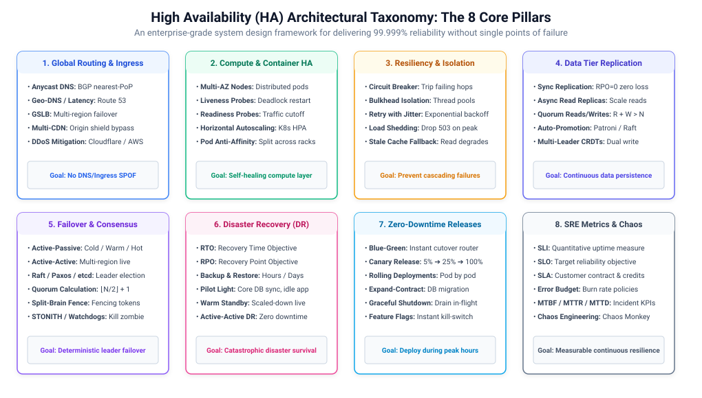
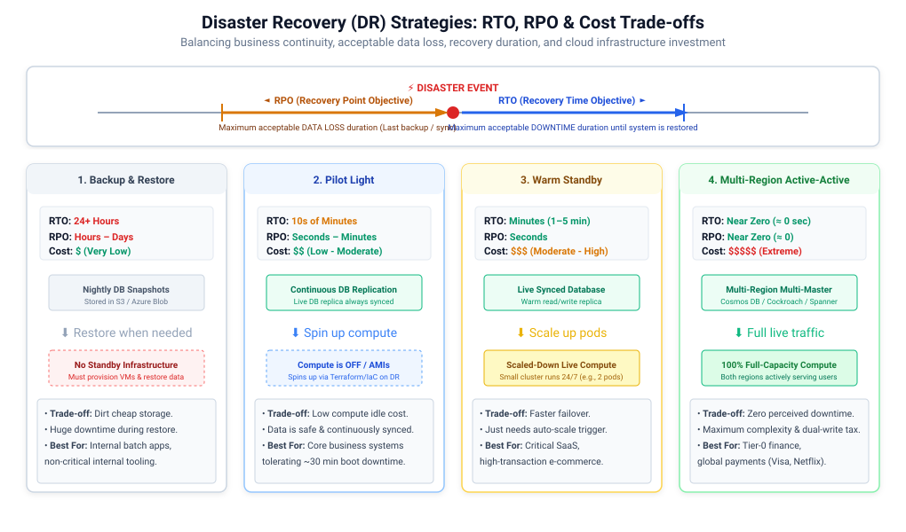
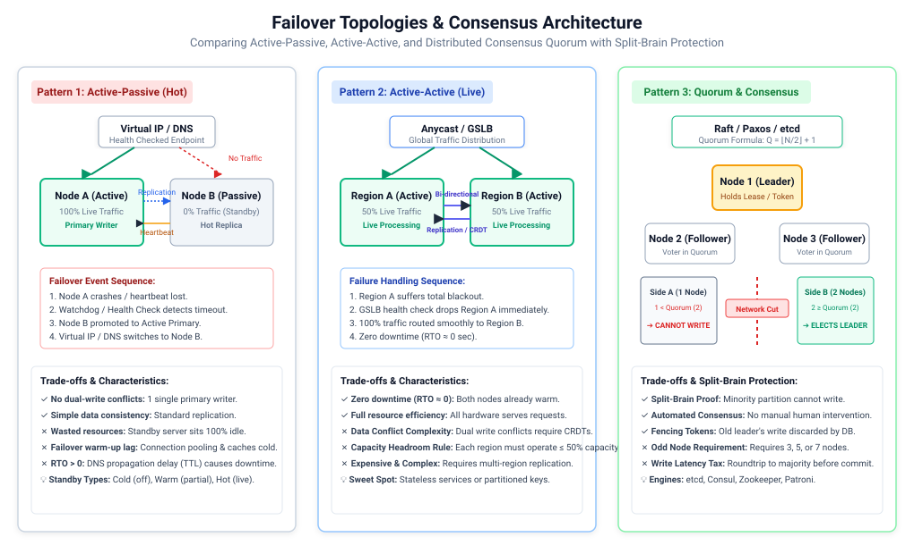
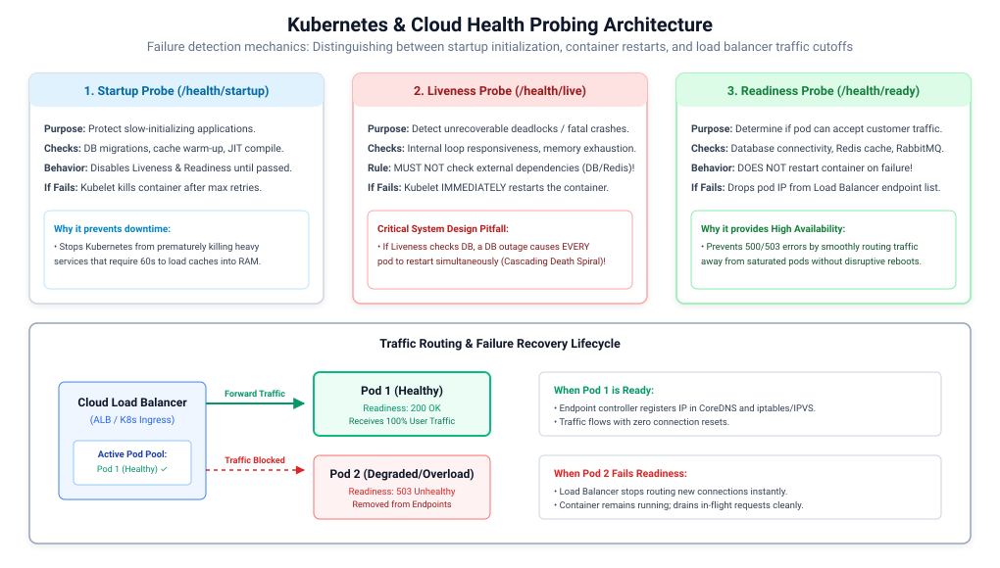

# ডিস্ট্রিবিউটেড সিস্টেমে হাই অ্যাভেইলেবিলিটি (HA) আর্কিটেকচার এবং ডিজাস্টার রিকভারি

**হাই অ্যাভেইলেবিলিটি বা উচ্চ প্রাপ্যতা (High Availability - HA)** হলো একটি ডিস্ট্রিবিউটেড সিস্টেমের এমন একটি পরিচালনগত বৈশিষ্ট্য যা নির্দিষ্ট সময়ের মধ্যে সিস্টেমের নির্ধারিত পারফরম্যান্স এবং আপটাইম (Uptime) নিশ্চিত করে। ফাইভ নাইনস ($99.999\%$) প্রাপ্যতা অর্জন করতে হলে সিস্টেমের প্রতিটি স্তর—DNS, গ্লোবাল এজ (Edge), ইনগ্রেস, কম্পিউট, ইন্টার-সার্ভিস নেটওয়ার্কিং এবং ডেটা স্টোরেজ লেয়ারকে স্বয়ংক্রিয়ভাবে নিরাময়যোগ্য (Self-healing), রিডান্ড্যান্ট এবং বিপর্যয় প্রতিরোধে সক্ষম করে ডিজাইন করতে হয়।



---

## ১. প্রাপ্যতা ভিত্তি, SRE মেট্রিক্স এবং গাণিতিক মডেল (Availability Fundamentals & Mathematics)

### প্রাপ্যতার গাণিতিক সংজ্ঞা (Mathematical Formula)
প্রাপ্যতা ($A$) হলো একটি সিস্টেমের মোট পরিকল্পিত কর্মঘণ্টার মধ্যে সিস্টেমটি কার্যকর থাকার সময়ের অনুপাত:

$$\mathcal{A} = \frac{\text{Uptime}}{\text{Uptime} + \text{Downtime}} = \frac{\text{MTBF}}{\text{MTBF} + \text{MTTR}}$$

- **MTBF (Mean Time Between Failures)**: দুটি সিস্টেম বিপর্যয়ের মধ্যবর্তী গড় পরিচালন সময়।
- **MTTR (Mean Time to Repair / Resolve)**: কোনো ত্রুটি সনাক্ত, সমাধান এবং সিস্টেমটি পুনরুদ্ধার করার গড় সময়।
- **MTTD (Mean Time to Detect)**: কোনো বিঘ্ন শুরু হওয়া থেকে স্বয়ংক্রিয় অ্যালার্ম বা ইঞ্জিনিয়ারদের সনাক্ত করতে যে সময় লাগে।

### দ্য নাইনস অফ অ্যাভেইলেবিলিটি (The Nine's of Availability Table)

| প্রাপ্যতা স্তর (Tier) | বার্ষিক ডাউনটাইম | মাসিক ডাউনটাইম | সাপ্তাহিক ডাউনটাইম | দৈনিক ডাউনটাইম | বাস্তব উদাহরণ |
| :--- | :--- | :--- | :--- | :--- | :--- |
| **90.0% (One 9)** | ৩৬.৫৩ দিন | ৭২.০০ ঘণ্টা | ১৬.৮০ ঘণ্টা | ২.৪০ ঘণ্টা | পরীক্ষামূলক ব্যাচ জব, ইন্টারনাল ডেভেলপমেন্ট টুলস |
| **99.0% (Two 9s)** | ৩.৬৫ দিন | ৭.২০ ঘণ্টা | ১.৬৮ ঘণ্টা | ১৪.৪০ মিনিট | সাধারণ অভ্যন্তরীণ কর্পোরেট অ্যাপ্লিকেশন |
| **99.9% (Three 9s)** | ৮.৭৭ ঘণ্টা | ৪৩.৮৩ মিনিট | ১০.০৮ মিনিট | ১.৪৪ মিনিট | স্ট্যান্ডার্ড SaaS সার্ভিস, কনজিউমার ওয়েব অ্যাপ |
| **99.99% (Four 9s)** | ৫২.৬০ মিনিট | ৪.৩৮ মিনিট | ১.০১ মিনিট | ৮.৬৪ সেকেন্ড | ই-কমার্স চেকআউট, অনলাইন ব্যাংকিং পোর্টাল |
| **99.999% (Five 9s)** | ৫.২৬ মিনিট | ২৬.৩০ সেকেন্ড | ৬.০৫ সেকেন্ড | ৮৬৪.০ মিলিমিটার | টেলিকম কোর নেটওয়ার্ক, গ্লোবাল পেমেন্ট গেটওয়ে (Visa/Stripe) |
| **99.9999% (Six 9s)** | ৩১.৫৬ সেকেন্ড | ২.৬৩ সেকেন্ড | ৬০৪.৮ মিলিমিটার | ৮৬.৪ মিলিমিটার | হাই-ফ্রিকোয়েন্সি ট্রেডিং, এয়ার ট্রাফিক কন্ট্রোল |

---

### কম্পোনেন্ট প্রাপ্যতা: অনুক্রম (Series) বনাম সমান্তরাল (Parallel)

ডিস্ট্রিবিউটেড সিস্টেম একাধিক উপাদানের সমন্বয়ে গঠিত। সামগ্রিক প্রাপ্যতা নির্ভর করে উপাদানগুলো ক্রমানুসারে কাজ করছে নাকি সমান্তরালভাবে রিডান্ড্যান্ট অবস্থায় রয়েছে।

#### ক. অনুক্রমিক উপাদান (Components in Series / Sequential Dependency)
যদি সার্ভিস A কল করে সার্ভিস B-কে এবং সার্ভিস B কল করে সার্ভিস C-কে, তবে পুরো সিস্টেমটি কেবল তখনই কাজ করবে যখন **প্রতিটি** উপাদান একসাথে চালু থাকবে। প্রতিটি অতিরিক্ত অনুক্রমিক ডিপেন্ডেন্সি সামগ্রিক প্রাপ্যতা কমিয়ে দেয়:

$$\mathcal{A}_{\text{series}} = \prod_{i=1}^{n} \mathcal{A}_i = \mathcal{A}_1 \times \mathcal{A}_2 \times \dots \times \mathcal{A}_n$$

*উদাহরণ*: যদি একটি API Gateway ($99.9\%$), একটি Order Service ($99.9\%$), এবং একটি Database ($99.9\%$) সিরিজে থাকে:

$$\mathcal{A}_{\text{series}} = 0.999 \times 0.999 \times 0.999 = 0.997 \quad (99.70\% \text{ প্রাপ্যতা; বার্ষিক ডাউনটাইম } 8.77 \text{ ঘণ্টা থেকে বেড়ে } 26.28 \text{ ঘণ্টায় দাঁড়ায়!})$$

#### খ. সমান্তরাল উপাদান (Components in Parallel / Redundancy)
যদি একাধিক লোড-ব্যালান্সড সার্ভার সমান্তরালভাবে ক্লাস্টারে কাজ করে, তবে সিস্টেমটি কেবল তখনই ডাউন হবে যদি **সবগুলো** সার্ভার একসাথে অকেজো হয়:

$$\mathcal{A}_{\text{parallel}} = 1 - \prod_{i=1}^{n} (1 - \mathcal{A}_i) = 1 - (1 - \mathcal{A}_1)(1 - \mathcal{A}_2)\dots(1 - \mathcal{A}_n)$$

*উদাহরণ*: যদি দুটি স্বাধীন ওয়েব সার্ভারের প্রতিটির প্রাপ্যতা $99.0\%$ ($0.99$) হয়, তবে তাদের সমান্তরালে চালালে মোট প্রাপ্যতা হবে:

$$\mathcal{A}_{\text{parallel}} = 1 - (1 - 0.99)(1 - 0.99) = 1 - (0.01 \times 0.01) = 1 - 0.0001 = 0.9999 \quad (99.99\% \text{ ফোর নাইনস!})$$

---

### প্রাপ্যতা বনাম নির্ভরযোগ্যতা বনাম ত্রুটি সহনশীলতা (Availability vs. Reliability vs. Fault Tolerance)

| বৈশিষ্ট্য | প্রাপ্যতা (Availability) | নির্ভরযোগ্যতা (Reliability) | ত্রুটি সহনশীলতা (Fault Tolerance) |
| :--- | :--- | :--- | :--- |
| **মূল প্রশ্ন** | *"সিস্টেমটি কি এই মুহূর্তে রিকোয়েস্ট প্রসেস করতে প্রস্তুত?"* | *"সিস্টেমটি কি নির্দিষ্ট সময় $T$ জুড়ে কোনো ত্রুটি ছাড়াই চলতে পারে?"* | *"সিস্টেমটি কি হার্ডওয়্যার পুড়ে গেলেও ব্যবহারকারীকে কোনো বিঘ্ন না ঘটিয়ে চলতে পারে?"* |
| **ত্রুটি সহনশীলতার ধরন** | দ্রুত রিকভারি নিশ্চিত করে (কম MTTR প্রাপ্যতা বাড়ায়)। | ব্যর্থতা পুরোপুরি প্রতিরোধ করতে চায় (উচ্চ MTBF)। | তাৎক্ষণিকভাবে ব্যাকআপ হার্ডওয়্যারে সুইচ করে বিঘ্ন পুরোপুরি আড়াল করে। |
| **খরচ** | মাঝারি (সাধারণ ক্লাউড রিডান্ড্যান্সি ও অটো-স্কেলিং)। | উচ্চ (কঠোর টেস্টিং এবং উচ্চমানের কম্পোনেন্ট)। | **অত্যন্ত ব্যয়বহুল** (সম্পূর্ণ দ্বৈত হার্ডওয়্যার, লক-স্টেপ সিপিইউ, ডাবল পাওয়ার গ্রিড)। |

---

### SRE নির্ভরযোগ্যতা গভর্ন্যান্স: SLI, SLO, SLA এবং এরর বাজেট (Error Budgets)

আধুনিক ক্লাউড সিস্টেমে প্রাপ্যতাকে SRE ফ্রেমওয়ার্কের মাধ্যমে পরিমাপ ও নিয়ন্ত্রণ করা হয়:

1. **SLI (Service Level Indicator)**: প্রোডাকশনে পরিমাপ করা বাস্তব মেট্রিক।
   $$\text{Availability SLI} = \frac{\text{সফল HTTP রিকোয়েস্ট সংখ্যা (Status } < 500\text{)}}{\text{মোট বৈধ HTTP রিকোয়েস্ট সংখ্যা}} \times 100$$
2. **SLO (Service Level Objective)**: ইঞ্জিনিয়ারিং টিমের অভ্যন্তরীণ লক্ষ্যমাত্রা (যেমন: রোলিং ৩০ দিনে $99.95\%$ সাকসেস রেট)।
3. **SLA (Service Level Agreement)**: গ্রাহকদের সাথে আইনি ব্যবসায়িক চুক্তি, যেখানে প্রাপ্যতা লক্ষ্যমাত্রার নিচে নামলে জরিমানা বা সার্ভিস ক্রেডিট দেওয়ার বিধান থাকে (যেমন: $< 99.9\%$).
4. **Error Budget (ত্রুটি বাজেট)**: একটি SLO সময়কালে গ্রাহক অসন্তুষ্টি না ঘটিয়ে সর্বোচ্চ কতটা ডাউনটাইম গ্রহণযোগ্য ($100\% - \text{SLO}$):
   $$\text{Error Budget} = 1 - 0.9995 = 0.05\% \quad (\text{প্রতি মাসে সর্বোচ্চ } \approx 21.6 \text{ মিনিট ডাউনটাইম অনুমোদন})$$
   - *বার্ন রেট নীতি (Burn Rate Policy)*: যদি নতুন ফিচার রিলিজের কারণে ৪৮ ঘণ্টার মধ্যে মাসিক বাজেটের $> 50\%$ পুড়ে যায়, তবে অবিলম্বে সব ফিচার ডিপ্লয়মেন্ট স্থগিত করা হয় এবং রিলায়েবিলিটি ফিক্সে অগ্রাধিকার দেওয়া হয়।

---

## ২. ডিজাস্টার রিকভারি (DR) উদ্দেশ্য এবং কৌশলসমূহ (Disaster Recovery Strategies)

প্রাকৃতিক দুর্যোগ, ডাটা সেন্টার বিদ্যুৎ বিপর্যয় বা র্যানসমওয়্যার হামলার মতো চরম পরিস্থিতিতে দ্রুত পুনরুদ্ধারের জন্য আনুষ্ঠানিক DR পরিকল্পনা অপরিহার্য।



### মূল মেট্রিক্স: RTO বনাম RPO
- **RTO (Recovery Time Objective)**: সিস্টেম ডাউন থাকার সর্বোচ্চ গ্রহণযোগ্য সময়সীমা। এটি উত্তর দেয়: *"ব্যবসা পুনরায় চালু করার আগে আমরা কতক্ষণ অফলাইনে থাকা সহ্য করতে পারি?"*
- **RPO (Recovery Point Objective)**: ডাটা হারানোর সর্বোচ্চ গ্রহণযোগ্য সময়সীমা। এটি উত্তর দেয়: *"দুর্যোগের কারণে আমরা সর্বোচ্চ কত সময়ের ডাটা হারানোর ঝুঁকি নিতে প্রস্তুত?"*

### ৪টি ডিজাস্টার রিকভারি স্তর (The 4 DR Tiers)

| DR স্ট্র্যাটেজি টিয়ার | RTO (ডাউনটাইম) | RPO (ডাটা ক্ষতি) | অবকাঠামোগত খরচ | অপারেশনাল জটিলতা | লক্ষ্যযুক্ত ওয়ার্কলোড |
| :--- | :--- | :--- | :--- | :--- | :--- |
| **১. Backup & Restore** | ২৪+ ঘণ্টা | কয়েক ঘণ্টা থেকে কয়েক দিন | **$** (অত্যন্ত কম) | কম (নিয়মিত ব্যাকআপ স্ক্রিপ্ট) | অভ্যন্তরীণ টুলস, আর্কাইভ ডাটা, ব্যাচ জব |
| **২. Pilot Light** | ১০ - ৬০ মিনিট | কয়েক সেকেন্ড থেকে মিনিট | **$$** (স্বল্প থেকে মাঝারি) | মাঝারি (IaC দিয়ে দ্রুত ক্লাস্টার বুট করা) | কোর বিজনেস ব্যাকএন্ড, সাধারণ SaaS |
| **৩. Warm Standby** | ১ - ৫ মিনিট | কয়েক সেকেন্ড | **$$$** (মাঝারি থেকে উচ্চ) | উচ্চ (লাইভ সিংক্রোনাইজেশন, স্কেল্ড-ডাউন ক্লাস্টার) | ই-কমার্স চেকআউট, ব্যাংকিং মোবাইল অ্যাপ |
| **৪. Multi-Region Active-Active** | **$\approx 0$ সেকেন্ড** | **$\approx 0$ (শূন্যের কাছাকাছি)** | **$$$$$** (চরম ব্যয়বহুল) | চরম (CRDT, ক্রস-রিজিয়ন ডাটা প্রতিলিপি) | টিয়ার-০ পেমেন্ট গেটওয়ে, Visa, Netflix |

---

## ৩. ফেইলওভার টপোলজি এবং কনসেনসাস মডেল (Failover Topologies & Consensus)

একটি প্রাইমারি নোড বা সম্পূর্ণ ক্লাউড রিজিয়ন ব্যর্থ হলে ট্রাফিক পুনর্নির্দেশ ও ব্যাকআপ রিসোর্স প্রমোট করতে হয়।



### ক. অ্যাক্টিভ-প্যাসিভ ফেইলওভার (Active-Passive)
- **হট স্ট্যান্ডবাই (Hot Standby)**: সেকেন্ডারি নোডটি চালু থাকে, রিয়েল-টাইমে ডাটা সিঙ্ক করে এবং নিষ্ক্রিয় থাকে। DNS বা ভার্চুয়াল আইপি পরিবর্তনের মাধ্যমে কয়েক সেকেন্ডে ফেইলওভার ঘটে।
- **ওয়ার্ম স্ট্যান্ডবাই (Warm Standby)**: সেকেন্ডারি ক্লাস্টারটি ন্যূনতম ক্ষমতায় (যেমন: ৫০টির বদলে ২টি পড) চলতে থাকে। ফেইলওভারের সময় অটো-স্কেলার বাকি পডগুলো চালু করে।
- **কোল্ড স্ট্যান্ডবাই (Cold Standby)**: ব্যাকআপ সার্ভার বন্ধ থাকে। দুর্যোগের সময় Terraform স্ক্রিপ্ট চালিয়ে নতুন মেশিন তৈরি করে ব্যাকআপ রিস্টোর করতে হয়।

### খ. অ্যাক্টিভ-অ্যাক্টিভ ক্লাস্টারিং (Active-Active)
উভয় রিজিয়নের সার্ভারগুলো একই সাথে লাইভ ট্রাফিক প্রসেস করে।
- **সুবিধা**: শতভাগ হার্ডওয়্যার ব্যবহারের কার্যকারিতা এবং তাৎক্ষণিক ফেইলওভার ($RTO \approx 0$).
- **৫০% হেডরুম ক্যাপাসিটি রুল (50% Headroom Rule)**: ২-রিজিয়ন অ্যাক্টিভ-অ্যাক্টিভ ক্লাস্টারে স্বাভাবিক অবস্থায় প্রতিটি রিজিয়নকে সর্বোচ্চ $\le 50\%$ লোডে চালাতে হবে। যাতে রিজিয়ন A ক্র্যাশ করলে রিজিয়ন B তাৎক্ষণিকভাবে শতভাগ গ্লোবাল ট্রাফিকের চাপ সহ্য করতে পারে।

### গ. কোরাম কনসেনসাস এবং স্প্লিট-ব্রেন প্রতিরোধ (Quorum Consensus & Split-Brain)
নেটওয়ার্ক পার্টিশনের কারণে ক্লাস্টার বিভক্ত হয়ে পড়লে উভয় পাশ নিজেকে প্রাইমারি মনে করতে পারে। যদি উভয় অংশই স্টোরেজে লিখতে শুরু করে, তবে ডেটা পুরোপুরি নষ্ট হয়ে যায়—যাকে **স্প্লিট-ব্রেন (Split-Brain)** বলা হয়।

#### ১. কোরাম গণনা সূত্র (Quorum Formula)
একটি ক্লাস্টার কেবল তখনই রাইট এক্সেপ্ট করতে পারবে যদি সেই অংশে সংখ্যাগরিষ্ঠ ভোট বা কোরাম থাকে:

$$\text{Quorum} = \left\lfloor \frac{N}{2} \right\rfloor + 1$$

| মোট ক্লাস্টার নোড সংখ্যা ($N$) | প্রয়োজনীয় কোরাম ($Q$) | সর্বোচ্চ সহনশীল নোড ব্যর্থতা |
| :---: | :---: | :---: |
| **৩** | **২** | ১টি নোড |
| **৫** | **৩** | ২টি নোড |
| **৭** | **৪** | ৩টি নোড |

*নিয়ম*: ক্লাস্টারে সর্বদা **বিজোড় সংখ্যক ভোটিং নোড** ($৩, ৫, ৭$) ভিন্ন ভিন্ন ক্লাউড অ্যাভেইলেবিলিটি জোনে ডিপ্লয় করতে হয়।

#### ২. ফেন্সিং টোকেন এবং STONITH
- **ফেন্সিং টোকেন (Fencing Tokens)**: কনসেনসাস লিডার (যেমন: etcd বা Zookeeper) দ্বারা ইস্যু করা ক্রমবর্ধনশীল মনোটোনিক কাউন্টার। যদি বিচ্ছিন্ন পুরনো লিডার পুরনো টোকেন দিয়ে লিখতে আসে, ডাটাবেজ তা সাথে সাথে প্রত্যাখ্যান করে।
- **STONITH ("Shoot The Other Node In The Head")**: হার্ডওয়্যার লেভেলের ফেন্সিং যেখানে ক্লাস্টারের সচল নোডগুলো রেসপন্স না করা ক্র্যাশড নোডের পাওয়ার সাপ্লাই রিমোটলি বন্ধ করে দেয় যাতে সে ভুলেও ডাটা করাপ্ট করতে না পারে।

---

## ৪. হেলথ প্রোবিং, ফেইলিউর ডিটেকশন এবং সেলফ-হিলিং (Health Probing Architecture)

স্বয়ংক্রিয় নিরাময়ের জন্য এমন নিখুঁত হেলথ চেক দরকার যা ইনিশিয়ালাইজেশনের বিলম্ব, সফটওয়্যার ডেডলক এবং বাহ্যিক নেটওয়ার্ক সমস্যার মধ্যে পার্থক্য করতে পারে।



### কুবারনেটিসের ৩টি প্রোবিং কৌশল (The 3 Probing Paradigms)

| প্রোব টাইপ | এন্ডপয়েন্ট | কী যাচাই করে | ব্যর্থ হলে গৃহীত পদক্ষেপ |
| :--- | :--- | :--- | :--- |
| **Startup Probe** | `/health/startup` | ডাটাবেজ মাইগ্রেশন, ক্যাশ প্রি-ওয়ার্মিং, JIT কম্পাইলেশন। | Liveness ও Readiness স্থগিত রাখে। টাইমআউট অতিক্রম করলে কন্টেইনার বাতিল করে। |
| **Liveness Probe** | `/health/live` | অভ্যন্তরীণ অ্যাপ্লিকেশন থ্রেড ডেডলক বা প্রসেস হ্যাং। | কন্টেইনার রানটাইমের মাধ্যমে **কন্টেইনারকে রিস্টার্ট (Restart) করে**। |
| **Readiness Probe** | `/health/ready` | ডাউনস্ট্রিম সংযোগ (Database, Redis, Message Broker)। | **লোড ব্যালেন্সার এন্ডপয়েন্ট থেকে পড আইপি সরিয়ে দেয়**; কন্টেইনার রিস্টার্ট করে না! |

> [!CAUTION]
> **ক্যাসকেডিং ডেথ স্পাইরাল অ্যান্টি-প্যাটার্ন (The Cascading Death Spiral)**:
> **কখনই** Liveness Probe-এর ভেতরে ডাটাবেজ বা ক্যাশের মতো বাহ্যিক ডিপেন্ডেন্সি চেক করবেন না!
> যদি ডাটাবেজে ৫ সেকেন্ডের জন্য সাময়িক সংযোগ সমস্যা দেখা দেয়, তবে চলমান ৫০টি পডের প্রতিটির লাইভনেস প্রোব ফেইল করবে। কুবারনেটিস ৫০টি পডকেই একসাথে রিস্টার্ট করে দেবে! এর ফলে র‍্যামের সব ক্যাশ মুছে যাবে, বুট হওয়ার সময় ৫০টি পড আবার ডাটাবেজে কানেকশন তৈরি করতে গিয়ে ডাটাবেজকে চিরতরে ক্র্যাশ করিয়ে পুরো সিস্টেমকে ধসিয়ে দেবে।

---

## ৫. ত্রুটি বিচ্ছিন্নকরণ, রেজিলিয়েন্স এবং গ্রেসফুল ডিগ্রেডেশন (Fault Isolation & Resiliency)

হাই অ্যাভেইলেবিলিটি বজায় রাখার মূল কৌশল হলো সিস্টেমের কোনো অংশের ব্যর্থতা যেন অন্য অংশে সংক্রমিত না হয় (Blast Radius Containment)।

### ক. বাল্কহেড প্যাটার্ন (Bulkhead Pattern)
জাহাজের জলরোধী প্রকোষ্ঠের মতো—একটি চেম্বারে পানি ঢুকলেও পুরো জাহাজ ডোবে না। সফটওয়্যারে থ্রেড পুল, মেমোরি পুল এবং ডাটাবেজ কানেকশন পুল আলাদা করা হয়।
- *উদাহরণ*: অ্যানালিটিক্স বা রিপোর্টিং কোয়েরির জন্য আলাদা ডেডিকেটেড কানেকশন পুল ব্যবহার করা হয়, যাতে রিপোর্টিং ধীরগতির হলেও চেকআউটের কানেকশন পুলে কোনো প্রভাব না পড়ে।

### খ. সার্কিট ব্রেকার এবং ফুল জিটার সহযোগে এক্সপোনেনশিয়াল ব্যাকঅফ (Circuit Breaker with Jitter)
- **সার্কিট ব্রেকার**: ডাউনস্ট্রিম সেবায় ব্যর্থতার হার ৫০% ছাড়ালে সার্কিট ব্রেকার ওপেন (Open) হয়ে সরাসরি দ্রুত ত্রুটি ফেরত দেয় এবং ডাউনস্ট্রিমকে রিকভার করার সময় দেয়।
- **ফুল জিটার (Full Jitter)**: রিট্রাইয়ের সময়ে র্যান্ডম বিলম্ব যোগ করে, যাতে হাজার হাজার ক্লায়েন্ট একই মুহূর্তে রিকোয়েস্ট পাঠিয়ে সার্ভারকে বিপর্যস্ত (Thundering Herd) না করতে পারে:
  $$T_{\text{sleep}} = \text{random}(0, \, \min(T_{\text{max}}, \, T_{\text{base}} \times 2^{\text{attempt}}))$$

### গ. লোড শেডিং এবং রিকোয়েস্ট অগ্রাধিকার (Load Shedding)
যখন সিপিইউ ব্যবহার ৮৫% অতিক্রম করে, সিস্টেম সারিতে আটকে না রেখে নির্দিষ্ট রিকোয়েস্ট সরাসরি ড্রপ করে:
1. **টিয়ার-১ (গুরুত্বপূর্ণ)**: পেমেন্ট, চেকআউট, লগইন ➔ সম্পূর্ণ অগ্রাধিকার সহকারে প্রসেস করা হয়।
2. **টিয়ার-২ (অপেক্ষাকৃত কম গুরুত্বপূর্ণ)**: রিকমেন্ডেশন, রিভিউ ➔ `HTTP 429 / 503` ড্রপ করা হয় বা পুরনো ক্যাশ (Stale Cache) থেকে সার্ভ করা হয়।

---

## ৬. ডাটা স্তরে উচ্চ প্রাপ্যতা ও রেপ্লিকেশন (Data Tier High Availability)

কম্পিউট স্তর স্টেটলেস হওয়ায় সহজে স্কেল করা যায়; কিন্তু ডাটা স্তর স্টেট ধরে রাখে এবং এটিই সিস্টেমের প্রকৃত প্রাপ্যতা নির্ধারণ করে।

### রেপ্লিকেশন মডেল তুলনা

| রেপ্লিকেশন টপোলজি | কনসিস্টেন্সি | প্রাপ্যতা (CAP) | RPO (ডাটা ক্ষতি) | সাধারণ ব্যবহারের ক্ষেত্র |
| :--- | :--- | :--- | :--- | :--- |
| **Single-Leader (Synchronous)** | স্ট্রং কনসিস্টেন্সি | কম (রেপ্লিকা ডাউন হলে রাইট ব্লক হয়) | **$RPO = 0$** | ব্যাংকিং লেজার, ACID রিলেশনাল ডাটাবেজ |
| **Single-Leader (Asynchronous)** | ইভেনচুয়াল কনসিস্টেন্সি | উচ্চ (প্রাইমারিতে রাইট সম্পন্ন হয়) | কয়েক সেকেন্ডের ক্ষতি | রিড-হেভি ওয়েব অ্যাপ্লিকেশন, রিড রেপ্লিকা |
| **Multi-Leader (Dual Primary)** | ইভেনচুয়াল কনসিস্টেন্সি | অত্যন্ত উচ্চ (সব রিজিয়নেই লোকাল রাইট) | কনফ্লিক্ট উইন্ডো | গ্লোবাল কোলাবোরেশন অ্যাপ, CMS, Git |
| **Leaderless (Quorum $R+W > N$)** | টিউনযোগ্য কনসিস্টেন্সি | সর্বোচ্চ (যেকোনো নোডেই রাইট সম্ভব) | টিউনযোগ্য | Amazon DynamoDB, Apache Cassandra |

### লিডারলেস সিস্টেমে স্ট্রং কনসিস্টেন্সি কোরাম সূত্র
- $N$ = সংরক্ষিত রেপ্লিকা সংখ্যা।
- $W$ = সফল হতে প্রয়োজনীয় রাইট একনলেজমেন্ট সংখ্যা।
- $R$ = রিড অপারেশনের সময় কোয়েরি করা নোড সংখ্যা।

$$\text{স্ট্রং কনসিস্টেন্সি নিয়ম:} \quad \mathbf{W + R > N}$$

*উদাহরণ*: $N = 3$ হলে, $W = 2$ এবং $R = 2$ সেট করলে নিশ্চিত হয় যে রিড সেটের অন্তত একটি নোডে সর্বশেষ সফল রাইট ডেটা বিদ্যমান ($2 + 2 = 4 > 3$), ফলে ১টি নোড নষ্ট হলেও শক্তিশালী কনসিস্টেন্সি অক্ষুণ্ণ থাকে।

---

## ৭. গ্লোবাল রাউটিং, DNS এবং ইনগ্রেস প্রাপ্যতা (Global Ingress Availability)

DNS বা আইপি স্তরে কোনো সিঙ্গেল পয়েন্ট অফ ফেইলিউর থাকলে পুরো গ্লোবাল সিস্টেম অচল হয়ে পড়ে।

### ইনগ্রেস প্রযুক্তি
1. **Anycast BGP Routing**: বিশ্বজুড়ে একাধিক ডাটা সেন্টার থেকে BGP প্রোটোকলের মাধ্যমে একই আইপি ঘোষণা করা হয়। ব্যবহারকারীর ট্রাফিক নিকটতম সচল নোডে যায়। কোনো পয়েন্ট অফ প্রেজেন্স নষ্ট হলে ইন্টারনেট রাউটারগুলো সেকেন্ডের মধ্যে রুট পরিবর্তন করে।
2. **Geo-DNS এবং Health-Checked রাউটিং (AWS Route 53)**: ব্যাকঅ্যান্ডের স্বাস্থ্য পর্যবেক্ষণ করে প্রাথমিক রিজিয়ন অচল হলে DNS কোয়েরির উত্তরে স্বয়ংক্রিয়ভাবে সেকেন্ডারি রিজিয়নের আইপি ফেরত দেয়।
3. **Multi-CDN আর্কিটেকচার**: দুটি স্বাধীন CDN (যেমন: Cloudflare এবং Fastly) ব্যবহার করা হয়, যাতে একটি সিডিএন বিভ্রাটে পড়লে অন্যটিতে ট্রাফিক ঘোরানো যায়।

---

## ৮. জিরো-ডাউনটাইম ডিপ্লয়মেন্ট (Zero-Downtime Deployment & Verification)

নতুন কোড ডিপ্লয়মেন্ট চলাকালীন ব্যবহারকারীর সার্ভিসে কোনো বিঘ্ন ঘটতে দেওয়া যাবে না।

### ডিপ্লয়মেন্ট পদ্ধতি
- **রোলিং আপডেট (Rolling Update)**: একে একে পুরনো পড নষ্ট করে নতুন পড চালু করে। খরচ কম, তবে এক সাথে উভয় সংস্করণ চালু থাকে।
- **ব্লু-গ্রিন ডিপ্লয়মেন্ট (Blue-Green)**: প্রোডাকশনের (Blue) পাশাপাশি সম্পূর্ণ নতুন পরিবেশ (Green) তৈরি করা হয়। পরীক্ষা শেষে রাউটারে তাৎক্ষণিক ট্রাফিক সুইচ করা হয় ($RTO = 0$)।
- **ক্যানারি রিলিজ (Canary Release)**: বাস্তব ব্যবহারকারীর ২% ট্রাফিক নতুন ভার্সনে পাঠানো হয়। ত্রুটি বা ল্যাটেন্সি না বাড়লে ধীরে ধীরে ১০%, ৫০% এবং ১০০% ট্রাফিকে রূপান্তর করা হয়।

### জিরো-ডাউনটাইম ডাটাবেজ মাইগ্রেশন: এক্সপ্যান্ড-কন্ট্রাক্ট প্যাটার্ন
ডাটাবেজ কলাম সরাসরি ড্রপ বা রিনেম করলে চলমান অ্যাপ্লিকেশন ক্র্যাশ করে। সমাধান হলো **Expand-Contract (Parallel Run)**:
1. **Expand**: পুরনো কলাম অক্ষুণ্ণ রেখে নতুন কলাম যোগ করুন (Nullable)।
2. **Dual Write**: অ্যাপ্লিকেশনে কোড পরিবর্তন করে পুরনো ও নতুন উভয় কলামেই ডেটা লিখুন।
3. **Backfill**: ব্যাকগ্রাউন্ড জবের মাধ্যমে ঐতিহাসিক ডেটা পুরনো থেকে নতুন কলামে কপি করুন।
4. **Read Switch**: অ্যাপ্লিকেশনকে নতুন কলাম থেকে ডেটা রিড করার নির্দেশ দিন।
5. **Contract**: পুরনো কলামে লেখা বন্ধ করে পরবর্তী রিলিজে তা নিরাপদে মুছে ফেলুন।

---

## ৯. আর্কিটেকচারাল স্ট্যান্ডার্ড (.NET / C# ফোকাস)

### সুবিধাসমূহ:
- **নেটিভ হেলথ প্রোব পাইপলাইন**: ASP.NET Core-এর হেলথ চেক ইঞ্জিন কুবারনেটিস এবং ক্লাউড লোড ব্যালেন্সারের সাথে চমৎকার সমন্বয় করে।
- **স্ট্যান্ডার্ড রেজিলিয়েন্স**: .NET 8/9-এ `Microsoft.Extensions.Http.Resilience` এবং `Polly v8` অত্যন্ত দ্রুতগতিতে মেমোরি অ্যালোকোশন ছাড়াই কাজ করে।

### দুর্বলতা ও ট্রেড-অফ:
- **প্রোব ওভারহেড**: রিডিনেস প্রোবে প্রতি ৩ সেকেন্ডে জটিল SQL চালালে ডাটাবেজ থ্রেড শেষ হয়ে যেতে পারে। হালকা `SELECT 1` ব্যবহার করুন।
- **থ্রেড ম্যানেজমেন্ট**: বাল্কহেড থ্রেড পুল খুব ছোট হলে বৈধ রিকোয়েস্ট রিজেক্ট হতে পারে।

### লক্ষ্যযুক্ত প্রযুক্তি ও .NET-এর জন্য NuGet প্যাকেজ:
- `Microsoft.Extensions.Diagnostics.HealthChecks` (নেটিভ ইঞ্জিন)
- `AspNetCore.HealthChecks.UI.Client` (কুবারনেটিস ও ড্যাশবোর্ডের জন্য JSON ফরম্যাটার)
- `Microsoft.Extensions.Http.Resilience` (Polly সমৃদ্ধ রেজিলিয়েন্স পাইপলাইন)

---

### প্রোডাকশন-গ্রেড C# কোড উদাহরণ ১: এন্টারপ্রাইজ ASP.NET Core হেলথ প্রোব পাইপলাইন

```csharp
// Program.cs - .NET 8/9-এ হাই অ্যাভেইলেবিলিটি হেলথ প্রোবিং
using HealthChecks.UI.Client;
using Microsoft.AspNetCore.Diagnostics.HealthChecks;
using Microsoft.Extensions.Diagnostics.HealthChecks;

var builder = WebApplication.CreateBuilder(args);

// হেলথ চেক রেজিস্ট্রেশন
builder.Services.AddHealthChecks()
    // ১. Liveness Probe (কেবল অভ্যন্তরীণ মেমোরি ও থ্রেড স্টেট চেক করে; বাহ্যিক ডাটাবেজ নয়!)
    .AddCheck("self", () => HealthCheckResult.Healthy("Process is alive"), tags: new[] { "live" })
    
    // ২. Readiness Probe (রিকোয়েস্ট গ্রহণের পূর্বে গুরুত্বপূর্ণ ডাটাবেজ ও ক্যাশ সংযোগ যাচাই করে)
    .AddCheck("primary_database", () =>
    {
        bool dbConnected = true; // বাস্তব ডাটাবেজে SELECT 1 পিং করুন
        return dbConnected 
            ? HealthCheckResult.Healthy("Database is responsive.")
            : HealthCheckResult.Unhealthy("Database connection timeout.");
    }, tags: new[] { "ready" })
    .AddCheck("distributed_cache", () =>
    {
        bool redisConnected = true;
        return redisConnected
            ? HealthCheckResult.Healthy("Redis cluster is reachable.")
            : HealthCheckResult.Degraded("Redis latency high; running in degraded cache mode.");
    }, tags: new[] { "ready" });

var app = builder.Build();

// এন্ডপয়েন্ট ১: কুবারনেটিস Liveness Probe (/health/live)
// প্রসেস ডেডলক হলে কন্টেইনার রিস্টার্ট করে।
app.MapHealthChecks("/health/live", new HealthCheckOptions
{
    Predicate = check => check.Tags.Contains("live"),
    ResponseWriter = UIResponseWriter.WriteHealthCheckUIResponse
});

// এন্ডপয়েন্ট ২: লোড ব্যালেন্সার Readiness Probe (/health/ready)
// ডাটাবেজ না পেলে লোড ব্যালেন্সার থেকে ট্রাফিক সরানো হয়; কন্টেইনার রিস্টার্ট হয় না।
app.MapHealthChecks("/health/ready", new HealthCheckOptions
{
    Predicate = check => check.Tags.Contains("ready"),
    ResponseWriter = UIResponseWriter.WriteHealthCheckUIResponse
});

app.MapGet("/", () => "API Gateway is operational.");

app.Run();
```

---

### প্রোডাকশন-গ্রেড C# কোড উদাহরণ ২: সার্কিট ব্রেকার ও ফলব্যাক সহযোগে রেজিলিয়েন্ট পাইপলাইন

```csharp
// Program.cs - Polly v8 রেজিলিয়েন্স হ্যান্ডলার কনফিগারেশন
using Microsoft.Extensions.Http.Resilience;
using Polly;
using Polly.CircuitBreaker;

var builder = WebApplication.CreateBuilder(args);

// HttpClient রেজিস্ট্রেশন ও রেজিলিয়েন্স পাইপলাইন কনফিগারেশন
builder.Services.AddHttpClient("PaymentService", client =>
{
    client.BaseAddress = new Uri("https://payment-service.internal:5001");
})
.AddStandardResilienceHandler(options =>
{
    // ১. সার্কিট ব্রেকার কনফিগারেশন
    options.CircuitBreaker.SamplingDuration = TimeSpan.FromSeconds(30);
    options.CircuitBreaker.FailureRatio = 0.5; // ৫০% কল ফেইল করলে ব্রেকার ওপেন হবে
    options.CircuitBreaker.MinimumThroughput = 20; // উইন্ডোতে অন্তত ২০টি কল থাকতে হবে
    options.CircuitBreaker.BreakDuration = TimeSpan.FromSeconds(15); // ১৫ সেকেন্ড ট্রাফিক বন্ধ থাকবে

    // ২. ফুল জিটার সহযোগে এক্সপোনেনশিয়াল ব্যাকঅফ
    options.Retry.MaxRetryAttempts = 3;
    options.Retry.BackoffType = DelayBackoffType.Exponential;
    options.Retry.UseJitter = true;
    options.Retry.Delay = TimeSpan.FromMilliseconds(200);

    // ৩. সর্বোচ্চ রিকোয়েস্ট টাইমআউট
    options.TotalRequestTimeout.Timeout = TimeSpan.FromSeconds(5);
});

var app = builder.Build();

app.MapPost("/checkout", async (IHttpClientFactory factory) =>
{
    var client = factory.CreateClient("PaymentService");
    try
    {
        var response = await client.PostAsync("/api/pay", null);
        response.EnsureSuccessStatusCode();
        return Results.Ok(new { status = "Payment Processed" });
    }
    catch (BrokenCircuitException)
    {
        // গ্রেসফুল ডিগ্রেডেশন: সার্কিট ওপেন থাকায় ডাউন সার্ভারে চাপ না ফেলে সরাসরি কিউতে রাখা হলো
        return Results.Json(new 
        { 
            status = "Queued", 
            message = "পেমেন্ট গেটওয়ে সাময়িকভাবে ডাউন। আপনার অর্ডারটি প্রসেসিং কিউতে জমা রাখা হয়েছে।" 
        }, statusCode: 202);
    }
});

app.Run();
```

---

## ১০. সিস্টেম ডিজাইন ইন্টারভিউ ডিসিশন ফ্রেমওয়ার্ক (High Availability Decision Tree)

ইন্টারভিউতে উচ্চ প্রাপ্যতাসম্পন্ন সিস্টেম ডিজাইনের সময় এই সুশৃঙ্খল কাঠামোটি ব্যবহার করুন:

```
প্রাপ্যতা প্রয়োজনীয়তা বিশ্লেষণ
 ├── কাঙ্ক্ষিত SLA / SLO কী?
 │    ├── 99.9% (Three 9s: বছরে ~৮.৭ ঘণ্টা ডাউন) ──► সিঙ্গেল রিজিয়ন, মাল্টি-AZ, লোড ব্যালেন্সার, হেলথ প্রোব
 │    ├── 99.99% (Four 9s: বছরে ~৫২ মিনিট ডাউন) ──► মাল্টি-AZ ক্লাস্টার, অটো-ফেইলওভার DB, ওয়ার্ম স্ট্যান্ডবাই DR
 │    └── 99.999% (Five 9s: বছরে ~৫ মিনিট ডাউন) ──► মাল্টি-রিজিয়ন অ্যাক্টিভ-অ্যাক্টিভ, GSLB, Anycast, কোরাম স্টোরেজ
 │
 ├── কম্পিউট লেয়ার কীভাবে সুরক্ষিত করবেন?
 │    ├── কন্টেইনার হ্যাং বা ডেডলক? ──► Liveness Probe (কন্টেইনার রিস্টার্ট)
 │    ├── অতিরিক্ত লোড ও সাময়িক ল্যাগ? ──► Readiness Probe (রিস্টার্ট না করে ট্রাফিক ড্রপ)
 │    └── জিরো-ডাউনটাইম রিলিজ? ──► ক্যানারি রিলিজ + এক্সপ্যান্ড-কন্ট্রাক্ট ডাটাবেজ মাইগ্রেশন
 │
 ├── ডাটা লেয়ারে কীভাবে ক্ষতি রোধ করবেন?
 │    ├── RPO = 0 বাধ্যতামূলক? ──► মাল্টি-AZ সিঙ্ক্রোনাস রেপ্লিকেশন + Raft/Paxos কোরাম
 │    ├── মাল্টি-রিজিয়ন নেটওয়ার্ক ল্যাটেন্সি সমস্যা? ──► লোকাল অ্যাসিনক্রোনাস রেপ্লিকা + আউটবক্স প্যাটার্ন
 │    └── নেটওয়ার্ক পার্টিশনের ঝুঁকি? ──► কোরাম (⌊N/2⌋ + 1) + ফেন্সিং টোকেন (স্প্লিট-ব্রেন প্রতিরোধ)
 │
 └── ডাউনস্ট্রিম সার্ভিসের বিভ্রাট কীভাবে সামলাবেন?
      ├── সাময়িক নেটওয়ার্ক ফ্লিকার? ──► ফুল জিটার সহযোগে এক্সপোনেনশিয়াল ব্যাকঅফ
      └── দীর্ঘস্থায়ী ব্যর্থতা? ──► সার্কিট ব্রেকার ও গ্রেসফুল ডিগ্রেডেশন / ক্যাশ ফলব্যাক
```
