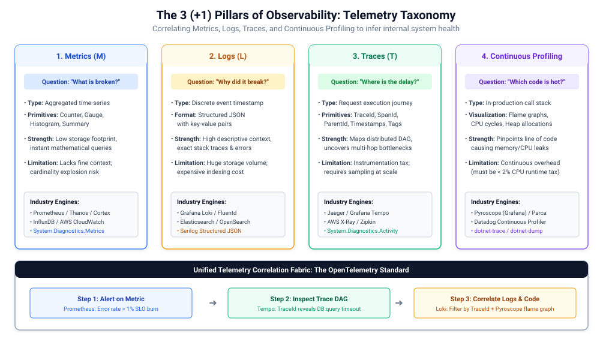
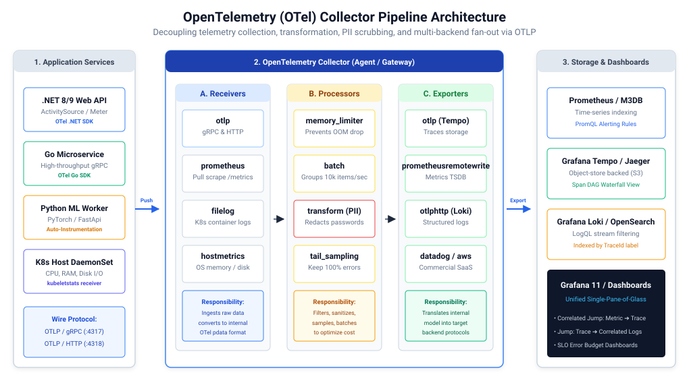
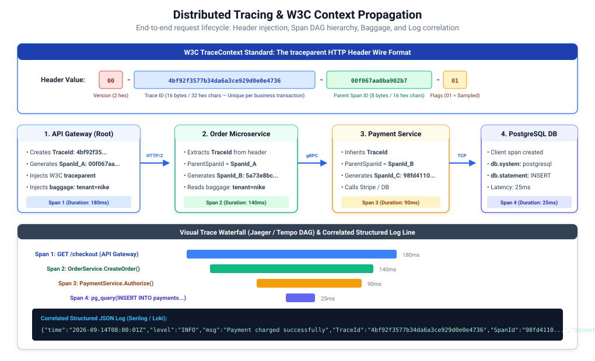
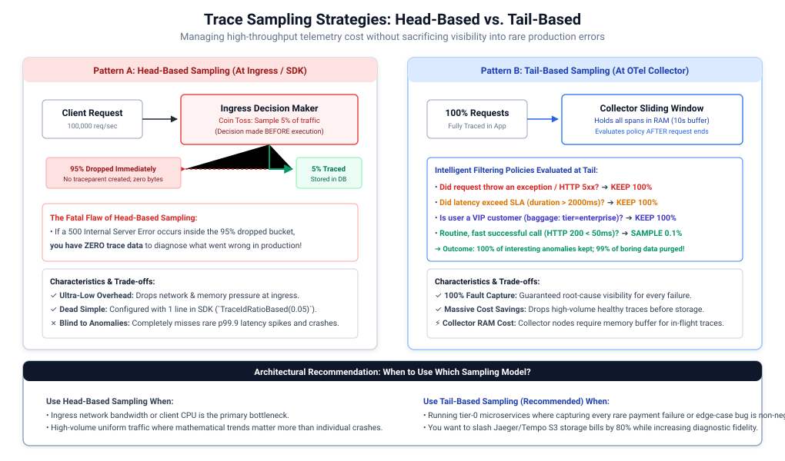

# Observability & Telemetry Engineering in Distributed Systems

In monolithic applications, diagnosing failures requires little more than attaching a debugger or reading a single local log file. In modern distributed microservice architectures—where a single user interaction can trigger dozens of asynchronous event hops, remote procedure calls, and database transactions across ephemeral container clusters—traditional monitoring falls apart.

**Observability** is the measure of how well the internal states of a complex distributed system can be inferred solely from knowledge of its external telemetry outputs.



---

## 1. Observability Fundamentals & The Three (+1) Pillars (M.E.L.T. + P)

### Monitoring vs. Observability: The Core Distinction
- **Monitoring**: Asks *"Is the system working?"* by tracking predefined thresholds (e.g., CPU > 80%, disk capacity, ping availability). It reports known failure modes (**Known-Unknowns**).
- **Observability**: Asks *"Why is the system behaving this way?"* by analyzing high-cardinality, contextual telemetry to diagnose unforeseen, emergent failure modes (**Unknown-Unknowns**).

### The Four Foundational Telemetry Types

| Telemetry Pillar | Core Primitive | Primary Question Answered | Data Volume & Cost | Typical Technology Stack |
| :--- | :--- | :--- | :--- | :--- |
| **1. Metrics (M)** | Time-series aggregations (Counters, Gauges, Histograms) | *"What is broken and when did it break?"* | **Low** (Aggregated numbers; constant byte size over time) | Prometheus, Thanos, AWS CloudWatch, Datadog |
| **2. Logs (L)** | Discrete, timestamped structured JSON events | *"Why did the failure happen?"* | **High** (Grows linearly with traffic; expensive indexing) | Grafana Loki, Elasticsearch, OpenSearch, Fluentd |
| **3. Traces (T)** | Directed Acyclic Graphs (DAG) of spans across network hops | *"Where is the bottleneck located across services?"* | **Moderate - High** (Requires intelligent sampling) | Grafana Tempo, Jaeger, Zipkin, AWS X-Ray |
| **4. Continuous Profiling (P)** | Runtime stack traces and flame graphs | *"Which specific line of code or method is burning CPU/RAM?"* | **Low** (Statistical kernel-level sampling) | Grafana Pyroscope, Parca, Datadog Profiler, dotnet-trace |

---

### A. Metrics Deep Dive: The 4 Fundamental Types
1. **Counter**: A monotonically increasing cumulative value (e.g., `http_requests_total`). It only increases or resets to zero on process reboot. Rate of change is calculated using $\text{rate}()$:
   $$\text{Requests Per Second (RPS)} = \text{rate}(\text{http\_requests\_total}[5m])$$
2. **Gauge**: A numerical value that can arbitrarily go up or down representing a snapshot in time (e.g., `active_connections`, `memory_usage_bytes`, `threadpool_queue_length`).
3. **Histogram**: Samples observations (usually request durations or payload sizes) and counts them into configurable statistical buckets (e.g., `<50ms`, `<100ms`, `<500ms`, `<2s`). Allows calculating percentiles (p50, p95, p99):
   $$\text{p99 Latency} = \text{histogram\_quantile}(0.99, \, \text{sum}(\text{rate}(\text{http\_request\_duration\_seconds\_bucket}[5m])) \text{ by } (\text{le}))$$
4. **Summary**: Calculates configurable quantiles directly on the application client side over a sliding time window. While accurate, summaries cannot be aggregated across multiple server instances.

---

### B. Structured Logging Best Practices
Unstructured, raw string logs (e.g., `log.Info("User " + userId + " paid " + amount)`) are unindexable at scale. Modern systems require **Structured JSON Logging** with semantic attributes:

```json
{
  "timestamp": "2026-09-14T11:00:00.123Z",
  "level": "ERROR",
  "message": "Payment transaction failed",
  "service.name": "payment-service",
  "deployment.environment": "production",
  "user.id": "usr_98741",
  "order.amount": 149.99,
  "error.code": "CARD_EXPIRED",
  "trace_id": "4bf92f3577b34da6a3ce929d0e0e4736",
  "span_id": "00f067aa0ba902b7"
}
```

---

## 2. OpenTelemetry (OTel) Architecture & Standardization

Prior to OpenTelemetry, organizations were trapped in proprietary agent lock-in (e.g., Datadog agent, Dynatrace, New Relic) or fragmented open-source libraries (OpenTracing vs. OpenCensus). 

**OpenTelemetry (OTel)** is the Cloud Native Computing Foundation (CNCF) standard providing a single, vendor-neutral API, SDK, and tooling pipeline to capture, transform, and export telemetry.



### API vs. SDK Separation
- **OTel API**: Specifies the programming interfaces used to instrument application code (e.g., starting spans, recording metric counters). It contains zero dependencies and can be safely referenced in shared domain libraries without runtime bloat.
- **OTel SDK**: Implements the API and handles configuration, state management, batching, thread pooling, and network transmission. It is wired exclusively in the application's composition root (`Program.cs` / main method).

### The OpenTelemetry Collector Pipeline Architecture
The OTel Collector operates as an out-of-process proxy or sidecar that receives telemetry from multiple applications, processes it, and fans it out to multiple backends. Its pipeline consists of three sequential components:

1. **Receivers (Push or Pull)**:
   - Ingests telemetry in various formats (OTLP over gRPC on port `4317`, OTLP over HTTP on port `4318`, Prometheus scraping, Zipkin, Jaeger).
   - Converts external payloads into standard in-memory OpenTelemetry objects (`pdata`).
2. **Processors (Transform & Sanitize)**:
   - **`memory_limiter`**: Mandatory first processor. Drops or refuses telemetry if the collector's RAM approaches its hard threshold, preventing out-of-memory crashes during spikes.
   - **`batch`**: Groups telemetry items into bulk network packets (e.g., 8,192 items or every 200ms) to reduce network overhead and increase ingestion throughput.
   - **`transform`**: Evaluates OpenTelemetry Transformation Language (OTTL) statements to scrub sensitive PII data or rewrite attributes.
   - **`tail_sampling`**: Retains 100% of error and high-latency traces while dropping routine successful traces.
3. **Exporters (Fan-Out & Translate)**:
   - Translates internal telemetry into destination backend formats: sends metrics to Prometheus via `prometheusremotewrite`, traces to Grafana Tempo via `otlp`, and logs to Loki via `otlphttp`.

---

## 3. Distributed Context Propagation & W3C TraceContext

When a single user request flows across 10 microservices, how does the final service know which client initiated the call? **Context Propagation** is the mechanism that injects and extracts tracking metadata across HTTP headers, gRPC metadata, or message broker envelopes.



### The W3C TraceContext Specification
Ratified by the W3C, the `traceparent` HTTP header standardizes distributed context across polyglot microservice ecosystems:

```
traceparent: 00-4bf92f3577b34da6a3ce929d0e0e4736-00f067aa0ba902b7-01
             │  └──────────────┬───────────────┘ └───────┬──────┘ └─┬─┘
          Version           Trace ID                 Parent Span ID Flags
```

- **Version (`00`)**: Current W3C specification version ($2$ hex characters).
- **Trace ID (`4bf92f3577b34da6a3ce929d0e0e4736`)**: Unique 16-byte ($32$ hex characters) globally unique identifier for the entire distributed transaction. Remains identical across every microservice hop!
- **Parent Span ID (`00f067aa0ba902b7`)**: Unique 8-byte ($16$ hex characters) identifier for the caller's specific execution block.
- **Trace Flags (`01`)**: 8-bit field. `01` indicates the trace was **Sampled** (recorded), while `00` indicates it was not recorded.

### Baggage API vs. Trace Context
- **Trace Attributes**: Bound strictly to a single span. They do **not** propagate downstream.
- **Baggage (`baggage` header)**: Key-value metadata that travels across **all** downstream network boundaries (e.g., `baggage: tenantId=enterprise_corp,userId=usr_1234`).
  > [!WARNING]
  > Baggage is sent in plain text over HTTP headers. Never put sensitive data (e.g., passwords, authorization tokens, PII) in Baggage!

### The Power of Log Correlation
By configuring logging frameworks (such as Serilog) to automatically extract `Activity.Current.TraceId` and inject it into every structured log line, engineers can jump from a latency spike in Grafana Tempo directly to the exact error logs in Loki with a single click:

$$\text{Log Line} \xrightarrow{\text{TraceId}} \text{Distributed Trace DAG} \xrightarrow{\text{SpanId}} \text{Specific Method Stack Trace}$$

---

## 4. SRE Observability Frameworks & Methodologies

System design interviews require applying structured SRE methodologies depending on whether you are observing request-driven microservices or underlying infrastructure.

```
                          OBSERVABILITY METHODOLOGY SELECTION
                                          │
                  ┌───────────────────────┴───────────────────────┐
                  ▼                                               ▼
         REQUEST-DRIVEN APIS                             INFRASTRUCTURE & HOSTS
          (The RED Method)                                  (The USE Method)
     ├── Rate: Throughput (RPS)                        ├── Utilization: % Capacity used
     ├── Errors: Failed requests                       ├── Saturation: Queue depth
     └── Duration: Request latency                     └── Errors: Hardware/device faults
```

### 1. The 4 Golden Signals (Google SRE)
1. **Latency**: The time it takes to service a request. Differentiate between successful request latency and failed request latency.
2. **Traffic**: A measure of demand on the system (e.g., HTTP requests/sec, network I/O throughput).
3. **Errors**: The rate of requests that fail, either explicitly (HTTP 500), implicitly (HTTP 200 with wrong payload), or by policy (exceeding a 2s timeout).
4. **Saturation**: How "full" the service is. Measures constrained system resources (e.g., CPU, memory, thread pool queue depth).

### 2. The RED Method (Tom Wilkie / Microservices Focus)
Designed specifically for request-driven architectures:
- **Rate**: The number of requests per second arriving at the service.
- **Errors**: The number of those requests that failed.
- **Duration**: The distribution of time those requests took (p50, p95, p99).

### 3. The USE Method (Brendan Gregg / Infrastructure Focus)
Designed for physical/virtual resources (CPUs, disks, network interfaces, database connection pools):
- **Utilization**: The average time that the resource was busy performing work (e.g., Disk 90% busy).
- **Saturation**: The degree to which extra work is queued waiting for the resource (e.g., CPU run queue length > core count).
- **Errors**: The count of error events (e.g., network interface dropped packets, disk read retries).

---

## 5. Trace Sampling Strategies & High-Cardinality Data Management

In ultra-high throughput systems ($100,000+$ RPS), recording $100\%$ of distributed traces and indexing every dimension will bankrupt your storage and degrade network bandwidth.



### The Cardinality Explosion Problem
**Cardinality** refers to the number of unique values a metric label or dimension can have.
- **Low Cardinality (Safe)**: `http_method` (`GET`, `POST`, `PUT`), `status_code` (`200`, `404`, `500`), `region` (`us-east`, `eu-west`).
- **High Cardinality (Dangerous for Metrics)**: `user_id`, `order_id`, `email`, `credit_card_number`.
  > [!CAUTION]
  > Never put high-cardinality values like `user_id` or `uuid` into **Prometheus metric labels**! If you have $10,000,000$ users, Prometheus will generate $10,000,000$ distinct time-series, consuming gigabytes of RAM and crashing the TSDB engine. High-cardinality identifiers belong in **Logs** and **Trace Span Attributes**, not metric labels.

### Head-Based vs. Tail-Based Sampling

| Architectural Dimension | Head-Based Sampling (Edge / SDK) | Tail-Based Sampling (OTel Collector) |
| :--- | :--- | :--- |
| **Sampling Decision Point** | At the very beginning of the request (Ingress / API Gateway). | At the very end of the request, after all spans complete. |
| **Criteria Evaluated** | Blind probabilistic ratio (e.g., sample 5% of all incoming calls). | Rich contextual attributes (HTTP status, total duration, customer tier). |
| **Visibility into Rare Errors** | **Poor**: If a rare payment failure occurs in the unsampled $95\%$, it is lost forever. | **Perfect ($100\%$)**: Configured to capture $100\%$ of HTTP 5xx errors and $>2$s latency traces. |
| **Network & CPU Overhead** | **Lowest**: Unsampled requests never generate or transmit spans downstream. | **Moderate**: All spans travel to collector; collector requires RAM buffer. |
| **Best Used For** | Uniform, non-critical background traffic; extreme scale ($>1\text{M}$ RPS). | Critical Tier-0 business microservices (e-commerce, financial settlement). |

---

## 6. Alerting, Anomaly Detection & Incident Governance

High-performing engineering teams avoid **Alert Fatigue** by strictly alerting on user-impacting symptoms rather than internal causes.

### Symptom-Based vs. Cause-Based Alerting
- **Cause-Based Alert (Anti-Pattern)**: *"CPU utilization on server X is at 92%!"* (Often benign during peak background batch jobs; wakes up on-call engineer for no reason).
- **Symptom-Based Alert (Best Practice)**: *"Customer checkout failure rate is > 1% over the last 5 minutes!"* (Direct customer pain; requires immediate intervention).

### Multi-Window Multi-Burn-Rate Alerting
Instead of setting arbitrary static thresholds, Google SRE mandates alerting on the **Error Budget Burn Rate**:
- An SLO of $99.9\%$ uptime gives an Error Budget of $0.1\%$ over 30 days.
- A **Burn Rate of 1** means your budget will be exhausted in exactly 30 days.
- A **Burn Rate of 14.4** means $2\%$ of your 30-day error budget is consumed in just **1 hour**!

```
Alert Condition:
 ├── Short Window (2 minutes) burn rate is high AND
 └── Long Window (1 hour) burn rate is high
      └── PagerDuty P1 Page triggers immediately!
```

---

## 7. Security, Privacy & PII Data Redaction

Telemetry data is easily weaponized if developers inadvertently log authentication tokens, credit card numbers, or passwords.

### Defense-in-Depth Redaction Pipeline
1. **Application-Level Sanitization**: Custom log enrichers strip sensitive keys (`password`, `ssn`, `authorization`, `credit_card`) before serializing JSON.
2. **OpenTelemetry Collector Transform Processor**: Centralized OTTL rules rewrite or mask attributes across all polyglot services before storage:

```yaml
# otel-collector-config.yaml
processors:
  transform:
    error_mode: ignore
    log_statements:
      - context: log
        statements:
          - replace_pattern(body, "(\\d{4}[- ]?){3}\\d{4}", "[REDACTED_PAN]")
          - set(attributes["http.request.header.authorization"], "[REDACTED]")
```

---

## 8. Architectural Standard (.NET / C# Focus)

### Benefits:
- **Zero-Allocation Native Telemetry**: .NET 8/9 integrates tracing directly into the runtime via `System.Diagnostics.ActivitySource` and metrics via `System.Diagnostics.Metrics.Meter`.
- **Automatic Context Propagation**: `HttpClient` automatically injects W3C `traceparent` headers into outgoing calls; ASP.NET Core automatically extracts them from incoming requests.

### Drawbacks & Trade-offs:
- **Collector Memory Sizing**: If running Tail-Based Sampling in high-throughput clusters, size collector container memory with adequate buffer pools (`memory_limiter`).

### Target Technology & NuGet Packages for .NET / C#:
- `OpenTelemetry.Extensions.Hosting` (Core OTel runtime host integration)
- `OpenTelemetry.Instrumentation.AspNetCore` (Automatic incoming HTTP trace & metric capture)
- `OpenTelemetry.Instrumentation.Http` (Automatic outgoing `HttpClient` W3C header injection)
- `OpenTelemetry.Exporter.OpenTelemetryProtocol` (High-performance OTLP gRPC/HTTP exporter)
- `Serilog.AspNetCore` & `Serilog.Enrichers.Span` (Structured logging with trace correlation)

---

### Production-Grade C# Example 1: Full OpenTelemetry Pipeline (.NET 8/9)

This example configures unified tracing, custom metrics, and the OTLP exporter in an ASP.NET Core Minimal API.

```csharp
// Program.cs - Production-Grade OpenTelemetry Observability Pipeline in .NET 8/9
using System.Diagnostics;
using System.Diagnostics.Metrics;
using OpenTelemetry.Metrics;
using OpenTelemetry.Resources;
using OpenTelemetry.Trace;

var builder = WebApplication.CreateBuilder(args);

// 1. Define Custom Instrumentation Sources
const string ServiceName = "OrderProcessingService";
const string ServiceVersion = "1.0.0";

// ActivitySource creates custom Distributed Tracing Spans
var appActivitySource = new ActivitySource(ServiceName, ServiceVersion);

// Meter creates custom Application Metrics (Counters, Histograms)
var appMeter = new Meter(ServiceName, ServiceVersion);
var orderCounter = appMeter.CreateCounter<long>("orders.completed.count", description: "Total processed orders");
var orderDurationHistogram = appMeter.CreateHistogram<double>("orders.processing.duration.ms", unit: "ms");

// 2. Configure Unified OpenTelemetry Telemetry Pipeline
builder.Services.AddOpenTelemetry()
    .ConfigureResource(resource => resource
        .AddService(serviceName: ServiceName, serviceVersion: ServiceVersion)
        .AddAttributes(new[]
        {
            new KeyValuePair<string, object>("deployment.environment", builder.Environment.EnvironmentName),
            new KeyValuePair<string, object>("host.name", Environment.MachineName)
        }))
    .WithTracing(tracing => tracing
        .AddSource(ServiceName) // Listens to custom ActivitySource spans
        .AddAspNetCoreInstrumentation(opts => opts.RecordException = true) // Automatic HTTP endpoint tracing
        .AddHttpClientInstrumentation() // Injects W3C traceparent into downstream HttpClient calls
        .AddOtlpExporter(opts =>
        {
            opts.Endpoint = new Uri(builder.Configuration["OTEL_EXPORTER_OTLP_ENDPOINT"] ?? "http://localhost:4317");
            opts.Protocol = OpenTelemetry.Exporter.OtlpExportProtocol.Grpc;
        }))
    .WithMetrics(metrics => metrics
        .AddMeter(ServiceName) // Listens to custom Meter counters/histograms
        .AddAspNetCoreInstrumentation() // Captures request rates, HTTP 5xx errors
        .AddHttpClientInstrumentation()
        .AddRuntimeInstrumentation() // Captures GC collections, CPU utilization, thread pool queues
        .AddOtlpExporter(opts =>
        {
            opts.Endpoint = new Uri(builder.Configuration["OTEL_EXPORTER_OTLP_ENDPOINT"] ?? "http://localhost:4317");
            opts.Protocol = OpenTelemetry.Exporter.OtlpExportProtocol.Grpc;
        }));

var app = builder.Build();

app.MapPost("/api/orders", async (OrderRequest request) =>
{
    var stopwatch = Stopwatch.StartNew();

    // Start a custom business span linked automatically to parent traceparent
    using var activity = appActivitySource.StartActivity("ProcessOrderTransaction");
    activity?.SetTag("order.id", request.OrderId);
    activity?.SetTag("customer.id", request.CustomerId);

    try
    {
        // Simulate Order Execution & Database work
        await Task.Delay(Random.Shared.Next(20, 80));

        // Record Metrics
        orderCounter.Add(1, new KeyValuePair<string, object?>("customer.tier", request.Tier));
        stopwatch.Stop();
        orderDurationHistogram.Record(stopwatch.ElapsedMilliseconds);

        return Results.Ok(new { Status = "Success", OrderId = request.OrderId });
    }
    catch (Exception ex)
    {
        activity?.SetStatus(ActivityStatusCode.Error, ex.Message);
        activity?.RecordException(ex);
        throw;
    }
});

app.Run();

public record OrderRequest(string OrderId, string CustomerId, string Tier);
```

---

### Production-Grade C# Example 2: Serilog Structured JSON Logging with Trace Correlation

```csharp
// Program.cs - Serilog with Automated W3C TraceId & SpanId Enrichment
using Serilog;
using Serilog.Events;
using Serilog.Formatting.Compact;

var builder = WebApplication.CreateBuilder(args);

// Configure Serilog to output JSON enriched with TraceId and SpanId
Log.Logger = new LoggerConfiguration()
    .MinimumLevel.Information()
    .MinimumLevel.Override("Microsoft.AspNetCore", LogEventLevel.Warning)
    .Enrich.FromLogContext()
    .Enrich.WithProperty("Application", "OrderService")
    // Native OpenTelemetry TraceContext correlation enricher
    .Enrich.WithSpan() 
    .WriteTo.Console(new CompactJsonFormatter()) // Structured JSON for Fluentd/Loki
    .CreateLogger();

builder.Host.UseSerilog();

var app = builder.Build();

app.MapGet("/api/checkout", (ILogger<Program> logger) =>
{
    // Serilog automatically captures Activity.Current.TraceId into the JSON log line
    logger.LogInformation("Processing checkout transaction for tenant {TenantId}", "NikeCorp");
    return Results.Ok(new { Status = "Checked out" });
});

app.Run();
```

---

## 9. System Design Interview Decision Framework for Observability

Apply this decision matrix during architectural system design interviews:

```
Observability Architecture Decision Tree
 ├── What is the primary operational question?
 │    ├── "Is the system healthy right now?" ──► Metrics (Prometheus / Grafana) + The RED Method
 │    ├── "Where is the multi-hop latency delay?" ──► Distributed Tracing (Tempo / Jaeger) + W3C TraceContext
 │    ├── "Why did this specific transaction crash?" ──► Structured JSON Logging (Loki / Serilog) via TraceId
 │    └── "Which method is burning CPU/RAM in production?" ──► Continuous Profiling (Grafana Pyroscope)
 │
 ├── How to manage telemetry cost & high throughput?
 │    ├── Extreme scale (>100k RPS) & network constrained? ──► Head-Based Probabilistic Sampling at Ingress
 │    └── Non-negotiable requirement to capture every error? ──► Tail-Based Sampling at OTel Collector
 │
 ├── How to prevent metric cardinality disaster?
 │    ├── Low cardinality (HTTP methods, status codes, regions) ──► Put in Prometheus Metric Labels
 │    └── High cardinality (User IDs, Order IDs, UUIDs) ──► Put strictly in Trace Attributes & Logs
 │
 └── How to architect on-call alerting?
      ├── Alert on CPU / Disk thresholds? ──► NO (Causes alert fatigue & false positives)
      └── Alert on Customer Pain / SLO Burn? ──► YES (Multi-window multi-burn-rate PagerDuty paging)
```
