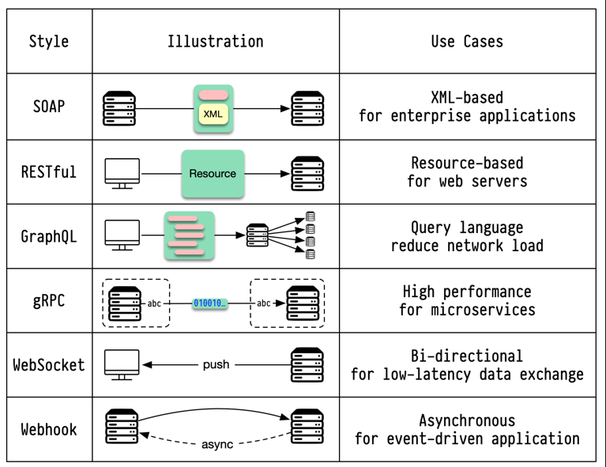
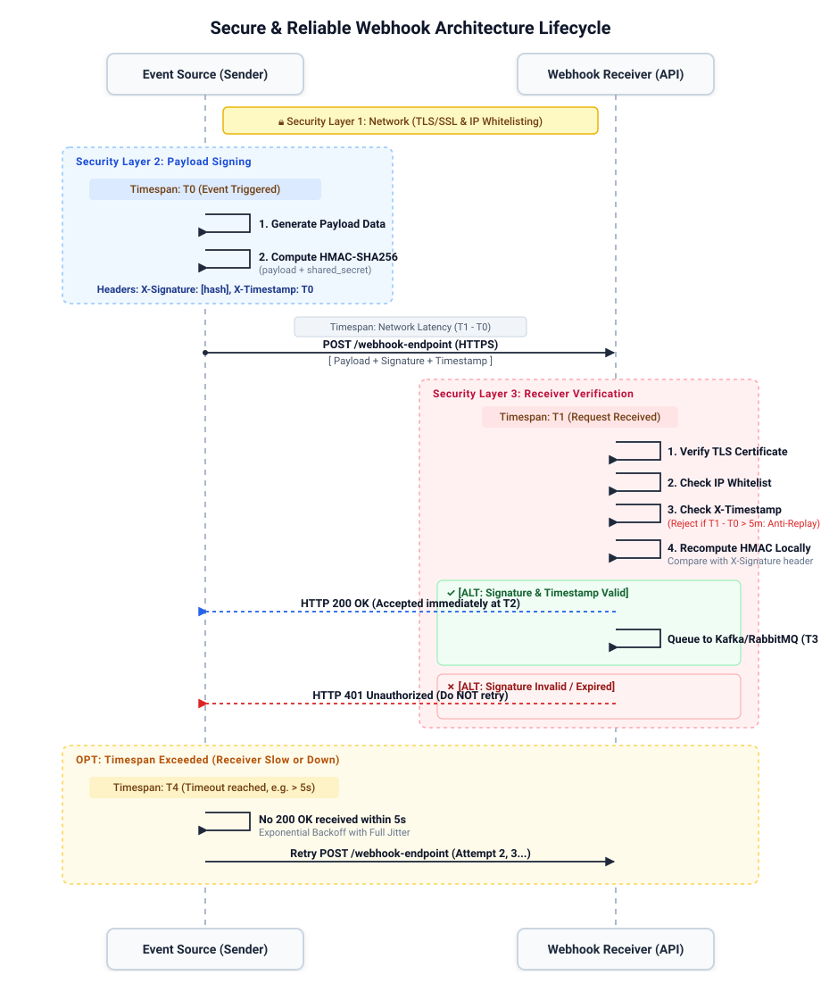

# এপিআই আর্কিটেকচার স্টাইল এবং কমিউনিকেশন প্রোটোকল (API Architecture Styles & Communication Protocols)

**এপিআই (Application Programming Interface)** হলো এমন কিছু নিয়ম, সংজ্ঞা এবং প্রোটোকলের সমন্বয় যা একটি সফটওয়্যার অ্যাপ্লিকেশনকে অন্য অ্যাপ্লিকেশনের সাথে যোগাযোগ ও ডেটা আদান-প্রদান করতে সক্ষম করে। ডিস্ট্রিবিউটেড সিস্টেম ডিজাইন এবং আর্কিটেকচারাল ইন্টারভিউতে সঠিক এপিআই আর্কিটেকচার স্টাইল এবং কমিউনিকেশন প্রোটোকল নির্বাচন করা একটি মৌলিক ও অত্যন্ত গুরুত্বপূর্ণ সিদ্ধান্ত।



---

## দ্রুত রেফারেন্স: আর্কিটেকচার এবং প্রোটোকল তুলনা (Comparison Matrix)

| প্রোটোকল / স্টাইল | ট্রান্সপোর্ট (Transport) | পে-লোড ফরম্যাট (Payload) | যোগাযোগের ধরন (Pattern) | সেরা ব্যবহারের ক্ষেত্র (Best Use Case) |
| :--- | :--- | :--- | :--- | :--- |
| **REST** | HTTP/1.1, HTTP/2 | JSON, XML | রিকোয়েস্ট-রেসপন্স (Stateless) | পাবলিক CRUD এপিআই, ওয়েব এবং মোবাইল ব্যাকএন্ড |
| **GraphQL** | HTTP/1.1, HTTP/2 | JSON | রিকোয়েস্ট-রেসপন্স, সাবস্ক্রিপশন | জটিল UI ফ্রন্টএন্ড, নমনীয় ও কাস্টম ডেটা কোয়েরি |
| **gRPC** | HTTP/2 | প্রোটোকল বাফার (Binary) | Unary, Server/Client/Bidi স্ট্রিমিং | উচ্চ-পারফরম্যান্স ইন্টারনাল মাইক্রোসার্ভিস, লো-লেটেন্সি IPC |
| **SOAP** | HTTP, SMTP, TCP | XML | রিকোয়েস্ট-রেসপন্স (কঠোর চুক্তি) | লিগ্যাসি এন্টারপ্রাইজ সিস্টেম, ব্যাংকিং, WS-Security |
| **WebSocket** | TCP (Upgraded HTTP) | টেক্সট, বাইনারি | ফুল-ডুপ্লেক্স দ্বিমুখী (Full-Duplex) | রিয়েল-টাইম চ্যাট, অনলাইন গেমিং, ফাইন্যান্সিয়াল ট্রেডিং |
| **SSE** | HTTP/1.1, HTTP/2 | প্লেইন টেক্সট (`text/event-stream`) | একমুখী (সার্ভার থেকে ক্লায়েন্ট) | লাইভ নোটিফিকেশন, LLM টোকেন স্ট্রিমিং (ChatGPT), স্টক ফিড |
| **Webhook** | HTTP POST | JSON, XML | ইভেন্ট-চালিত পুশ (অ্যাসিঙ্ক্রোনাস) | থার্ড-পার্টি ইভেন্ট নোটিফিকেশন (Stripe, GitHub, PayPal) |
| **Long-Polling** | HTTP/1.1 | JSON, XML | দীর্ঘায়িত রিকোয়েস্ট (Pseudo-stream) | ওয়েবসকেট সাপোর্ট না থাকলে রিয়েল-টাইম ফলব্যাক |
| **Short-Polling** | HTTP/1.1 | JSON, XML | নির্দিষ্ট সময় পর পর রিকোয়েস্ট | কম গুরুত্বপূর্ণ এবং দেরিতে আপডেট হলেও চলে এমন স্ট্যাটাস চেক |
| **MQTT** | TCP | কম্প্যাক্ট বাইনারি | পাবলিশ-সাবস্ক্রাইব (ব্রোকার ভিত্তিক) | IoT ডিভাইস, স্মার্ট হোম, দুর্বল বা লো-ব্যান্ডউইথ নেটওয়ার্ক |

---

## ১. REST (Representational State Transfer)

REST হলো একটি রিসোর্স-ভিত্তিক (Resource-oriented) আর্কিটেকচারাল স্টাইল, যেখানে প্রতিটি রিসোর্স একটি নির্দিষ্ট URI দ্বারা চিহ্নিত হয়। এটি ওয়েব এবং মোবাইল ব্যাকএন্ডের জন্য বহুল ব্যবহৃত স্ট্যান্ডার্ড এপিআই স্টাইল।

### মূল বৈশিষ্ট্যসমূহ (Core Principles):
- **স্টেটলেসনেস (Statelessness)**: ক্লায়েন্টের প্রতিটি রিকোয়েস্টে প্রসেস করার জন্য প্রয়োজনীয় সমস্ত অথেন্টিকেশন এবং স্টেট ডেটা উপস্থিত থাকতে হয়; সার্ভার কোনো ক্লায়েন্ট সেশন স্টোর করে রাখে না।
- **স্ট্যান্ডার্ড HTTP মেথডসমূহ**:
  - `GET`: রিসোর্স নিরাপদে পড়ার জন্য (Safe and Idempotent)।
  - `POST`: নতুন সাব-রিসোর্স তৈরি করার জন্য (Non-idempotent)।
  - `PUT`: সম্পূর্ণ রিসোর্স প্রতিস্থাপন করার জন্য (Idempotent)।
  - `PATCH`: রিসোর্সের আংশিক পরিমার্জন বা পরিবর্তনের জন্য।
  - `DELETE`: রিসোর্স মুছে ফেলার জন্য (Idempotent)।
- **ক্যাশেবিলিটি (Cacheability)**: `Cache-Control`, `ETag`, এবং `Last-Modified` হেডার ব্যবহার করে সহজে ব্রাউজার ও CDN লেভেলে ক্যাশিং কার্যকর করা যায়।
- **ইউনিফর্ম ইন্টারফেস (Uniform Interface)**: সামঞ্জস্যপূর্ণ রিসোর্স আইডেন্টিফায়ার (যেমন: `/api/v1/orders/123`)।

### সুবিধাসমূহ:
- সাধারণ ব্রাউজার ও টুলস (cURL, Postman) দিয়ে খুব সহজে বোঝা, তৈরি ও ডিবাগ করা যায়।
- স্টেটলেস আর্কিটেকচার এবং সিডিএন (CDN) ক্যাশিং লেয়ারের সাহায্যে উচ্চমাত্রায় স্কেল করা সম্ভব।

### সীমাবদ্ধতা ও দুর্বলতা:
- **ওভার-ফেচিং (Over-fetching)**: ক্লায়েন্টের নির্দিষ্ট ১-২টি ফিল্ডের প্রয়োজন হলেও পুরো রিসোর্স অবজেক্ট রেসপন্সে পাঠায়, যা ব্যান্ডউইথের অপচয় ঘটায়।
- **আন্ডার-ফেচিং এবং N+1 সমস্যা**: সম্পর্কিত ডেটা সংগ্রহের জন্য ক্লায়েন্টকে ক্রমান্বয়ে একাধিক এন্ডপয়েন্টে আলাদা নেটওয়ার্ক কল করতে হয় (যেমন: প্রথমে `/users/1`, এরপর `/users/1/orders`, এবং শেষে `/orders/99/items`)।

---

## ২. GraphQL

২০১২ সালে ফেসবুক কর্তৃক উদ্ভাবিত GraphQL হলো একটি শক্তিশালী কোয়েরি ল্যাঙ্গুয়েজ এবং সার্ভার-সাইড রানটাইম, যা ক্লায়েন্টকে **ঠিক যতটুকু ডেটা প্রয়োজন ততটুকুই চাওয়ার এবং তার অতিরিক্ত কিছুই না পাওয়ার** পূর্ণ ক্ষমতা দেয়।

### মূল ধারণাসমূহ (Core Concepts):
- **একক এন্ডপয়েন্ট (Single Endpoint)**: সম্পূর্ণ এপিআই সাধারণত একটি মাত্র এন্ডপয়েন্টে এক্সপোজ করা হয় (`POST /graphql`)।
- **স্কিমা ডেফিনিশন ল্যাঙ্গুয়েজ (SDL)**: স্ট্রংলি টাইপড স্কিমা দ্বারা অবজেক্ট টাইপ, ফিল্ড এবং তাদের মধ্যকার সম্পর্ক সংজ্ঞায়িত করা হয়।
- **অপারেশনসমূহ**:
  - `Query`: ডেটা রিড বা পড়ার জন্য (REST-এর GET-এর সমতুল্য)।
  - `Mutation`: ডেটা পরিবর্তন, তৈরি বা ডিলিট করার জন্য (POST, PUT, DELETE-এর সমতুল্য)।
  - `Subscription`: ওয়েবসকেটের মাধ্যমে সার্ভার থেকে ক্লায়েন্টে রিয়েল-টাইম পুশ নোটিফিকেশন পাওয়ার জন্য।

### সুবিধাসমূহ:
- একক নেটওয়ার্ক রাউন্ড-ট্রিপে **ওভার-ফেচিং** এবং **আন্ডার-ফেচিং** উভয় সমস্যারই নিখুঁত সমাধান করে।
- স্ট্রং টাইপ ব্যবস্থার কারণে ক্লায়েন্ট কোড (যেমন TypeScript ইন্টারফেস) স্বয়ংক্রিয়ভাবে জেনারেট করা যায়।
- ভার্শনিং ঝামেলা ছাড়াই এপিআই ইভলভ করা যায় (নতুন ফিল্ড যোগ করা বা পুরনো ফিল্ড ডেপ্রিকেট করা যায় `/v2` রিলিজ না করেই)।

### অসুবিধা ও চ্যালেঞ্জ:
- **জটিল ক্যাশিং**: সব রিকোয়েস্ট একই URL-এ `POST` মেথডে যাওয়ায় সাধারণ HTTP URL-ভিত্তিক ক্যাশিং কাজ করে না।
- **N+1 ডেটাবেস কোয়েরি সমস্যা**: ব্যাকএন্ড রেজলভারগুলো যদি অপ্টিমাইজড না হয়, তবে ডেটাবেসে $1 + N$ সংখ্যক অপ্রয়োজনীয় কোয়েরি চলতে পারে। এটি সমাধানের জন্য **DataLoader** প্যাটার্ন (ব্যাচিং এবং রিকোয়েস্ট-লেভেল মেমোইজেশন) ব্যবহার করতে হয়।
- **পারফরম্যান্স ও নিরাপত্তা ঝুঁকি**: অসৎ উদ্দেশ্যে বা অনিচ্ছাকৃতভাবে পাঠানো অতিরিক্ত জটিল বা রিকার্সিভ কোয়েরি ডেটাবেসকে ক্র্যাশ করাতে পারে। তাই কোয়েরি ডেপথ লিমিট (Depth Limiting) এবং কোয়েরি কমপ্লেক্সিটি অ্যানালাইসিস প্রয়োগ করা আবশ্যক।

---

## ৩. gRPC (Google Remote Procedure Call)

gRPC হলো গুগলের তৈরি একটি ওপেন-সোর্স, অত্যন্ত দ্রুতগতির এবং হাই-পারফরম্যান্স RPC ফ্রেমওয়ার্ক। এটি দূরবর্তী সার্ভারের মেথডকে এমনভাবে কল করতে সাহায্য করে যেন তা লোকাল মেমোরির ফাংশন কল।

### মূল বৈশিষ্ট্যসমূহ:
- **প্রোটোকল বাফার (Protobuf)**: টেক্সট-ভিত্তিক JSON/XML-এর পরিবর্তে বাইনারি সিরিয়ালাইজেশন ব্যবহার করে। ফলে পে-লোড সাইজ ৫ থেকে ১০ গুণ ছোট হয় এবং সিরিয়ালাইজেশন/ডিসিরিয়ালাইজেশন ৭ থেকে ১০ গুণ দ্রুত সম্পন্ন হয়।
- **HTTP/2 ট্রান্সপোর্টের সুবিধা**:
  - **মাল্টিপ্লেক্সিং (Multiplexing)**: হেড-অফ-লাইন ব্লকিং ছাড়াই একক TCP কানেকশনের ওপর একই সাথে একাধিক রিকোয়েস্ট ও রেসপন্স আদান-প্রদান করতে পারে।
  - বাইনারি ফ্রেমিং এবং HPACK হেডার কম্প্রেশন সাপোর্ট করে।
- **৪টি স্ট্রিমিং মোড (Four Streaming Modes)**:
  1. **Unary RPC**: একক রিকোয়েস্ট $\rightarrow$ একক রেসপন্স। ক্লায়েন্ট একটি সিঙ্গেল রিকোয়েস্ট পাঠায় এবং সার্ভার থেকে একটি সিঙ্গেল রেসপন্স ফেরত পায় (স্ট্যান্ডার্ড রিকোয়েস্ট-রেসপন্স মডেল)।
  2. **Server Streaming RPC**: একক রিকোয়েস্ট $\rightarrow$ রেসপন্সের অবিচ্ছিন্ন স্ট্রিম। ক্লায়েন্ট একটি রিকোয়েস্ট পাঠায় এবং সার্ভার ডেটা পাঠানো শেষ না করা পর্যন্ত স্ট্রিম আকারে একাধিক মেসেজ পাঠাতে থাকে।
  3. **Client Streaming RPC**: রিকোয়েস্টের স্ট্রিম $\rightarrow$ একক রেসপন্স। ক্লায়েন্ট একটি মেসেজ স্ট্রিম পাঠায়; সার্ভার পুরো স্ট্রিম প্রসেস করে শেষে একটি সামারি রেসপন্স রিটার্ন করে।
  4. **Bidirectional Streaming RPC**: উভয় দিক থেকেই একই সাথে স্বাধীন স্ট্রিম। ক্লায়েন্ট এবং সার্ভার উভয়ই একক কানেকশনের ওপর কোনো প্রকার ইন্টারাপশন ছাড়াই স্বাধীনভাবে রিয়েল-টাইমে মেসেজ স্ট্রিম পাঠাতে পারে।

### সেরা ব্যবহারের ক্ষেত্র:
- মাইক্রোসার্ভিস সমূহের নিজেদের মধ্যে ইন্টারনাল হাই-থ্রুপুট এবং লো-লেটেন্সি ইন্টার-প্রসেস কমিউনিকেশনের (IPC) জন্য।
- পলিগ্লট (বিভিন্ন প্রোগ্রামিং ভাষায় তৈরি) মাইক্রোসার্ভিস আর্কিটেকচারের জন্য।

### সীমাবদ্ধতা:
- সাধারণ ওয়েব ব্রাউজারে সরাসরি gRPC সাপোর্ট করে না (এর জন্য `gRPC-Web` প্রক্সি ব্যবহার করতে হয়)।
- পে-লোড বাইনারি হওয়ায় কোনো বিশেষ স্কিমা ডিকোডিং টুল ছাড়া সরাসরি মানুষের পক্ষে পড়া বা ডিবাগ করা সম্ভব নয়।

---

## ৪. SOAP (Simple Object Access Protocol)

SOAP হলো এক্সটেনসিবল মার্কআপ ল্যাঙ্গুয়েজ (XML) ভিত্তিক একটি অত্যন্ত কঠোর এবং স্ট্যান্ডার্ডাইজড মেসেজিং প্রটোকল স্পেসিফিকেশন। এটি সাধারণত HTTP, SMTP বা TCP প্রটোকলের ওপর কাজ করে।

### প্রধান উপাদানসমূহ:
- **WSDL (Web Services Description Language)**: একটি সুনির্দিষ্ট XML কন্ট্রাক্ট যা সার্ভিসে কী কী মেথড আছে, কী প্যারামিটার গ্রহণ করে এবং কী ডেটা টাইপ ফেরত দেয় তা কঠোরভাবে সংজ্ঞায়িত করে।
- **WS-Security**: এন্টারপ্রাইজ-গ্রেড নিরাপত্তা স্ট্যান্ডার্ড যা মেসেজ-লেভেল এনক্রিপশন, ডিজিটাল সিগনেচার এবং টোকেন-ভিত্তিক অথেনটিকেশন প্রদান করে।
- **ACID ট্রানজাকশন সাপোর্ট**: WS-AtomicTransaction-এর মাধ্যমে ডিস্ট্রিবিউটেড ACID ট্রানজাকশন নিশ্চিত করে।

### ব্যবহারের ক্ষেত্র:
- ব্যাংকিং সিস্টেম, পেমেন্ট ট্রানজাকশন গেটওয়ে, হেলথকেয়ার সিস্টেম এবং লিগ্যাসি এন্টারপ্রাইজ প্ল্যাটফর্ম যেখানে সর্বোচ্চ কমপ্লায়েন্স ও ট্রানজাকশনাল গ্যারান্টি প্রয়োজন।

### অসুবিধা:
- ভার্বোস XML সিনট্যাক্সের কারণে অতিরিক্ত ব্যান্ডউইথ খরচ হয়।
- আধুনিক REST/JSON-এর তুলনায় পার্সিং ওভারহেড বেশি এবং এটি অত্যন্ত অনমনীয় (Rigid)।

---

## ৫. ওয়েবহুক (Webhook - Reverse API / Event-Driven Push)

**ওয়েবহুক (Webhook)** হলো একটি স্বয়ংক্রিয় HTTP `POST` নোটিফিকেশন মেকানিজম, যার মাধ্যমে সোর্স সিস্টেমে কোনো নির্দিষ্ট ইভেন্ট ঘটার সাথে সাথে তা গন্তব্য সিস্টেমের হ্যান্ডলারে ডেটা পুশ করে দেয়। সাধারণ পোলিংয়ের বিপরীত হওয়ায় একে প্রায়শই "Reverse API" বলা হয়।

### সিকিউরিটি এবং লাইফসাইকেল আর্কিটেকচার:



### সুবিধাসমূহ:
1. **তাৎক্ষণিক ডেটা ট্রান্সফার**: কোনো পোলিং লেটেন্সি ছাড়াই ইভেন্ট তৈরি হওয়া মাত্রই ডেটা পৌঁছে যায়।
2. **সার্ভার লোড হ্রাস**: খালি পোলিং রিকোয়েস্টের নেটওয়ার্ক ব্যান্ডউইথ ও সার্ভার সিপিইউ অপচয় বন্ধ করে।

### রিলায়েবিলিটি এবং সিকিউরিটি ইনভ্যারিয়েন্ট:
1. **সিগনেচার ভেরিফিকেশন (HMAC-SHA256)**: রিকোয়েস্ট স্পুফিং বা জালিয়াতি রোধ করতে হেডারের সিক্রেট সিগনেচার (যেমন: `X-Signature`) যাচাই করতে হবে।
2. **আইডেমপোটেন্সি (Idempotency)**: নেটওয়ার্ক রিট্রাই বা ফেইলিউরের কারণে ওয়েবহুক একাধিকবার আসতে পারে (At-least-once delivery)। তাই রিসিভার হ্যান্ডলারকে ইউনিক ইভেন্ট আইডি (`eventId`) দিয়ে ডুপ্লিকেট প্রসেসিং প্রতিরোধ করতে হবে।
3. **অ্যাসিঙ্ক্রোনাস ইনজেশন**: ওয়েবহুক হ্যান্ডলারের ভেতরে কখনো সরাসরি ভারী কাজ (যেমন ইমেল পাঠানো বা জটিল রিপোর্ট জেনারেট করা) করা যাবে না। তৎক্ষণাৎ মেসেজ কিউতে (Kafka, RabbitMQ, SQS) পুশ করে দ্রুত `200 OK` রিটার্ন করতে হবে।
4. **রিকনসিলিয়েশন (Reconciliation)**: নেটওয়ার্ক সম্পূর্ণ বিচ্ছিন্ন থাকার কারণে মিস হয়ে যাওয়া ওয়েবহুক শনাক্ত করতে নিয়মিত ব্যাকগ্রাউন্ড ব্যাচ রিকনসিলিয়েশন জব চালু রাখতে হবে।

---

## ৬. ওয়েবসকেট (WebSocket - Full-Duplex Bidirectional)

ওয়েবসকেট একটি দীর্ঘমেয়াদী, একক TCP কানেকশনের ওপর উভয়মুখী (Full-Duplex) তাৎক্ষণিক ডেটা আদান-প্রদানের নির্ভরযোগ্য চ্যানেল প্রদান করে (RFC 6455)।

### লাইফসাইকেল এবং কাজের ধাপসমূহ:
1. **HTTP হ্যান্ডশেক**: ক্লায়েন্ট প্রথমে একটি সাধারণ HTTP GET রিকোয়েস্ট পাঠায় যার হেডারে কানেকশন আপগ্রেড করার অনুরোধ থাকে:
   ```http
   Connection: Upgrade
   Upgrade: websocket
   Sec-WebSocket-Key: dGhlIHNhbXBsZSBub25jZQ==
   ```
2. **সার্ভার রেসপন্স**: সার্ভার সম্মত হলে `HTTP 101 Switching Protocols` স্ট্যাটাস কোড দিয়ে রেসপন্স পাঠায়।
3. **বাইনারি/টেক্সট ফ্রেম**: হ্যান্ডশেক সম্পন্ন হওয়ার পর কোনো HTTP হেডার ওভারহেড ছাড়াই মাত্র ২ থেকে ১০ বাইটের অতি ক্ষুদ্র ফ্রেমে যেকোনো সময় উভয় পক্ষই ডেটা পাঠাতে পারে।
4. **হার্টবিট (Ping/Pong)**: মধ্যবর্তী প্রক্সি বা লোড ব্যালেন্সার যাতে অলস কানেকশন কেটে না দেয়, সেজন্য নিয়মিত পিং-পং ফ্রেম আদান-প্রদান করা হয়।

### সেরা ব্যবহারের ক্ষেত্র:
- কোলাবোরেটিভ এডিটিং টুলস (Google Docs, Figma), রিয়েল-টাইম অনলাইন মাল্টিপ্লেয়ার গেমিং, লাইভ চ্যাট অ্যাপ্লিকেশন এবং ফাইন্যান্সিয়াল স্টক ও ক্রিপ্টো ট্রেডিং প্ল্যাটফর্ম।

---

## ৭. সার্ভার-সেন্ট ইভেন্টস (Server-Sent Events - SSE)

Server-Sent Events (SSE) হলো HTML5 স্ট্যান্ডার্ডের একটি সহজ ওয়েব প্রযুক্তি, যা ক্লায়েন্টকে একটি দীর্ঘস্থায়ী সাধারণ HTTP কানেকশন ওপেন করে সার্ভার থেকে ডেটা পুশ পাওয়ার সুযোগ দেয়।

### ওয়েবসকেটের সাথে মূল পার্থক্যসমূহ:
- **একমুখী (Unidirectional)**: শুধুমাত্র সার্ভার ক্লায়েন্টকে ডেটা পাঠাতে পারে; ক্লায়েন্ট এই স্ট্রিম দিয়ে কোনো মেসেজ পাঠায় না।
- **স্ট্যান্ডার্ড HTTP ট্রান্সপোর্ট**: এটি সাধারণ HTTP (`Content-Type: text/event-stream`) ব্যবহার করে, ফলে যেকোনো কর্পোরেট ফায়ারওয়াল, রিভার্স প্রক্সি এবং HTTP/2 মাল্টিপ্লেক্সিংয়ের মধ্য দিয়ে অনায়াসে কাজ করে।
- **ন্যাটিভ ব্রাউজার সাপোর্ট**: আধুনিক সকল ব্রাউজারে ইনবিল্ট `EventSource` জাভাস্ক্রিপ্ট এপিআই থাকে।
- **অটোমেটিক রিকানেকশন**: কানেকশন ড্রপ হলে ব্রাউজার নিজে থেকেই `Last-Event-ID` হেডার সহ পুনরায় রিকানেক্ট করে মিস হওয়া ইভেন্ট সংগ্রহ করে।

### জনপ্রিয় ব্যবহারের ক্ষেত্র:
- **LLM / AI টোকেন স্ট্রিমিং**: ChatGPT বা আধুনিক AI যেভাবে একের পর এক শব্দ স্ক্রিনে লাইভ স্ট্রিম করে।
- লাইভ স্টক মার্কেট টিকার, স্পোর্টস লাইভ স্কোরবোর্ড, সোশ্যাল মিডিয়া অ্যাক্টিভিটি নোটিফিকেশন।

---

## ৮. পোলিং: শর্ট পোলিং বনাম লং পোলিং (Polling Comparison)

| বৈশিষ্ট্য | শর্ট পোলিং (Short Polling) | লং পোলিং (Long Polling) |
| :--- | :--- | :--- |
| **কাজের ধরন** | ক্লায়েন্ট নির্দিষ্ট বিরতিতে (যেমন প্রতি ১-২ সেকেন্ডে) বারবার রিকোয়েস্ট পাঠায়। | ক্লায়েন্ট রিকোয়েস্ট পাঠিয়ে কানেকশন ধরে রাখে; নতুন ডেটা এলে বা টাইমআউট হলে সার্ভার রেসপন্স দেয়। |
| **লেটেন্সি (Latency)** | বেশি (পরবর্তী পোলিং সাইকেল না আসা পর্যন্ত ইউজারকে অপেক্ষা করতে হয়)। | খুব কম (সার্ভারে ডেটা আসা মাত্রই তৎক্ষণাৎ ক্লায়েন্টকে রেসপন্স পাঠানো হয়)। |
| **সার্ভার ওভারহেড** | অত্যন্ত বেশি (৯৫%+ রিকোয়েস্টে কোনো নতুন ডেটা থাকে না, ফলে খালি রেসপন্স আসে)। | মাঝারি (সার্ভারে দীর্ঘ সময় অনেকগুলো কানেকশন সকেট ওপেন রাখতে হয়)। |
| **কানেকশন মডেল** | প্রতিটি রেসপন্সের পর সাথে সাথে কানেকশন ক্লোজ হয়ে যায়। | প্রতিটি রেসপন্স পাওয়ার সাথে সাথে ক্লায়েন্ট আবার নতুন রিকোয়েস্ট পাঠায়। |
| **ব্যবহারের ক্ষেত্র** | কম গুরুত্বপূর্ণ স্ট্যাটাস চেক যেখানে রিয়েল-টাইম লাইভ আপডেটের দরকার নেই। | যেসব পরিবেশে বা প্রক্সিতে ওয়েবসকেট বা SSE ব্লক করা থাকে সেখানে রিয়েল-টাইম ফলব্যাক হিসেবে। |

---

## ৯. MQTT (Message Queuing Telemetry Transport)

MQTT হলো একটি অত্যন্ত হালকা (Lightweight) পাবলিশ-সাবস্ক্রাইব ভিত্তিক নেটওয়ার্ক প্রোটোকল, যা বিশেষভাবে সীমাবদ্ধ মেমোরি, লো-ব্যান্ডউইথ এবং অস্থির বা দুর্বল নেটওয়ার্কের ডিভাইসের (IoT) জন্য তৈরি।

### মূল আর্কিটেকচার:
- **ব্রোকার-ভিত্তিক পাব/সাব**: ক্লায়েন্টরা কোনো হায়ারার্কিকাল টপিকে (যেমন: `sensors/temp/room1`) মেসেজ পাবলিশ করে এবং সাবস্ক্রাইবাররা সেই টপিক ফিল্টার অনুযায়ী মেসেজ গ্রহণ করে।
- **ক্ষুদ্রতম প্যাকেট ওভারহেড**: ফিক্সড হেডার মাত্র **২ বাইটের**, যা ব্যাটারি চালিত আইওটি ডিভাইসের জন্য অত্যন্ত উপযোগী।
- **কোয়ালিটি অফ সার্ভিস (QoS) লেভেলসমূহ**:
  - **QoS 0 (সর্বোচ্চ একবার / At most once)**: ফায়ার-অ্যান্ড-ফরগেট; মেসেজ পৌঁছানোর কোনো স্বীকৃতি বা নিশ্চয়তা নেই।
  - **QoS 1 (কমপক্ষে একবার / At least once)**: অ্যাকনলেজমেন্টের মাধ্যমে মেসেজ পৌঁছানো নিশ্চিত করা হয়, তবে ডুপ্লিকেট হতে পারে।
  - **QoS 2 (ঠিক একবার / Exactly once)**: ৪-ধাপের বিশেষ হ্যান্ডশেকের মাধ্যমে নিশ্চিত করা হয় যে মেসেজ ডুপ্লিকেট ছাড়াই ঠিক একবারই পৌঁছাবে।
- **লাস্ট উইল অ্যান্ড টেস্টামেন্ট (LWT)**: কোনো ডিভাইস অপ্রত্যাশিতভাবে নেটওয়ার্ক থেকে বিচ্ছিন্ন হলে ব্রোকার স্বয়ংক্রিয়ভাবে অন্যান্য সাবস্ক্রাইবারদের সতর্কবার্তা পাঠিয়ে দেয়।

---

## ১০. মেসেজ ব্রোকার এবং ইভেন্ট স্ট্রিমিং (Message Brokers & Event Streaming)

বৃহৎ ডিস্ট্রিবিউটেড মাইক্রোসার্ভিস আর্কিটেকচারে সিঙ্ক্রোনাস রিকোয়েস্ট-রেসপন্স এপিআই-এর ওপর চাপ কমাতে মেসেজ কিউ এবং ইভেন্ট স্ট্রিমিং প্ল্যাটফর্ম অপরিহার্য ভূমিকা পালন করে।

### পয়েন্ট-টু-পয়েন্ট মেসেজ কিউ (যেমন: RabbitMQ, AWS SQS):
- প্রোডিউসার কিউতে মেসেজ পুশ করে; নির্দিষ্ট একটি মেসেজ শুধুমাত্র **একজন ওয়ার্কার বা কনজিউমারই** প্রসেস করে।
- ভারী ব্যাকগ্রাউন্ড জব (যেমন: ভিডিও ট্রান্সকোডিং, ইনভয়েস পিডিএফ তৈরি, বাল্ক ইমেইল পাঠানো) মূল রিকোয়েস্ট পাথ থেকে আলাদা করতে ব্যবহৃত হয়।

### ইভেন্ট স্ট্রিমিং / লগ-ভিত্তিক আর্কিটেকচার (যেমন: Apache Kafka, Redpanda):
- অ্যাপেন্ড-অনলি, পার্টিশনড ডিস্ট্রিবিউটেড কমিট লগ।
- **পাবলিশ-সাবস্ক্রাইব মডেল**: একাধিক স্বাধীন কনজিউমার গ্রুপ একই ডেটা স্ট্রিম নিজেদের সুবিধাজনক গতিতে স্বাধীনভাবে কনজিউম করতে পারে।
- প্রতি সেকেন্ডে লাখ লাখ ইভেন্ট হ্যান্ডেল করার ক্ষমতা, ডেটা রি-প্লে বা পুনরায় প্লেব্যাক করার সুবিধা এবং স্টেটফুল স্ট্রিম প্রসেসিং সাপোর্ট করে।

---

## ১১. HTTP প্রটোকলের বিবর্তন: HTTP/1.1 vs HTTP/2 vs HTTP/3

| বৈশিষ্ট্য | HTTP/1.1 (1997) | HTTP/2 (2015) | HTTP/3 (2022) |
| :--- | :--- | :--- | :--- |
| **ট্রান্সপোর্ট লেয়ার** | TCP | TCP | **QUIC (UDP-এর ওপর)** |
| **মাল্টিপ্লেক্সিং** | নেই (হেড-অফ-লাইন ব্লকিং সমস্যা) | আছে (একক TCP কানেকশনে বাইনারি স্ট্রিম) | **সম্পূর্ণ মুক্ত** (প্রতিটি স্ট্রিম সম্পূর্ণ স্বাধীন) |
| **প্যাকেট লসের প্রভাব** | নির্দিষ্ট কানেকশনে আটকে থাকে | একটি প্যাকেট হারালে TCP ব্লকিংয়ে সব স্ট্রিম থেমে যায় | **শূন্য হেড-অফ-লাইন ব্লকিং** (অন্যান্য স্ট্রিম স্বাভাবিক গতিতে চলে) |
| **ফরম্যাট** | প্লেইন টেক্সট | বাইনারি ফ্রেমিং | বাইনারি ফ্রেমিং |
| **হেডার কম্প্রেশন** | নেই | HPACK | QPACK |
| **হ্যান্ডশেক লেটেন্সি** | TCP + TLS (২-৩ RTT সময় নেয়) | TCP + TLS (২-৩ RTT সময় নেয়) | **0-RTT অথবা 1-RTT অতি দ্রুত কানেকশন** |
| **কানেকশন মাইগ্রেশন** | আইপি বদলালে (WiFi $\rightarrow$ 4G) কানেকশন ড্রপ করে | আইপি বদলালে কানেকশন ড্রপ করে | **Connection ID দিয়ে নিরবচ্ছিন্ন মাইগ্রেশন** |

---

## ১২. কমিউনিকেশন প্রটোকল নির্বাচনের ডিসিশন ফ্রেমওয়ার্ক (Decision Framework)

সিস্টেম ডিজাইন ইন্টারভিউতে যখন কোনো নির্দিষ্ট রিকোয়ারমেন্টের জন্য প্রোটোকল নির্বাচন করতে বলা হবে, তখন নিচের ডিসিশন ট্রি অনুসরণ করুন:

```
আপনার কি রিয়েল-টাইম যোগাযোগের প্রয়োজন?
 ├── না  ──► স্ট্যান্ডার্ড REST অথবা GraphQL
 └── হ্যাঁ
      ├── উভয় পক্ষ থেকেই কি ঘন ঘন ডেটা আদান-প্রদান হয় (Bidirectional)?
      │    ├── হ্যাঁ ──► WebSocket (চ্যাট, মাল্টিপ্লেয়ার গেমিং, হোয়াইটবোর্ড)
      │    └── না   (শুধুমাত্র সার্ভার থেকে ক্লায়েন্টে ডেটা পুশ দরকার)
      │         ├── ব্রাউজার-বান্ধব সহজ লাইভ স্ট্রিমিং চাই? ──► Server-Sent Events (SSE) (ChatGPT, স্টক এলার্ট)
      │         └── সিস্টেম-টু-সিস্টেম থার্ড-পার্টি ইভেন্ট নোটিফিকেশন? ──► Webhook
      ├── এটি কি ব্যাটারি বা রিসোর্স সীমাবদ্ধ IoT ডিভাইস? ──► MQTT
      └── এটি কি ইন্টারনাল হাই-স্পিড মাইক্রোসার্ভিস যোগাযোগ? ──► gRPC
```
