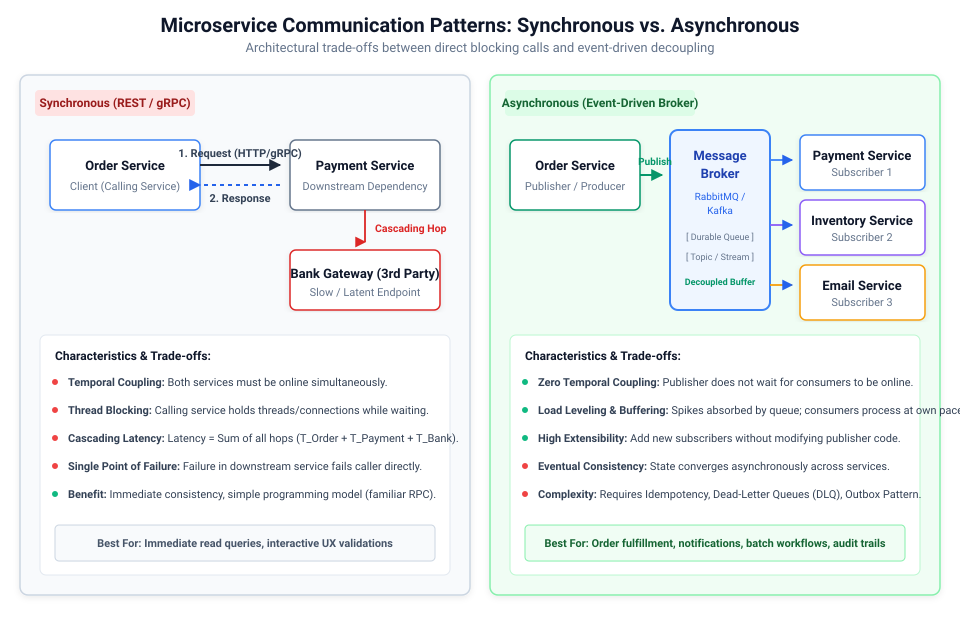
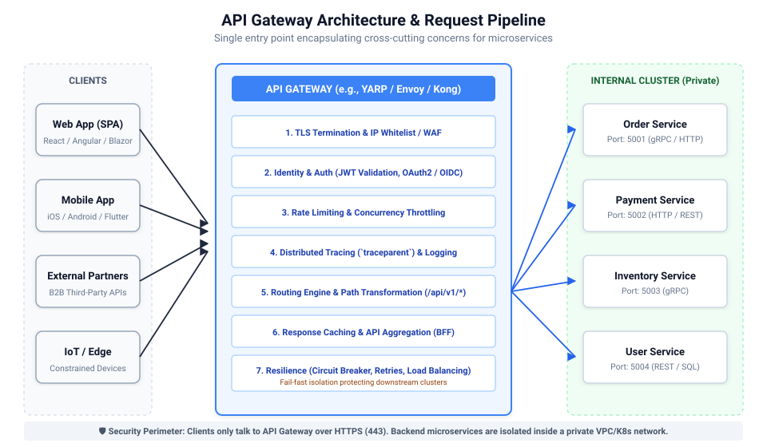
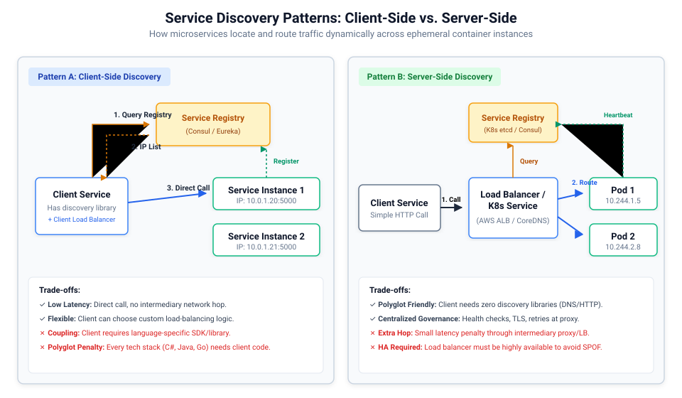
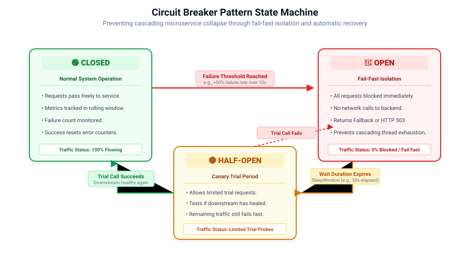
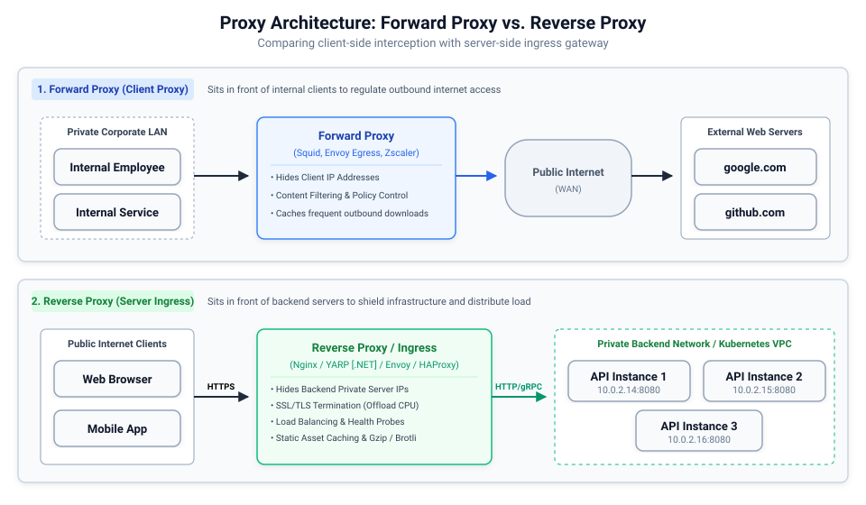
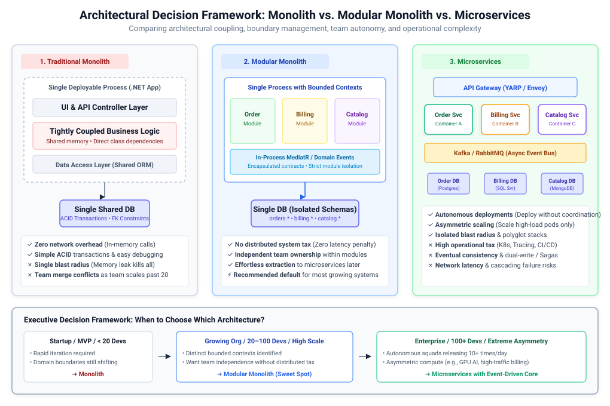

# মাইক্রোসার্ভিস কমিউনিকেশন আর্কিটেকচার ও রেজিলিয়েন্স প্যাটার্নস (Microservice Communication Architecture & Resilience Patterns)

মাইক্রোসার্ভিস আর্কিটেকচারে একটি মনোলিথিক সিস্টেমকে একাধিক স্বাধীন সার্ভিসে বিভক্ত করলে মেমরি-অভ্যন্তরীণ ফাংশন কলের পরিবর্তে নেটওয়ার্ক কলের মাধ্যমে যোগাযোগ (Communication) সম্পন্ন হয়। এর ফলে সিস্টেমে লেটেন্সি (Latency), আংশিক ব্যর্থতা (Partial Failure), নেটওয়ার্ক পার্টিশন এবং ডেটা কনসিস্টেন্সি সংক্রান্ত জটিলতা তৈরি হয়। একটি নির্ভরযোগ্য ডিস্ট্রিবিউটেড সিস্টেম ডিজাইনের জন্য সঠিক কমিউনিকেশন প্রোটোকল, রাউটিং টপোলজি এবং রেজিলিয়েন্স মেকানিজম নির্বাচন করা অপরিহার্য।



---

## ১. মূল কমিউনিকেশন প্যারাডাইম: সিঙ্ক্রোনাস বনাম অ্যাসিঙ্ক্রোনাস (Synchronous vs. Asynchronous)

| আর্কিটেকচারাল ডাইমেনশন | সিঙ্ক্রোনাস কমিউনিকেশন (REST / gRPC) | অ্যাসিঙ্ক্রোনাস কমিউনিকেশন (AMQP / Kafka) |
| :--- | :--- | :--- |
| **কাপলিং ধরণ (Coupling Type)** | **টেম্পোরাল ও স্পেশিয়াল কাপলিং**: কলার (Caller) এবং রিসিভার (Receiver) উভয়কেই একই সময়ে সচল ও নেটওয়ার্কে কানেক্টেড থাকতে হয়। | **সম্পূর্ণ ডিকাপল্ড (Decoupled)**: কলার মেসেজ ব্রোকারে ইভেন্ট পাঠিয়ে তাৎক্ষণিকভাবে পরবর্তী কাজের জন্য মুক্ত হয়ে যায়। |
| **থ্রেড ম্যানেজমেন্ট (Thread Model)** | রেসপন্স না পাওয়া পর্যন্ত কলারের থ্রেড/কানেকশন ব্লক বা অপেক্ষারত অবস্থায় থাকে (I/O Bound)। | নন-ব্লকিং ফায়ার-অ্যান্ড-ফরগেট; কলারের থ্রেড তাৎক্ষণিকভাবে রিলিজ হয়ে যায়। |
| **কনসিস্টেন্সি মডেল (Consistency)** | তাৎক্ষণিক স্ট্রং কনসিস্টেন্সি (Immediate Strong Consistency) অথবা ব্যর্থতার তাত্ক্ষণিক ফিডব্যাক। | ইভেনচুয়াল কনসিস্টেন্সি (Eventual Consistency); সময়ের ব্যবধানে ডেটা সামঞ্জস্যপূর্ণ হয়। |
| **লেটেন্সি প্রোফাইল (Latency)** | পয়েন্ট-টু-পয়েন্ট লেটেন্সি কম, তবে একাধিক হপে **ক্যাসকেডিং লেটেন্সি** ($T_{total} = \sum T_{hop}$)। | কলারের লেটেন্সি নগণ্য; তবে এন্ড-টু-এন্ড প্রসেসিংয়ে কিছু ডেলিভারি ডিলে হতে পারে। |
| **ব্যর্থতার প্রভাব (Blast Radius)** | ডাউনস্ট্রিম সার্ভিসের ব্যর্থতা পুরো আপস্ট্রিম সিস্টেমে ক্যাসকেডিং ফেইলিউর ও থ্রেড এক্সহশন ঘটায়। | সম্পূর্ণ আইসোলেটেড: ডাউনস্ট্রিম সার্ভিস ডাউন থাকলেও ব্রোকারে মেসেজ জমা থাকে। |
| **ব্যবহার ক্ষেত্র (Best Use Cases)** | ইন্টারঅ্যাক্টিভ রিড কুয়েরি, রিয়েল-টাইম ইউজার ভ্যালিডেশন। | অর্ডার প্রসেসিং, পেমেন্ট নোটিফিকেশন, ব্যাকগ্রাউন্ড ব্যাচ প্রসেসিং, অডিট লগিং। |

---

## ২. সিঙ্ক্রোনাস কমিউনিকেশন: REST এবং gRPC (Synchronous Communication)

সিঙ্ক্রোনাস কমিউনিকেশনে ক্লায়েন্ট বা কলার সার্ভিস একটি রিকোয়েস্ট পাঠায় এবং রেসপন্স না পাওয়া পর্যন্ত অথবা টাইমআউট না হওয়া পর্যন্ত তার স্বাভাবিক এক্সিকিউশন স্থগিত রাখে।

### সিঙ্ক্রোনাস চেইনের ঝুঁকি ও সীমাবদ্ধতা:
১. **টেম্পোরাল কাপলিং (Temporal Coupling)**: যদি সার্ভিস A সার্ভিস B-কে কল করে এবং সার্ভিস B সার্ভিস C-কে কল করে, তবে তিনটি সার্ভিসকেই একই মুহূর্তে সচল থাকতে হবে। সিস্টেমের সামগ্রিক অ্যাভেইলেবিলিটি প্রতিটি সার্ভিসের গুণফল হয়ে দাঁড়ায়: $A_{sys} = A_1 	imes A_2 	imes A_3$।
২. **ক্যাসকেডিং ফেইলিউর (Cascading Failures)**: সার্ভিস C ধীরগতির হলে সার্ভিস B-এর কানেকশন পুল পূর্ণ হয়ে যাবে, যার ফলে সার্ভিস A-এর থ্রেড পুল নিঃশেষ হয়ে সম্পূর্ণ অ্যাপ্লিকেশন ক্র্যাশ করবে।
৩. **লেটেন্সি বৃদ্ধি (Latency Amplification)**: প্রতিটি নেটওয়ার্ক হপ এবং প্রসেসিং সময়ের যোগফলের সমান হয় ক্লায়েন্টের মোট অপেক্ষার সময়।

### gRPC (Google Remote Procedure Call)
gRPC হলো একটি উচ্চ-ক্ষমতাসম্পন্ন ওপেন সোর্স RPC ফ্রেমওয়ার্ক যা ট্রান্সপোর্ট হিসেবে **HTTP/2** এবং সিরিয়ালাইজেশন ও ইন্টারফেস বর্ণনার জন্য **Protocol Buffers (Protobuf)** ব্যবহার করে।

#### সুবিধাসমূহ (Benefits):
- **উচ্চ থ্রুপুট ও সর্বনিম্ন লেটেন্সি**: প্রোটোবাফ বাইনারি সিরিয়ালাইজেশন JSON-এর তুলনায় ৫-১০ গুণ দ্রুত এবং প্রায় ৮০% কম ব্যান্ডউইথ ব্যবহার করে।
- **HTTP/2 মাল্টিপ্লেক্সিং (Multiplexing)**: একটিমাত্র TCP কানেকশনের ওপর দিয়ে একই সাথে অসংখ্য রিকোয়েস্ট ও রেসপন্স স্ট্রিম আদান-প্রদান করা যায়।
- **স্ট্রংলি-টাইপড ইন্টারফেস কন্ট্রাক্ট**: `.proto` ফাইলটি বিভিন্ন ভাষায় তৈরি মাইক্রোসার্ভিসগুলোর মধ্যে কম্পাইল-টাইম টাইপ সেফটি নিশ্চিত করে।
- **নেটিভ স্ট্রিমিং সাপোর্ট**: Unary, Server Streaming, Client Streaming এবং Bi-directional Streaming সরাসরি সাপোর্ট করে।

#### সীমাবদ্ধতা ও ট্রেড-অফ (Drawbacks & Trade-offs):
- **হিউম্যান রিডেবিলিটির অভাব**: বাইনারি ফরম্যাট হওয়ায় সাধারণ ব্রাউজার বা নেটওয়ার্ক লগে সরাসরি ডেটা দেখা যায় না; ডিবাগিংয়ের জন্য `grpcurl` জাতীয় বিশেষ টুল প্রয়োজন হয়।
- **ব্রাউজার সীমাবদ্ধতা**: সাধারণ ওয়েব ব্রাউজার সরাসরি স্ট্যান্ডার্ড gRPC ফ্রেম পাঠাতে পারে না; ফলে ওয়েব ক্লায়েন্টের জন্য `grpc-web` ও প্রক্সি গেটওয়ের প্রয়োজন হয়।
- **কঠোর স্কিমা রূপান্তর**: ফিল্ড নম্বর পরিবর্তন করলে ব্যাকওয়ার্ড ও ফরোয়ার্ড কম্প্যাটিবিলিটি নষ্ট হয়।

#### .NET / C#-এর জন্য টার্গেট টেকনোলজি ও NuGet প্যাকেজ:
- `Grpc.AspNetCore` (সার্ভার-সাইড gRPC ইঞ্জিন)
- `Grpc.Net.ClientFactory` (রেজিলিয়েন্ট gRPC ক্লায়েন্ট ফ্যাক্টরি ও কানেকশন পুলিং)
- `Google.Protobuf` (বাইনারি সিরিয়ালাইজেশন ইঞ্জিন)

#### প্রডাকশন-গ্রেড ন্যূনতম C# কোড উদাহরণ:
```csharp
// Program.cs - .NET 8+-এ রেজিলিয়েন্ট gRPC ক্লায়েন্ট কনফিগারেশন ও ব্যবহার
using Grpc.Net.ClientFactory;
using OrderService.Protos;

var builder = WebApplication.CreateBuilder(args);

// HTTP/2 এবং স্ট্যান্ডার্ড রেজিলিয়েন্স হ্যান্ডলারসহ gRPC ক্লায়েন্ট রেজিস্টার করা
builder.Services.AddGrpcClient<PaymentProtoService.PaymentProtoServiceClient>(options =>
{
    options.Address = new Uri("https://payment-service.internal:5001");
})
.AddStandardResilienceHandler(); // স্বয়ংক্রিয় Polly টাইমআউট, রিট্রাই ও সার্কিট ব্রেকার যুক্ত করে

var app = builder.Build();

app.MapPost("/checkout", async (PaymentProtoService.PaymentProtoServiceClient client, CancellationToken ct) =>
{
    // কঠোর টাইমআউট বা ডেডলাইনসহ gRPC কল এক্সিকিউট করা
    using var cts = CancellationTokenSource.CreateLinkedTokenSource(ct);
    cts.CancelAfter(TimeSpan.FromSeconds(3));

    var response = await client.ProcessPaymentAsync(
        new PaymentRequest { OrderId = "ORD-9876", Amount = 149.99 },
        cancellationToken: cts.Token
    );

    return Results.Ok(new { response.TransactionId, response.Status });
});

app.Run();
```

---

## ৩. অ্যাসিঙ্ক্রোনাস ও ইভেন্ট-ড্রিভেন কমিউনিকেশন (Event-Driven Architecture)

অ্যাসিঙ্ক্রোনাস কমিউনিকেশনে সার্ভিসগুলো সরাসরি একে অপরকে কল না করে একটি মেসেজ ব্রোকার (Message Broker - যেমন RabbitMQ, Apache Kafka, Azure Service Bus)-এ ইভেন্ট পাবলিশ এবং কিউ থেকে মেসেজ কনজিউম করার মাধ্যমে যোগাযোগ রক্ষা করে।

### টপোলজি ধরণ:
- **পয়েন্ট-টু-পয়েন্ট কিউ (Point-to-Point Queue - 1:1)**: একটি মেসেজ শুধুমাত্র একটি নির্দিষ্ট কনজিউমার প্রসেস করে (যেমন RabbitMQ Standard Queue, AWS SQS)।
- **পাবলিশ/সাবস্ক্রাইব টপিক (Pub/Sub Topic - 1:N)**: পাবলিশ করা একটি ইভেন্ট একাধিক স্বাধীন সাবস্ক্রাইবার সার্ভিস তাদের নিজস্ব গতিতে গ্রহণ ও প্রসেস করে (যেমন Kafka Topics, RabbitMQ Fanout/Topic Exchange)।

### ডুয়াল-রাইট সমস্যা ও ট্রানজ্যাকশনাল আউটবক্স প্যাটার্ন (Transactional Outbox Pattern)
ডিস্ট্রিবিউটেড সিস্টেমে লোকাল ডাটাবেজে রেকর্ড সেভ করা এবং একই সাথে ব্রোকারে মেসেজ পাঠানো একটি মারাত্মক ঝুঁকি তৈরি করে। যেকোনো একটি ব্যর্থ হলে ডেটা অসামঞ্জস্যপূর্ণ হয়ে যায়। **Transactional Outbox Pattern** এই সমস্যার সমাধান দেয়:
১. মূল বিজনেস ডেটা এবং আউটবক্স মেসেজটি ডাটাবেজের একই লোকাল ট্রানজ্যাকশনের মধ্যে সেভ করা হয়।
২. একটি পৃথক ব্যাকগ্রাউন্ড প্রসেসর আউটবক্স টেবিল থেকে মেসেজ পড়ে নির্ভরযোগ্যভাবে ব্রোকারে পাবলিশ করে।

### আর্কিটেকচারাল প্যাটার্ন: MassTransit ও Outbox সহ ইভেন্ট-ড্রিভেন মেসেজিং

#### সুবিধাসমূহ (Benefits):
- **টেম্পোরাল ডিকাপলিং (Temporal Decoupling)**: কনজিউমার সার্ভিস সম্পূর্ণ ডাউন থাকলেও পাবলিশার স্বাভাবিক গতিতে কাজ চালিয়ে যেতে পারে।
- **লোড লেভেলিং ও ট্রাফিক স্পাইক শোষণ**: মেসেজ ব্রোকার একটি ইলাস্টিক বাফার হিসেবে কাজ করে; অতিরিক্ত ট্রাফিক লোডেও কনজিউমার ক্র্যাশ না করে ধীরে ধীরে কিউ খালি করে।
- **সহজ সম্প্রসারণযোগ্যতা (Extensibility)**: পাবলিশারের কোড পরিবর্তন না করেই যেকোনো নতুন সার্ভিস (যেমন Analytics বা নোটিফিকেশন) সিস্টেমে যুক্ত হতে পারে।
- **ফল্ট টলারেন্স ও DLQ**: ত্রুটিযুক্ত মেসেজগুলোকে স্বয়ংক্রিয়ভাবে ডেড-লেটার কিউতে (DLQ) স্থানান্তর করা যায়।

#### সীমাবদ্ধতা ও ট্রেড-অফ (Drawbacks & Trade-offs):
- **ইভেনচুয়াল কনসিস্টেন্সি (Eventual Consistency)**: ডেটা তাৎক্ষণিকভাবে সব জায়গায় আপডেট হয় না; ইউজার ইন্টারফেসে পেন্ডিং স্টেট ম্যানেজ করতে হয়।
- **অপারেশনাল জটিলতা**: ব্রোকার ক্লাস্টার পরিচালনা, মনিটরিং, পার্টিশন রিব্যালেন্সিং এবং স্টোরেজ ব্যবস্থাপনা অতিরিক্ত প্রকৌশল শ্রম দাবি করে।
- **অ্যাট-লিস্ট-ওয়ানস ডেলিভারি (At-Least-Once Delivery)**: নেটওয়ার্ক রিট্রাইয়ের কারণে একই মেসেজ একাধিকবার পৌঁছাতে পারে; তাই প্রতিটি কনজিউমারকে অবশ্যই **আইডেমপোটেন্ট (Idempotent)** হতে হয়।

#### .NET / C#-এর জন্য টার্গেট টেকনোলজি ও NuGet প্যাকেজ:
- `MassTransit` (.NET-এর জন্য প্রধান ডিস্ট্রিবিউটেড অ্যাপ্লিকেশন মেসেজিং ফ্রেমওয়ার্ক)
- `MassTransit.RabbitMQ` অথবা `MassTransit.Kafka` (ব্রোকার ট্রান্সপোর্ট অ্যাডাপ্টার)
- `MassTransit.EntityFrameworkCore` (ট্রানজ্যাকশনাল আউটবক্স ও সাগা স্টেট পারসিস্টেন্স)

#### প্রডাকশন-গ্রেড ন্যূনতম C# কোড উদাহরণ:
```csharp
// Program.cs - MassTransit ইভেন্ট কনজিউমার এবং ট্রানজ্যাকশনাল আউটবক্স কনফিগারেশন
using MassTransit;

var builder = WebApplication.CreateBuilder(args);

builder.Services.AddMassTransit(x =>
{
    // Entity Framework Core দিয়ে Transactional Outbox এনেবল করা
    x.AddEntityFrameworkOutbox<ApplicationDbContext>(o =>
    {
        o.UseSqlServer();
        o.UseBusOutbox();
    });

    x.AddConsumer<OrderCreatedConsumer>();

    x.UsingRabbitMq((context, cfg) =>
    {
        cfg.Host("rabbitmq://localhost", h =>
        {
            h.Username("guest");
            h.Password("guest");
        });

        // রেজিলিয়েন্স পলিসি: ৩ বার এক্সপোনেনশিয়াল ব্যাকঅফ দিয়ে রিট্রাই করার পর ফেইল হলে DLQ-তে যাবে
        cfg.ReceiveEndpoint("order-created-queue", e =>
        {
            e.UseMessageRetry(r => r.Exponential(3, TimeSpan.FromSeconds(1), TimeSpan.FromSeconds(10), TimeSpan.FromSeconds(2)));
            e.ConfigureConsumer<OrderCreatedConsumer>(context);
        });
    });
});

var app = builder.Build();
app.Run();

// ডোমেন ইভেন্ট রেকর্ড এবং কনজিউমার ক্লাস
public record OrderCreatedEvent(Guid OrderId, decimal TotalAmount, DateTime CreatedAt);

public class OrderCreatedConsumer(ILogger<OrderCreatedConsumer> logger) : IConsumer<OrderCreatedEvent>
{
    public async Task Consume(ConsumeContext<OrderCreatedEvent> context)
    {
        var msg = context.Message;
        logger.LogInformation("OrderCreatedEvent প্রসেস হচ্ছে - OrderId: {OrderId}, Amount: {Amount}", msg.OrderId, msg.TotalAmount);
        
        // ব্যবসায়িক লজিক (msg.OrderId ব্যবহার করে আইডেমপোটেন্সি চেক নিশ্চিত করতে হবে)
        await Task.Delay(50);
    }
}
```

---

## ৪. এপিআই গেটওয়ে প্যাটার্ন (API Gateway Pattern)

এপিআই গেটওয়ে হলো একটি বিশেষায়িত রিভার্স প্রক্সি (Reverse Proxy) যা একটি মাইক্রোসার্ভিস আর্কিটেকচারে ক্লায়েন্টদের জন্য একমাত্র এন্ট্রি পয়েন্ট (Single Entry Point) হিসেবে কাজ করে। এটি অভ্যন্তরীণ সিস্টেম আর্কিটেকচারকে লুকিয়ে রাখে এবং সার্বিক ক্রস-কাটিং কনসার্নগুলো কেন্দ্রীয়ভাবে পরিচালনা করে।



### এপিআই গেটওয়ের প্রধান দায়িত্বসমূহ:
১. **SSL/TLS টার্মিনেশন (TLS Termination)**: গেটওয়েতে ইনকামিং HTTPS ডিক্রিপ্ট করে অভ্যন্তরীণ সার্ভারগুলোর ওপর থেকে ক্রিপ্টোগ্রাফিক প্রসেসিংয়ের চাপ কমায়।
২. **সেন্ট্রালাইজড অথেন্টিকেশন ও অথরাইজেশন**: রিকোয়েস্ট রাউটিংয়ের আগেই JWT Bearer Token বা API Key যাচাই করে।
৩. **ডায়নামিক রাউটিং ও পাথ ট্রান্সফরমেশন**: পাথ বা হেডার অনুসারে সঠিক মাইক্রোসার্ভিসে ট্রাফিক পাঠায় (যেমন `/api/v1/orders` $
ightarrow$ `order-service:5001`)।
৪. **রেট লিমিটিং ও ট্রাফিক থ্রটলিং (Rate Limiting)**: ট্রাফিক স্পাইক ও DoS আক্রমণ থেকে অভ্যন্তরীণ মাইক্রোসার্ভিসগুলোকে রক্ষা করে।
৫. **অবজারভেবিলিটি ও কোরিলেশন আইডি ইনজেকশন**: প্রতিটি রিকোয়েস্টে W3C `traceparent` হেডার যুক্ত করে ডিস্ট্রিবিউটেড ট্রেসিং নিশ্চিত করে।
৬. **এপিআই কম্পোজিশন / BFF (Backend for Frontend)**: মোবাইল বা ওয়েব ক্লায়েন্টের জন্য একাধিক সার্ভিসের ডেটা একত্রিত করে একটি সিঙ্গেল রেসপন্স তৈরি করে।

### আর্কিটেকচারাল প্যাটার্ন: YARP দিয়ে রিভার্স প্রক্সি ও এপিআই গেটওয়ে

#### সুবিধাসমূহ (Benefits):
- **উচ্চ পারফরম্যান্স**: মাইক্রোসফটের উচ্চ ক্ষমতাসম্পন্ন `Kestrel` ওয়েব সার্ভার এবং `SocketsHttpHandler` ইঞ্জিনের ওপর নির্মিত।
- **ডায়নামিক কনফিগারেশন**: কানেকশন ড্রপ না করেই রানটাইমে মেমরি বা JSON ফাইল থেকে রাউট এবং ক্লাস্টার পরিবর্তন করা যায়।
- **সহজ এক্সটেনসিবিলিটি**: ASP.NET Core-এর সকল স্ট্যান্ডার্ড মিডলওয়্যার (Auth, Rate Limiting, OpenTelemetry, Caching) সরাসরি সাপোর্ট করে।
- **বুদ্ধিমান লোড ব্যালেন্সিং**: `RoundRobin`, `PowerOfTwoChoices`, `LeastRequests` অ্যালগরিদম ইনবিল্ট থাকে।

#### সীমাবদ্ধতা ও ট্রেড-অফ (Drawbacks & Trade-offs):
- **একক ব্যর্থতার কেন্দ্র (SPOF)**: সঠিকভাবে হাই-অ্যাভেইলেবিলিটি ক্লাস্টারে না রাখলে পুরো সিস্টেম অচল হতে পারে।
- **অতিরিক্ত নেটওয়ার্ক হপ**: রিকোয়েস্টে সামান্য ১-৩ মিলিসেকেন্ড লেটেন্সি যোগ হয়।
- **মনোলিথিক ঝুঁকির সম্ভাবনা**: গেটওয়েতে ডোমেন বা বিজনেস লজিক যোগ করা অ্যান্টি-প্যাটার্ন; এটি শুধুমাত্র নেটওয়ার্ক রাউটিংয়ে সীমাবদ্ধ থাকা উচিত।

#### .NET / C#-এর জন্য টার্গেট টেকনোলজি ও NuGet প্যাকেজ:
- `Yarp.ReverseProxy` (মাইক্রোসফটের অফিশিয়াল রিভার্স প্রক্সি ও গেটওয়ে লাইব্রেরি)

#### প্রডাকশন-গ্রেড ন্যূনতম C# কোড উদাহরণ:
```csharp
// Program.cs - YARP ব্যবহার করে এপিআই গেটওয়ে কনফিগারেশন (.NET 8+)
using Yarp.ReverseProxy.Transforms;

var builder = WebApplication.CreateBuilder(args);

// YARP সার্ভিস রেজিস্টার করা এবং appsettings.json থেকে রাউট লোড করা
builder.Services.AddReverseProxy()
    .LoadFromConfig(builder.Configuration.GetSection("ReverseProxy"))
    .AddTransforms(builderContext =>
    {
        // প্রতিটি ফরোয়ার্ড করা রিকোয়েস্টে ডিস্ট্রিবিউটেড ট্রেসিং কোরিলেশন আইডি ইনজেক্ট করা
        builderContext.AddRequestTransform(async transformContext =>
        {
            var correlationId = Guid.NewGuid().ToString("N");
            transformContext.ProxyRequest.Headers.Add("X-Correlation-ID", correlationId);
            await ValueTask.CompletedTask;
        });
    });

var app = builder.Build();

app.UseRouting();
app.MapReverseProxy();

app.Run();
```

```json
// appsettings.json - YARP রাউট এবং ক্লাস্টার কনফিগারেশন
{
  "ReverseProxy": {
    "Routes": {
      "order-route": {
        "ClusterId": "order-cluster",
        "Match": {
          "Path": "/api/v1/orders/{**catch-all}"
        }
      }
    },
    "Clusters": {
      "order-cluster": {
        "LoadBalancingPolicy": "RoundRobin",
        "Destinations": {
          "order-instance-1": {
            "Address": "http://order-service-1:5001"
          },
          "order-instance-2": {
            "Address": "http://order-service-2:5001"
          }
        },
        "HealthCheck": {
          "Active": {
            "Enabled": true,
            "Interval": "00:00:10",
            "Timeout": "00:00:02",
            "Policy": "ConsecutiveFailures",
            "Path": "/healthz"
          }
        }
      }
    }
  }
}
```

---

## ৫. সার্ভিস ডিসকভারি ও সার্ভিস মেশ (Service Discovery & Service Mesh)

ক্লাউড বা কুবারনেটিস (Kubernetes) পরিবেশে কন্টেইনারগুলো প্রতিনিয়ত স্কেল-আপ হয়, ক্র্যাশ করে এবং নতুন নোডে চালু হয়ে ক্ষণস্থায়ী (Ephemeral) আইপি অ্যাড্রেস গ্রহণ করে। তাই কোনো সার্ভিসের আইপি হার্ডকোড করা সম্ভব নয়। **সার্ভিস ডিসকভারি** সচল সার্ভিসগুলোর নেটওয়ার্ক লোকেশন ট্র্যাক করে এই সমস্যার সমাধান করে।



### বিস্তারিত তুলনা: ক্লায়েন্ট-সাইড বনাম সার্ভার-সাইড ডিসকভারি

| বৈশিষ্ট্য | ক্লায়েন্ট-সাইড ডিসকভারি (Client-Side Discovery) | সার্ভার-সাইড ডিসকভারি (Server-Side Discovery) |
| :--- | :--- | :--- |
| **ডিসকভারি দায়িত্ব** | **কলার সার্ভিস নিজেই** সার্ভিস রেজিস্ট্রিতে (Consul/Eureka) কুয়েরি করে আইপি লিস্ট নেয়। | **কলার সার্ভিস** শুধুমাত্র একটি লোড ব্যালেন্সার বা গেটওয়েতে কল পাঠায়; প্রক্সি আইপি খুঁজে নেয়। |
| **লোড ব্যালেন্সিং অবস্থান** | ক্লায়েন্ট সার্ভিসের অভ্যন্তরীণ কোডে পরিচালিত হয় (Client-side LB)। | কেন্দ্রীয়ভাবে লোড ব্যালেন্সার বা কুবারনেটিসের kube-proxy দ্বারা পরিচালিত হয়। |
| **নেটওয়ার্ক হপ সংখ্যা** | **সরাসরি কল**: মাত্র ১টি নেটওয়ার্ক হপ (Client $
ightarrow$ Service Instance)। | **মধ্যস্থতাকারী কল**: ২টি নেটওয়ার্ক হপ (Client $
ightarrow$ Load Balancer $
ightarrow$ Service Instance)। |
| **ক্লায়েন্টের জটিলতা** | **উচ্চ**: প্রতিটি ক্লায়েন্ট সার্ভিসে স্পেসিফিক এসডিকে (SDK) ও হার্টবিট লজিক প্রয়োজন। | **জিরো**: ক্লায়েন্ট সাধারণ DNS নামে সাধারণ HTTP কল করে (যেমন `http://order-service`)। |
| **পলিগ্লট আর্কিটেকচার** | কঠিন: বিভিন্ন ভাষার সার্ভিসের জন্য আলাদা ক্লায়েন্ট লাইব্রেরি প্রয়োজন হয়। | **সর্বজনীন (Universal)**: যেকোনো প্রোগ্রামিং ভাষা সাধারণ স্ট্যান্ডার্ড DNS ব্যবহার করতে পারে। |

### সার্ভিস মেশ (Service Mesh - যেমন Istio, Linkerd, Envoy)
মাইক্রোসার্ভিসের সংখ্যা শত শত ছাড়িয়ে গেলে অ্যাপ্লিকেশনের ভেতরে mTLS এনক্রিপশন, রিট্রাই, সার্কিট ব্রেকিং এবং টেলিমেট্রি কোড রাখা জটিল হয়ে পড়ে। **সার্ভিস মেশ** প্রতিটি কন্টেইনারের পাশে একটি হালকা **সাইডকার প্রক্সি (Sidecar Proxy - যেমন Envoy)** যুক্ত করে এই অবকাঠামোগত কাজগুলোকে অ্যাপ্লিকেশন কোড থেকে পুরোপুরি আলাদা করে ফেলে।

- **ডাটা প্লেন (Data Plane)**: সাইডকার প্রক্সিগুলো সার্ভিস টু সার্ভিস সকল ট্রাফিক ক্যাপচার, এনক্রিপ্ট (mTLS) এবং রাউট করে।
- **কন্ট্রোল প্লেন (Control Plane)**: কেন্দ্রীয় কনফিগারেশন, ট্রাফিক রুলস, ক্যানারি স্প্লিট এবং mTLS সার্টিফিকেট প্রক্সিগুলোতে পুশ করে।

---

## ৬. রেজিলিয়েন্স ও ফল্ট টলারেন্স প্যাটার্নস (Resilience Patterns)

ডিস্ট্রিবিউটেড সিস্টেমে নেটওয়ার্ক ফ্লিকার এবং আংশিক সার্ভার ডাউন থাকা অত্যন্ত স্বাভাবিক। সঠিক রেজিলিয়েন্স প্যাটার্ন বাস্তবায়ন না করলে একটি সাধারণ ত্রুটি পুরো ডিস্ট্রিবিউটেড সিস্টেমকে অচল করে দিতে পারে।

### প্যাটার্ন ক: এক্সপোনেনশিয়াল ব্যাকঅফ ও ফুল জিটারসহ রিট্রাই (Retry with Jitter)

ডাউনস্ট্রিম সার্ভিসে সাময়িক বিঘ্ন ঘটলে সাথে সাথে অন্ধের মতো রিট্রাই করা হলে হাজার হাজার ক্লায়েন্ট একই মুহূর্তে রিকোয়েস্ট পাঠায়। একে **থান্ডারিং হার্ড প্রবলেম (Thundering Herd Problem)** বলা হয়, যা ডাউনস্ট্রিম সার্ভিসের রিকভারি অসম্ভব করে তোলে।

**এক্সপোনেনশিয়াল ব্যাকঅফ ও ফুল জিটার সূত্র**:
$$T_{sleep} = 	ext{random}(0, \min(Cap, Base 	imes 2^{attempt}))$$

#### সুবিধাসমূহ (Benefits):
- ব্যবহারকারীকে এরর না দেখিয়ে সাময়িক নেটওয়ার্ক ফ্লিকার বা ব্লিপ স্বয়ংক্রিয়ভাবে সমাধান করে।
- র্যান্ডম জিটার যোগ করার ফলে ক্লায়েন্টদের রিট্রাই রিকোয়েস্টগুলো সময়ের সাথে সুষমভাবে ছড়িয়ে পড়ে।

#### সীমাবদ্ধতা ও ট্রেড-অফ (Drawbacks & Trade-offs):
- **শুধুমাত্র আইডেমপোটেন্ট অপারেশনের জন্য প্রযোজ্য**: নন-আইডেমপোটেন্ট `POST` রিকোয়েস্টে রিট্রাই চালালে ডুপ্লিকেট পেমেন্ট বা ডুপ্লিকেট অর্ডারের ঝুঁকি তৈরি হয়।
- ডাউনস্ট্রিম সার্ভিস স্থায়ীভাবে ডাউন থাকলে কলার সার্ভিসের থ্রেড অপ্রয়োজনীয়ভাবে দীর্ঘ সময় আটকে থাকে।

#### .NET / C#-এর জন্য টার্গেট টেকনোলজি ও NuGet প্যাকেজ:
- `Microsoft.Extensions.Http.Resilience` (.NET 8+-এর আধুনিক বিল্ট-ইন রেজিলিয়েন্স ফ্রেমওয়ার্ক)
- `Polly.Core` (Polly v8 ইঞ্জিন)

#### প্রডাকশন-গ্রেড ন্যূনতম C# কোড উদাহরণ:
```csharp
// Program.cs - .NET 8+-এ এক্সপোনেনশিয়াল ব্যাকঅফ ও জিটারসহ স্ট্যান্ডার্ড রিট্রাই হ্যান্ডলার
using Microsoft.Extensions.Http.Resilience;
using Polly;

var builder = WebApplication.CreateBuilder(args);

builder.Services.AddHttpClient("InventoryClient", client =>
{
    client.BaseAddress = new Uri("https://inventory.internal/api/");
})
.AddStandardResilienceHandler(options =>
{
    // রিট্রাই পলিসি কনফিগারেশন
    options.Retry.MaxRetryAttempts = 3;
    options.Retry.BackoffType = DelayBackoffType.Exponential;
    options.Retry.UseJitter = true; // থান্ডারিং হার্ড প্রতিহত করার জন্য জিটার
    options.Retry.Delay = TimeSpan.FromMilliseconds(500);

    // টাইমআউট লিমিট
    options.AttemptTimeout.Timeout = TimeSpan.FromSeconds(2);
    options.TotalRequestTimeout.Timeout = TimeSpan.FromSeconds(10);
});

var app = builder.Build();
app.Run();
```

---

### প্যাটার্ন খ: সার্কিট ব্রেকার প্যাটার্ন (Circuit Breaker Pattern)

সার্কিট ব্রেকার কোনো ডাউনস্ট্রিম মাইক্রোসার্ভিস অকার্যকর হয়ে পড়লে সেদিকে বারবার রিকোয়েস্ট পাঠিয়ে কলারের থ্রেড নষ্ট না করে তাৎক্ষণিকভাবে ফেইল-ফাস্ট (Fail-Fast) রেসপন্স প্রদান করে।



### সার্কিট ব্রেকারের তিনটি মূল স্টেট (States):
১. **Closed (স্বাভাবিক অবস্থা)**: সকল রিকোয়েস্ট ডাউনস্ট্রিমে চলে যায়। একটি নির্দিষ্ট স্লাইডিং উইন্ডোতে সাকসেস ও ফেইলিউর রেট পর্যবেক্ষণ করা হয়।
২. **Open (ফেইল-ফাস্ট অবস্থা)**: ব্যর্থতার হার নির্দিষ্ট সীমা অতিক্রম করলে (যেমন ১০ সেকেন্ডে $> ৫০\%$ ফেইল) সার্কিট ট্রিপ করে। পরবর্তী সকল রিকোয়েস্ট নেটওয়ার্কে না পাঠিয়ে সাথে সাথে বাতিল বা ফলব্যাক রিটার্ন করে।
৩. **Half-Open (পরীক্ষামূলক অবস্থা)**: একটি নির্দিষ্ট বিরতির পর (যেমন ৩০ সেকেন্ড) সার্কিট পরীক্ষামূলকভাবে কয়েকটি রিকোয়েস্ট পাঠায়। সেগুলো সফল হলে সার্কিট আবার **Closed** হয়; ব্যর্থ হলে পুনরায় **Open** স্টেটে ফিরে যায়।

#### সুবিধাসমূহ (Benefits):
- **ক্যাসকেডিং ফেইলিউর প্রতিরোধ**: ডাউন সার্ভিসটির কারণে কলারের থ্রেড ও মেমরি নিঃশেষ হওয়া প্রতিরোধ করে।
- **স্বয়ংক্রিয় নিরাময় (Self-Healing)**: মানুষের হস্তক্ষেপ ছাড়াই ডাউনস্ট্রিম সিস্টেম সুস্থ হলে স্বয়ংক্রিয়ভাবে ট্রাফিক প্রবাহ স্বাভাবিক করে।
- **গ্রেসফুল ডিগ্রেডেশন (Graceful Degradation)**: সার্কিট ওপেন থাকা অবস্থায় ক্যাশড ডেটা বা ডিফল্ট ফলব্যাক ভ্যালু প্রদর্শন করা যায়।

#### সীমাবদ্ধতা ও ট্রেড-অফ (Drawbacks & Trade-offs):
- **থ্রেশহোল্ড টিউনিংয়ের জটিলতা**: থ্রেশহোল্ড খুব সংবেদনশীল হলে সামান্য নেটওয়ার্ক ফ্রিকশনেও সার্কিট অপ্রয়োজনীয়ভাবে ওপেন হয়ে যেতে পারে।
- ফলব্যাক হিসেবে ক্যাশড ডেটা ব্যবহার করলে গ্রাহক সাময়িকভাবে পুরানো ডেটা দেখতে পারেন।

#### .NET / C#-এর জন্য টার্গেট টেকনোলজি ও NuGet প্যাকেজ:
- `Microsoft.Extensions.Http.Resilience`
- `Polly`

#### প্রডাকশন-গ্রেড ন্যূনতম C# কোড উদাহরণ:
```csharp
// Program.cs - .NET 8+-এ কাস্টম সার্কিট ব্রেকার পলিসি কনফিগারেশন
using Microsoft.Extensions.Http.Resilience;
using Polly.CircuitBreaker;

var builder = WebApplication.CreateBuilder(args);

builder.Services.AddHttpClient("PaymentClient", client =>
{
    client.BaseAddress = new Uri("https://payment.internal/api/");
})
.AddResilienceHandler("CustomCircuitBreaker", pipelineBuilder =>
{
    pipelineBuilder.AddCircuitBreaker(new HttpCircuitBreakerStrategyOptions
    {
        FailureRatio = 0.5, // ৫০% রিকোয়েস্ট ব্যর্থ হলে সার্কিট ওপেন হবে
        SamplingDuration = TimeSpan.FromSeconds(10), // মূল্যায়নের স্লাইডিং উইন্ডো
        MinimumThroughput = 8, // উইন্ডোর মধ্যে ন্যূনতম রিকোয়েস্টের সংখ্যা
        BreakDuration = TimeSpan.FromSeconds(30), // Open অবস্থায় অপেক্ষার সময়
        OnOpened = args =>
        {
            Console.WriteLine($"[সতর্কবার্তা] সার্কিট ব্রেকার OPEN হয়েছে {args.BreakDuration.TotalSeconds} সেকেন্ডের জন্য!");
            return ValueTask.CompletedTask;
        },
        OnClosed = args =>
        {
            Console.WriteLine("[তথ্য] সার্কিট ব্রেকার পুনরায় স্বাভাবিক (CLOSED) অবস্থায় ফিরে এসেছে।");
            return ValueTask.CompletedTask;
        }
    });
});

var app = builder.Build();
app.Run();
```

---

## ৭. রেট লিমিটিং ও থ্রটলিং (Rate Limiting & Throttling)

রেট লিমিটিং একটি নির্দিষ্ট সময়ের মধ্যে ক্লায়েন্ট কর্তৃক প্রেরিত রিকোয়েস্টের সংখ্যা সীমাবদ্ধ করে সিস্টেমের রিসোর্স রক্ষা করে। এটি ডিনায়াল-অব-সার্ভিস (DoS) আক্রমণ প্রতিহত করতে এবং বিভিন্ন গ্রাহক সাবস্ক্রিপশন টিয়ার কার্যকর করতে অপরিহার্য।

### প্রধান রেট লিমিটিং অ্যালগরিদম:
১. **ফিক্সড উইন্ডো (Fixed Window)**: নির্দিষ্ট সময়ের ব্লকে রিকোয়েস্ট গণনা করে (যেমন প্রতি মিনিটে ১০০ রিকোয়েস্ট)। তবে উইন্ডোর শেষ ও শুরুর সন্ধিক্ষণে ট্রাফিক স্পাইকের ঝুঁকি থাকে।
২. **স্লাইডিং উইন্ডো (Sliding Window)**: পূর্ববর্তী উপ-উইন্ডোর অনুপাত হিসাব করে রিকোয়েস্টের হার নির্ধারণ করে, যা ট্রাফিক স্পাইক দূর করে।
৩. **টোকেন বাকেট (Token Bucket)**: একটি নির্দিষ্ট হারে বাকেটে টোকেন জমা হয়। রিকোয়েস্ট এলে টোকেন গ্রহণ করে কাজ হয়। বাকেটের ধারণক্ষমতা পর্যন্ত ট্রাফিক বার্স্ট (Burst) এলাউ করে।
৪. **লিকি বাকেট (Leaky Bucket)**: রিকোয়েস্টগুলো একটি কিউতে জমা হয় এবং নির্দিষ্ট অপরিবর্তনীয় গতিতে প্রক্রিয়াজাত হয়, যা ট্রাফিককে মসৃণ ও সুষম রাখে।

### আর্কিটেকচারাল প্যাটার্ন: ASP.NET Core-এ বিল্ট-ইন রেট লিমিটিং

#### সুবিধাসমূহ (Benefits):
- **সার্ভিস সুরক্ষা**: অনাকাঙ্ক্ষিত ট্রাফিক লোড থেকে ব্যাকএন্ড ডাটাবেজ ও সিপিইউকে রক্ষা করে।
- **ন্যায্য বণ্টন (Fair Usage)**: কোনো একটি বিশেষ ক্লায়েন্ট বা স্ক্র্যাপার যেন পুরো সিস্টেমের রিসোর্স দখল না করে তা নিশ্চিত করে।
- **মনিটাইজেশন প্রয়োগ**: ফ্রি বনাম প্রিমিয়াম গ্রাহকদের জন্য পৃথক কোটা কার্যকর করা সহজ হয়।

#### সীমাবদ্ধতা ও ট্রেড-অফ (Drawbacks & Trade-offs):
- ক্লায়েন্টকে `HTTP 429 Too Many Requests` এরর এবং `Retry-After` হেডার হ্যান্ডেল করার জন্য বিশেষ কোড লিখতে হয়।
- একাধিক গেটওয়ে নোড থাকলে সেন্ট্রালাইজড ডিস্ট্রিবিউটেড ক্যাশ (যেমন Redis) ব্যবহার না করলে সার্বিক কোটা নিয়ন্ত্রণ কঠিন হয়।

#### .NET / C#-এর জন্য টার্গেট টেকনোলজি ও NuGet প্যাকেজ:
- `Microsoft.AspNetCore.RateLimiting` (ASP.NET Core 7.0+ নেটিভ মিডলওয়্যার)

#### প্রডাকশন-গ্রেড ন্যূনতম C# কোড উদাহরণ:
```csharp
// Program.cs - .NET 8+-এ ক্লায়েন্ট আইপি ভিত্তিক টোকেন বাকেট রেট লিমিটিং
using System.Threading.RateLimiting;
using Microsoft.AspNetCore.RateLimiting;

var builder = WebApplication.CreateBuilder(args);

builder.Services.AddRateLimiter(options =>
{
    options.RejectionStatusCode = StatusCodes.Status429TooManyRequests;

    // ক্লায়েন্টের রিমোট আইপি দিয়ে ডায়নামিক পার্ট্রিশন তৈরি করা
    options.AddPolicy("IpTokenBucket", httpContext =>
    {
        var clientIp = httpContext.Connection.RemoteIpAddress?.ToString() ?? "unknown";

        return RateLimitPartition.GetTokenBucketLimiter(clientIp, _ => new TokenBucketRateLimiterOptions
        {
            TokenLimit = 100, // সর্বোচ্চ ধারণক্ষমতা
            ReplenishmentPeriod = TimeSpan.FromSeconds(10), // টোকেন রিফিলের ব্যবধান
            TokensPerPeriod = 20, // প্রতিটি ব্যবধানে যোগ হওয়া টোকেন সংখ্যা
            QueueProcessingOrder = QueueProcessingOrder.OldestFirst,
            QueueLimit = 5 // রিজেক্ট করার আগে বাফারে রাখার কিউ সাইজ
        });
    });

    options.OnRejected = async (context, token) =>
    {
        context.HttpContext.Response.Headers.RetryAfter = "10";
        await context.HttpContext.Response.WriteAsJsonAsync(new
        {
            error = "অনুমোদিত রিকোয়েস্ট লিমিট অতিক্রম করেছে। ১০ সেকেন্ড পর পুনরায় চেষ্টা করুন।"
        }, cancellationToken: token);
    };
});

var app = builder.Build();

app.UseRateLimiter();

app.MapGet("/api/products", () => Results.Ok(new[] { "পণ্য ১", "পণ্য ২" }))
   .RequireRateLimiting("IpTokenBucket");

app.Run();
```

---

## ৮. প্রক্সি আর্কিটেকচার: ফরোয়ার্ড প্রক্সি বনাম রিভার্স প্রক্সি (Forward vs. Reverse Proxy)

প্রক্সি সার্ভার মূলত ক্লায়েন্ট এবং টার্গেট সার্ভারের মধ্যবর্তী সংযোগ সেতু হিসেবে কাজ করে। এই দুইয়ের প্রধান পার্থক্য হলো **প্রক্সি কার পক্ষ হয়ে কাজ করছে**।



### বিস্তারিত তুলনা: ফরোয়ার্ড প্রক্সি বনাম রিভার্স প্রক্সি

| ডাইমেনশন | ফরোয়ার্ড প্রক্সি (Forward Proxy) | রিভার্স প্রক্সি (Reverse Proxy) |
| :--- | :--- | :--- |
| **অবস্থান ও দিক** | **ক্লায়েন্টদের সামনে** (অভ্যন্তরীণ অফিস ল্যান বা প্রাইভেট নেটওয়ার্ক) বসে। | **সার্ভারগুলোর সামনে** (ক্লাউড বা ব্যাকএন্ড প্রাইভেট নেটওয়ার্ক) বসে। |
| **কার পক্ষ নেয়** | ইন্টারনেটে ডেটা পাঠানোর সময় **ক্লায়েন্টের পক্ষ হয়ে** কাজ করে। | ক্লায়েন্টের রিকোয়েস্ট গ্রহণের সময় **ব্যাকএন্ড সার্ভারের পক্ষ হয়ে** কাজ করে। |
| **পরিচয় গোপন রাখা** | টার্গেট ওয়েবসাইটের কাছে ক্লায়েন্টের অভ্যন্তরীণ আইপি গোপন রাখে। | বহির্বিশ্বের কাছে অভ্যন্তরীণ ব্যাকএন্ড সার্ভারগুলোর আসল আইপি ও টপোলজি গোপন রাখে। |
| **সাধারণ ব্যবহারের ক্ষেত্র** | অফিসের কর্মী ট্রাফিক ফিল্টারিং, ব্যান্ডউইথ সাশ্রয়, নিষিদ্ধ সাইট ব্লক, ইগ্রেস লগিং। | লোড ব্যালেন্সিং, SSL/TLS টার্মিনেশন, রেসপন্স ক্যাশিং, ওয়েব অ্যাপ্লিকেশন ফায়ারওয়াল (WAF)। |
| **জনপ্রিয় সফটওয়্যার** | Squid, Envoy Egress Proxy, Zscaler। | **YARP (.NET)**, Nginx, Envoy, HAProxy, Traefik। |

### কেন Nginx বা YARP-কে "রিভার্স" প্রক্সি বলা হয়?
সাধারণ (ফরোয়ার্ড) প্রক্সি লোকাল ক্লায়েন্টদের অনুরোধ বাইরে ইন্টারনেটের দিকে ফরোয়ার্ড করে। কিন্তু একটি **রিভার্স** প্রক্সি ইন্টারনেটের রিকোয়েস্ট গ্রহণ করে ভেতরমুখীভাবে অভ্যন্তরীণ প্রাইভেট সার্ভারগুলোর কাছে পৌঁছে দেয়—অর্থাৎ সম্পূর্ণ উল্টো বা রিভার্স দিকে কাজ পরিচালনা করে।

---

## ৯. ডিস্ট্রিবিউটেড ট্রেসিং ও অবজারভেবিলিটি (Distributed Tracing)

একটি একক মনোলিথিক অ্যাপ্লিকেশনে একটি সাধারণ স্ট্যাক ট্রেস (Stack Trace) দেখেই কোনো এরর সহজেই নির্ণয় করা যায়। কিন্তু একটি মাইক্রোসার্ভিস আর্কিটেকচারে ব্যবহারকারীর একটি রিকোয়েস্ট একাধিক সার্ভিসের ভেতর দিয়ে প্রবাহিত হয়। স্ট্যান্ডার্ড ডিস্ট্রিবিউটেড ট্রেসিং ছাড়া বাগ বা লেটেন্সির উৎস খুঁজে বের করা অসম্ভব।

### ডিস্ট্রিবিউটেড ট্রেসিংয়ের মূল ভিত্তি:
- **W3C TraceContext স্ট্যান্ডার্ড**: সকল প্ল্যাটফর্মের জন্য ইউনিফাইড HTTP হেডার:
  - `traceparent`: এতে `version-traceId-parentId-traceFlags` এনকোড থাকে (যেমন `00-4bf92f3577b34da6a3ce929d0e0e4736-00f067aa0ba902b7-01`)।
  - `tracestate`: প্ল্যাটফর্মের নিজস্ব ট্র্যাকিং মেটাডেটা বহন করে।
- **OpenTelemetry (.NET)**: ওপেন-সোর্স স্ট্যান্ডার্ড টেলিমেট্রি ফ্রেমওয়ার্ক যা মেট্রিক্স, লগ এবং ডিস্ট্রিবিউটেড ট্রেস স্বয়ংক্রিয়ভাবে প্রোপাগেট করে।

```csharp
// Program.cs - .NET 8+-এ নেটিভ OpenTelemetry ডিস্ট্রিবিউটেড ট্রেসিং কনফিগারেশন
using OpenTelemetry.Resources;
using OpenTelemetry.Trace;

var builder = WebApplication.CreateBuilder(args);

builder.Services.AddOpenTelemetry()
    .ConfigureResource(resource => resource.AddService("OrderMicroservice"))
    .WithTracing(tracing =>
    {
        tracing
            .AddAspNetCoreInstrumentation() // ইনকামিং HTTP রিকোয়েস্ট ক্যাপচার করে
            .AddHttpClientInstrumentation() // ডাউনস্ট্রিম কলে স্বয়ংক্রিয়ভাবে W3C traceparent পাঠায়
            .AddOtlpExporter(opt => opt.Endpoint = new Uri("http://jaeger-collector:4317"));
    });

var app = builder.Build();
app.Run();
```

---

## ১০. সিস্টেম ডিজাইন ইন্টারভিউ ডিসিশন ফ্রেমওয়ার্ক (Decision Framework)

সিস্টেম ডিজাইন ইন্টারভিউতে সঠিক মাইক্রোসার্ভিস কমিউনিকেশন প্রোটোকল নির্বাচনে নিচের সিদ্ধান্ত কাঠামোটি অনুসরণ করুন:

```
কমিউনিকেশন প্রয়োজনীয়তা
 ├── রিয়েল-টাইম ইউজার-ফেসিং সিঙ্ক্রোনাস রেসপন্স প্রয়োজন?
 │    ├── পাবলিক ওয়েব বা মোবাইল ক্লায়েন্ট? ──► API Gateway (YARP/Envoy) হয়ে HTTPS / REST অথবা GraphQL
 │    └── অভ্যন্তরীণ দ্রুতগতির মাইক্রোসার্ভিস-টু-মাইক্রোসার্ভিস? ──► HTTP/2-এর ওপর gRPC
 │
 ├── অপারেশনটি ব্যাকগ্রাউন্ডে অ্যাসিঙ্ক্রোনাসভাবে চালানো সম্ভব?
 │    ├── কেবল একটি নির্দিষ্ট কনজিউমার প্রয়োজন? ──► Point-to-Point Queue (RabbitMQ / SQS)
 │    └── একাধিক স্বাধীন সাবস্ক্রাইবার ডোমেন? ──► Publish/Subscribe Topic (Kafka / RabbitMQ Topic)
 │         └── ডাটাবেজ ট্রানজ্যাকশন জড়িত? ──► MassTransit সহযোগে বাধ্যতামূলক Transactional Outbox Pattern
 │
 ├── অবিশ্বস্ত বা থার্ড-পার্টি ডাউনস্ট্রিম ডিপেন্ডেন্সি রয়েছে?
 │    ├── আইডেমপোটেন্ট সাময়িক নেটওয়ার্ক ফ্লিকার? ──► Retry with Exponential Backoff + Full Jitter (Polly)
 │    └── ডাউনস্ট্রিম সার্ভিস অতিরিক্ত মন্থর বা ক্র্যাশড? ──► Circuit Breaker with Fallback (Polly)
 │
 └── অতিরিক্ত ট্রাফিক থেকে API ইনগ্রেস ও ডাটাবেজ রক্ষা প্রয়োজন?
      └── Token Bucket বা Sliding Window সহযোগে Rate Limiting (ASP.NET Core RateLimiter)
```

---

## ১১. আর্কিটেকচারাল সিদ্ধান্ত: কখন এবং কেন মাইক্রোসার্ভিস বনাম মনোলিথ বেছে নেবেন (Monolith vs. Microservices)

ডিস্ট্রিবিউটেড সিস্টেম ডিজাইনে সবচেয়ে গুরুত্বপূর্ণ ও মৌলিক সিদ্ধান্তগুলোর একটি হলো: অ্যাপ্লিকেশনটি কি **মনোলিথ (Monolith)** হিসেবে শুরু করবেন, **মডুলার মনোলিথ (Modular Monolith)** আর্কিটেকচার বেছে নেবেন, নাকি **মাইক্রোসার্ভিস (Microservices)** আর্কিটেকচারে বিভক্ত করবেন? সিস্টেম ডিজাইন ইন্টারভিউতে কোনো ট্রেড-অফ বিবেচনা না করেই সরাসরি মাইক্রোসার্ভিসের প্রস্তাব দেওয়া প্রার্থীদের জন্য একটি বড় রেড ফ্ল্যাগ। ইন্টারভিউয়াররা দেখতে চান আপনি **ডিস্ট্রিবিউটেড সিস্টেমের অদৃশ্য খরচ বা জটিলতা (Distributed Systems Tax)**—যেমন নেটওয়ার্ক ল্যাটেন্সি, আংশিক ব্যর্থতা (Partial Failures), ডেটা কনসিস্টেন্সি এবং অপারেশনাল ওভারহেড সম্পর্কে কতটা সচেতন।



### ১. আর্কিটেকচারাল স্টাইলের সংক্ষিপ্ত রূপরেখা

#### ক. ট্র্যাডিশনাল মনোলিথ (Traditional Monolith)
- **আর্কিটেকচার**: সম্পূর্ণ সিস্টেমটি একটি একক ডিপ্লয়েবল আর্টিফ্যাক্ট (একক `.dll` / এক্সিকিউটেবল / ডকার কন্টেইনার) হিসেবে একক প্রসেস স্পেসে রান করে এবং একটি শেয়ার্ড রিলেশনাল ডাটাবেজ ব্যবহার করে।
- **যোগাযোগের মাধ্যম (Communication)**: মেমোরি পয়েন্টার ও কল-স্ট্যাকের মাধ্যমে ইন-মেমোরি ফাংশন কল (In-memory function calls)। কোনো নেটওয়ার্ক ওভারহেড বা সিরিয়ালাইজেশনের প্রয়োজন হয় না।

#### খ. মডুলার মনোলিথ (Modular Monolith - The Pragmatic Middle Ground)
- **আর্কিটেকচার**: একটি মাত্র ডিপ্লয়েবল প্রসেস, কিন্তু কোডবেসটি সুনির্দিষ্ট ও কঠোরভাবে এনক্যাপসুলেটেড ডোমেন মডিউলে বিভক্ত (যেমন: `Catalog`, `Orders`, `Billing`)। প্রতিটি মডিউলের নিজস্ব যৌক্তিক স্কিমা বা বাউন্ডেড কনটেক্সট (Bounded Context) থাকে।
- **যোগাযোগের মাধ্যম**: ইন-প্রসেস মিডিয়েটর পাইপলাইন (যেমন: `MediatR`) অথবা ইন-মেমোরি ডোমেন ইভেন্ট। মডিউল বাউন্ডারি ইন্টারনাল অ্যাক্সেস মডিফায়ার এবং আর্কিটেকচারাল টেস্ট (যেমন: `NetArchTest`) দ্বারা সুরক্ষিত থাকে, ফলে ভবিষ্যতে যেকোনো মডিউলকে আলাদা মাইক্রোসার্ভিসে রূপান্তর করা অত্যন্ত সহজ।

#### গ. মাইক্রোসার্ভিস আর্কিটেকচার (Microservices Architecture)
- **আর্কিটেকচার**: একাধিক স্বাধীনভাবে ডিপ্লয়েবল এবং লুজলি কাপল্ড ক্ষুদ্র ক্ষুদ্র সার্ভিস, যার প্রতিটির নিজস্ব ডেডিকেটেড প্রাইভেট ডাটাবেজ থাকে (Database-per-Service প্যাটার্ন)।
- **যোগাযোগের মাধ্যম**: সিঙ্ক্রোনাস কোয়েরির জন্য নেটওয়ার্ক রিমোট প্রসিডিউর কল (gRPC/REST) এবং অ্যাসিঙ্ক্রোনাস যোগাযোগের জন্য ডিস্ট্রিবিউটেড ইভেন্ট ব্রোকার (Kafka/RabbitMQ)।

---

### ২. পাশাপাশি আর্কিটেকচারাল তুলনা ও ট্রেড-অফ ম্যাট্রিক্স

| আর্কিটেকচারাল মাত্রা | ট্র্যাডিশনাল মনোলিথ | মডুলার মনোলিথ | মাইক্রোসার্ভিস আর্কিটেকচার |
| :--- | :--- | :--- | :--- |
| **স্বাধীন ডিপ্লয়মেন্ট (Deployment Independence)** | কম (পুরো সিস্টেম একসাথে ডিপ্লয় করতে হয়)। | মাঝারি (একটি একক আর্টিফ্যাক্ট, তবে মডিউলগুলো স্বাধীনভাবে টেস্টেবল)। | **অত্যন্ত উচ্চ** (বিভিন্ন স্কোয়াড দিনে ১০+ বার স্বাধীনভাবে ডিপ্লয় করতে পারে)। |
| **ডেটা কনসিস্টেন্সি (Data Consistency)** | **স্ট্রং এসিড (ACID)** (লোকাল ট্রানজ্যাকশন, তাৎক্ষণিক কনসিস্টেন্সি)। | **স্ট্রং এসিড (ACID)** (একক ডাটাবেজ, প্রয়োজনমতো ট্রানজ্যাকশন কার্যকর)। | **ইভেনচুয়াল কনসিস্টেন্সি (Eventual)** (ডিস্ট্রিবিউটেড ট্রানজ্যাকশন, Saga, Outbox)। |
| **নেটওয়ার্ক ও ল্যাটেন্সি ট্যাক্স** | **শূন্য (Zero)** ($0$ ms নেটওয়ার্ক ওভারহেড, দ্রুত ইন-মেমোরি কল)। | **শূন্য (Zero)** ($0$ ms নেটওয়ার্ক ওভারহেড, দ্রুত ইন-মেমোরি কল)। | **উচ্চ (High)** (সিরিয়ালাইজেশন, TLS হ্যান্ডশেক, মাল্টি-হপ নেটওয়ার্ক ল্যাটেন্সি)। |
| **অপারেশনাল ও ডেভঅপ্স খরচ** | **নগণ্য** (একটি মাত্র CI/CD পাইপলাইন, একটি মাত্র কন্টেইনার/সার্ভার)। | **কম** (একক পাইপলাইন, সাধারণ টেলিমেট্রি, সাশ্রয়ী ক্লাউড বিল)। | **অত্যন্ত উচ্চ** (Kubernetes, Service Mesh, K8s ইনগ্রেস, ডিস্ট্রিবিউটেড ট্রেসিং)। |
| **ব্যর্থতার ব্যাপ্তি (Failure Blast Radius)** | **উচ্চ** (মেমোরি লিক বা সিপিইউ স্পাইক পুরো সিস্টেমকে ডাউন করে দিতে পারে)। | **মাঝারি** (শেয়ার্ড প্রসেস হলেও মডিউলের লজিক্যাল বাউন্ডারি সুরক্ষিত)। | **আইসোলেটেড (বিচ্ছিন্ন)** (একটি পড ক্র্যাশ কেবল সেই সার্ভিসের ভেতরেই সীমাবদ্ধ থাকে)। |
| **স্কেলিং মডেল (Scalability Model)** | ইউনিফর্ম (পুরো অ্যাপ্লিকেশনটিকে অনুভূমিকভাবে স্কেল করতে হয়)। | ইউনিফর্ম (সম্পূর্ণ হোস্ট স্কেল করতে হয়)। | **অ্যাসিমেট্রিক (Asymmetric)** (ভারী লোডের সার্ভিস আলাদাভাবে স্কেল করা যায়)। |
| **টিম সাইজ ও সংগতি** | ১ – ২০ জন সফটওয়্যার ইঞ্জিনিয়ার | ২০ – ৫০+ জন ইঞ্জিনিয়ার | ৫০ – ১০০+ জন ইঞ্জিনিয়ার (একাধিক স্বাধীন স্বায়ত্তশাসিত স্কোয়াড)। |

---

### ৩. কখন এবং কেন মনোলিথ বা মডুলার মনোলিথ বেছে নেবেন

#### মনোলিথ বেছে নেওয়ার মূল কারণসমূহ:
1. **প্রাথমিক পর্যায় / MVP / অনিশ্চিত প্রোডাক্ট-মার্কেট ফিট (Unproven Market Fit)**: এ পর্যায়ে ব্যবসার ডোমেন বাউন্ডারি প্রায়ই পরিবর্তিত হয়। মনোলিথে প্রজেক্ট বা ফোল্ডারের মাঝে কোড পরিবর্তন করতে ৩০ সেকেন্ড সময় লাগে; কিন্তু মাইক্রোসার্ভিসে ইন্টার-সার্ভিস বাউন্ডারি পরিবর্তন করতে সপ্তাহব্যাপী স্কিমা মাইগ্রেশন ও এপিআই চুক্তি সংস্কার করতে হয়।
2. **ছোট বা মাঝারি ইঞ্জিনিয়ারিং টিম (১–২৫ জন ডেভেলপার)**: ২০টি আলাদা গিট রিপোজিটরি, ২০টি CI/CD পাইপলাইন এবং লোকাল ডকার এনভায়রনমেন্ট মেইনটেইন করতেই পুরো টিমের সময় নষ্ট হয়ে যায়।
3. **অ্যাটোমিক ট্রানজ্যাকশন ও কঠোর রিপোর্টিং (ACID Consistency)**: যদি অ্যাপ্লিকেশনের মূল মডিউলগুলোতে একাধিক সত্ত্বার মাঝে কঠোর ACID গ্যারান্টি প্রয়োজন হয় (যেমন: ফাইন্যান্সিয়াল লেজার ব্যালেন্সিং, ব্যাংকিং লেনদেন), তবে একক ডাটাবেজ টু-ফেজ কমিট (2PC) বা সাগা (Saga) অর্কেস্ট্রেশনের বিশাল জটিলতা থেকে মুক্তি দেয়।
4. **সীমিত ক্লাউড বাজেট ও ডেভঅপ্স টিম**: একটি মনোলিথিক অ্যাপ সাধারণ বেসিক ভার্চুয়াল মেশিন বা Azure App Service-এ খুব সামান্য খরচে অত্যন্ত উচ্চ থ্রুপুট প্রদান করতে পারে, যেখানে কুবারনেটিস ক্লাস্টার পরিচালনা অনেক ব্যয়বহুল।

> [!TIP]
> **মার্টিন ফাউলারের মনোলিথ-ফার্স্ট নীতি (Martin Fowler's MonolithFirst Principle)**: সফল মাইক্রোসার্ভিস সিস্টেমের প্রায় সবগুলোই শুরু হয়েছিল একটি সুগঠিত মনোলিথ হিসেবে। ডে-ওয়ান থেকেই মাইক্রোসার্ভিস দিয়ে শুরু করার ফলশ্রুতিতে প্রায়শই তৈরি হয় **ডিস্ট্রিবিউটেড মনোলিথ (Distributed Monolith)**—যেখানে মনোলিথের টাইট কাপলিং বিদ্যমান থাকে, কিন্তু সাথে যোগ হয় মাইক্রোসার্ভিসের তীব্র নেটওয়ার্ক ল্যাটেন্সি, আংশিক ফেইলিউর এবং জটিল ডেভঅপ্স ভোগান্তি।

---

### ৪. কখন এবং কেন মাইক্রোসার্ভিস বেছে নেবেন

#### মাইক্রোসার্ভিস বেছে নেওয়ার মূল কারণসমূহ:
1. **কনওয়ের নিয়ম ও বৃহৎ সাংগঠনিক স্কেল (Conway's Law - ৫০–১০০+ ডেভেলপার)**: যখন ১৫টি ভিন্ন টিম একটি একক রিপোজিটরিতে কাজ করে, তখন গিট মার্জ কনফ্লিক্ট, স্টেজিং সার্ভার দখল এবং রিলিজ-ট্রেন ডিপ্লয়মেন্ট জট পুরো টিমের গতি থামিয়ে দেয়। মাইক্রোসার্ভিস প্রতিটি স্কোয়াডকে অন্যদের সাথে কোনো সমন্বয় না করেই দিনে একাধিকবার প্রোডাকশনে স্বাধীনভাবে ডিপ্লয় করার স্বায়ত্তশাসন দেয়।
2. **অ্যাসিমেট্রিক বা অসম রিসোর্স চাহিদা (Asymmetric Resource Demands)**:
   - *উদাহরণ*: ভিডিও ট্রান্সকোডিং বা মেশিন লার্নিং সার্ভিসের জন্য উচ্চ জিপিইউ (GPU) ও মেমোরিযুক্ত বিশেষ সার্ভার নোড প্রয়োজন; পক্ষান্তরে ইউজার প্রোফাইল সার্ভিসের জন্য সাধারণ সিপিইউ যথেষ্ট। মনোলিথে সম্পূর্ণ অ্যাপটিকেই ব্যয়বহুল জিপিইউ সার্ভারে চালাতে হতো। মাইক্রোসার্ভিসে কেবল ট্রান্সকোডিং পডগুলোকে বিশেষায়িত নোডপুলে চালানো যায়।
3. **কঠোর ফেইলিউর আইসোলেশন (Strict Blast Radius Containment)**:
   - *উদাহরণ*: একটি ই-কমার্স সিস্টেমে পার্সোনালাইজড রিকমেন্ডেশন ইঞ্জিন মেমোরি লিকের কারণে ক্র্যাশ করলেও কোর চেকআউট এবং পেমেন্ট ফানেল শতভাগ সচল থাকবে।
4. **পলিগলট টেকনোলজি স্ট্যাক (Polyglot Flexibility)**: বিশেষায়িত ডোমেনে সেরা টেকনোলজি ব্যবহার (যেমন: ML ইনফারেন্সের জন্য Python/PyTorch, অতি উচ্চ গতির লেনদেনের জন্য C#/.NET বা Go, রিয়েল-টাইম ফিডের জন্য Node.js)।

---

### ৫. আর্কিটেকচারাল স্ট্যান্ডার্ড (.NET / C# ফোকাস)

#### সুবিধাসমূহ:
- **বাস্তবধর্মী বিবর্তন (Pragmatic Evolution)**: মডুলার মনোলিথে পরিষ্কার বাউন্ডারি এবং ইন-প্রসেস মেসেজিং রাখলে পরবর্তীতে কোনো বিজনেস লজিক পরিবর্তন ছাড়াই সার্ভিস এক্সট্র্যাক্ট করে মাইক্রোসার্ভিসে নেওয়া যায়।
- **সর্বোচ্চ পারফরম্যান্স ও খরচ সাশ্রয়**: .NET 8/9-এ মডুলার মনোলিথ অত্যন্ত ক্ষুদ্র মেমোরি ফুটপ্রিন্টে প্রতি সেকেন্ডে লক্ষাধিক রিকোয়েস্ট হ্যান্ডেল করতে সক্ষম।

#### দুর্বলতা ও ট্রেড-অফ:
- **কঠোর ডিসিপ্লিন প্রয়োজন**: মডুলার মনোলিথে ইন্টারনাল অ্যাক্সেস রুল বা আর্কিটেকচার টেস্ট না থাকলে ডেভেলপাররা অসাবধানতাবশত সরাসরি অন্য মডিউলের ডাটাবেজ এন্টিটি রেফারেন্স করে ফেলতে পারে।
- **মাইক্রোসার্ভিসের অদৃশ্য জটিলতা**: মাইক্রোসার্ভিসে গেলে ইভেনচুয়াল কনসিস্টেন্সি, আউটবক্স প্যাটার্ন, আইডেমপোটেন্সি কি এবং ডিস্ট্রিবিউটেড ট্রেসিং বাধ্যতামূলক হয়ে পড়ে।

#### লক্ষ্যযুক্ত প্রযুক্তি ও .NET-এর জন্য NuGet প্যাকেজ:
- **মডুলার মনোলিথ (Modular Monolith)**:
  - `MediatR` (কমান্ড ও ডোমেন ইভেন্ট প্রসেসিংয়ের জন্য ইন-প্রসেস মিডিয়েটর)
  - `Microsoft.EntityFrameworkCore` (মডিউলভিত্তিক আলাদা DbContext এবং PostgreSQL/SQL স্কিমা আইসোলেশন)
  - `NetArchTest.Rules` (মডিউলের বাউন্ডারি লঙ্ঘন প্রতিরোধে স্বয়ংক্রিয় আর্কিটেকচার টেস্ট)
- **ডিস্ট্রিবিউটেড মাইক্রোসার্ভিস (Microservices)**:
  - `MassTransit` (ইন-মেমোরি বাস এবং RabbitMQ/Kafka/Azure Service Bus উভয় ক্ষেত্রে ট্রান্সপোর্ট-অজ্ঞেয় মেসেজিং ফ্রেমওয়ার্ক)
  - `Microsoft.Extensions.Http.Resilience` (Polly রেজিলিয়েন্স পাইপলাইন)
  - `Yarp.ReverseProxy` (এপিআই গেটওয়ে ও গতিশীল রাউটিং)
  - `OpenTelemetry.Extensions.Hosting` (কন্টেইনারগুলোর মাঝে পূর্ণ ডিস্ট্রিবিউটেড ট্রেসিং)
  - `Aspire.Hosting` (.NET Aspire ক্লাউড-নেটিভ অর্কেস্ট্রেশন)

#### ন্যূনতম প্রোডাকশন-গ্রেড C# কোড উদাহরণ: ইন-প্রসেস থেকে এক্সটার্নাল ব্রোকারে নির্বিঘ্ন ট্রানজিশন
**MassTransit** অথবা **MediatR** ব্যবহার করে ডোমেন ইভেন্ট ডিজাইন করলে, মডুলার মনোলিথে এটি **ইন-মেমোরি (In-Memory)** হিসেবে রান করবে। পরবর্তীতে আলাদা মাইক্রোসার্ভিস তৈরি করতে চাইলে কোনো বিজনেস কোড পরিবর্তন না করে কেবল ডিপেন্ডেন্সি ইনজেকশনে ব্রোকার সুইচ করলেই চলবে:

```csharp
// --- ডোমেন চুক্তি (Shared Kernel Contract) ---
namespace ECommerce.SharedKernel.Contracts;

public record OrderCreatedEvent(Guid OrderId, Guid CustomerId, decimal TotalAmount, DateTime CreatedAtUtc);

// --- অর্ডার মডিউল (ইভেন্ট পাবলিশ করে) ---
namespace ECommerce.Modules.Orders.Services;

using ECommerce.SharedKernel.Contracts;
using MassTransit;

public class OrderService(IPublishEndpoint publishEndpoint)
{
    public async Task CreateOrderAsync(Guid customerId, decimal amount, CancellationToken ct)
    {
        var orderId = Guid.NewGuid();
        
        // ১. অর্ডার ডাটাবেজে সেভ করা হলো (লোকাল ট্রানজ্যাকশন)
        // ... await _dbContext.SaveChangesAsync(ct);

        // ২. ডোমেন ইভেন্ট পাবলিশ (ইন-মেমোরি বা এক্সটার্নাল মেসেজ ব্রোকার)
        await publishEndpoint.Publish(new OrderCreatedEvent(orderId, customerId, amount, DateTime.UtcNow), ct);
    }
}

// --- বিলিং মডিউল (স্বাধীনভাবে ইভেন্ট গ্রহণ করে) ---
namespace ECommerce.Modules.Billing.Consumers;

using ECommerce.SharedKernel.Contracts;
using MassTransit;

public class OrderCreatedBillingConsumer : IConsumer<OrderCreatedEvent>
{
    public async Task Consume(ConsumeContext<OrderCreatedEvent> context)
    {
        var message = context.Message;
        // অর্ডার মডিউল থেকে সম্পূর্ণ বিচ্ছিন্ন অবস্থায় পেমেন্ট প্রসেসিং বা ইনভয়েস তৈরি করে
        await Task.CompletedTask;
    }
}

// --- Program.cs: মডুলার মনোলিথ বনাম মাইক্রোসার্ভিস DI কনফিগারেশন ---
// মডুলার মনোলিথে: শূন্য নেটওয়ার্ক ল্যাটেন্সিতে ইন-মেমোরি বাস রান করে
// মাইক্রোসার্ভিসে: কেবল .UsingInMemory() পরিবর্তন করে .UsingRabbitMq() দিলেই সার্ভিস আলাদা হয়ে যায়
var builder = WebApplication.CreateBuilder(args);

builder.Services.AddMassTransit(x =>
{
    x.AddConsumer<OrderCreatedBillingConsumer>();

    // ফেজ ১ (মডুলার মনোলিথ): দ্রুত ইন-মেমোরি বাস, একক প্রসেস, কোনো নেটওয়ার্ক বিলম্ব নেই
    x.UsingInMemory((context, cfg) =>
    {
        cfg.ConfigureEndpoints(context);
    });

    // ফেজ ২ (মাইক্রোসার্ভিস স্কেলিং): স্বাধীন কন্টেইনারে আলাদা করার সময় এটি আনকমেন্ট করুন
    // x.UsingRabbitMq((context, cfg) =>
    // {
    //     cfg.Host("rabbitmq://localhost");
    //     cfg.ConfigureEndpoints(context);
    // });
});

var app = builder.Build();
app.Run();
```
