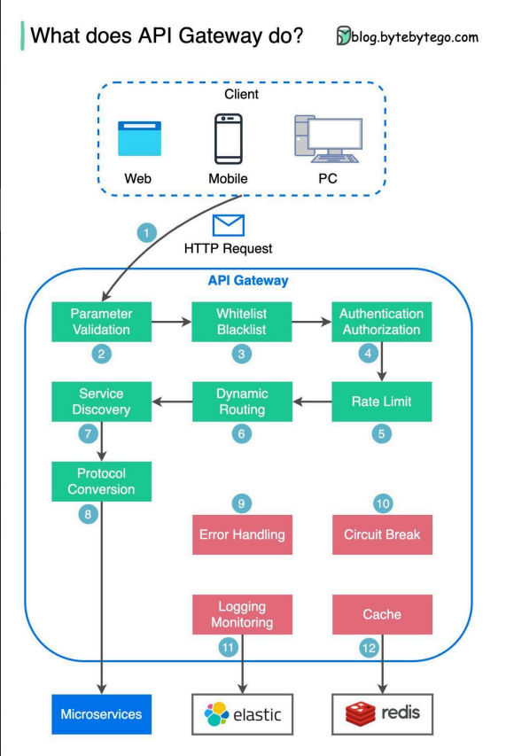
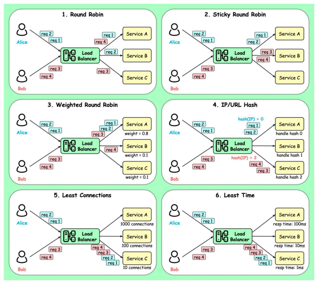

## Table of Contents

- [Table of Contents](#table-of-contents)
- [Microservice Communication:](#microservice-communication)
  - [Sync Communication:](#sync-communication)
  - [Async Communication:](#async-communication)
  - [Request-Response:](#request-response)
  - [Event-Driven Communication:](#event-driven-communication)
- [API gateway:](#api-gateway)
  - [1#Authentication and Authorization](#1authentication-and-authorization)
  - [2#Service Discovery:](#2service-discovery)
    - [Client Side Discovery:](#client-side-discovery)
    - [Server Side Discovery:](#server-side-discovery)
      - [Apache Zookeeper:](#apache-zookeeper)
    - [Service mesh:](#service-mesh)
  - [3#Retry and Circuit Breaker:](#3retry-and-circuit-breaker)
    - [Why do we need circuit breaker?](#why-do-we-need-circuit-breaker)
  - [4#Logging and Tracing:](#4logging-and-tracing)
  - [5#API composition](#5api-composition)
  - [6#Rate Limiting:](#6rate-limiting)
  - [7#Load Balancing](#7load-balancing)
- [Proxy Server:](#proxy-server)
  - [Why is Nginx called a “reverse” proxy?](#why-is-nginx-called-a-reverse-proxy)

---
## Microservice Communication:

### Sync Communication:
Basically, we can say that Synchronous communication is using HTTP or gRPC protocol for returning sync response. The client sends a request and waits for a response from the service. So that means client code block their thread, until the response reach from the server.

- Use gRPC
---
### Async Communication:
Basically, In Asynchronous communication, the client sends a request but it doesn’t wait for a response from the service. So the key point here is that, the client should not have blocked a thread while waiting for a response.

The most popular protocol for this Asynchronous communications is AMQP (Advanced Message Queuing Protocol). So with using AMQP protocols, the client sends the message with using message broker systems like Kafka and RabbitMQ queue.

An asynchronous systems can be implemented in a one-to-one(queue) mode or one-to-many (topic) mode. Basically an event-bus or message broker system is publishing events between multiple microservices, and communication provide with subscribing these events in an async way.

---

### Request-Response:
A microservice dispatches a request to another microservice, seeking the execution of a task, and anticipates receiving a response detailing the outcome. These can be achieved using RPC protocols like REST, gRPC, and GraphQL. Also, asynchronous way for request-response can be achieved using push notifications using web sockets or signalr, pull (polling) between the services and queue based messaged.
- gRPC
---
### Event-Driven Communication:
Event-Driven Communication is a variant of asynchronous communication, where microservices communicate through a message broker that facilitates the exchange of events. Each microservice publishes events when certain actions occur, and other microservices can subscribe to those events and react accordingly. Event-driven communication can enable loosely-coupled systems and provide greater flexibility, but it can also introduce potential issues with event ordering and consistency.

---

## API gateway:
The API Gateway is an API management tool that sits between a client and a collection of backend services. It is a `single entry point into a system` that encapsulates the internal system architecture and provides an API that is tailored to each client. It also has other responsibilities such as `authentication, monitoring, load balancing, caching, throttling, logging`, etc.



1. Step 1 - The client sends an HTTP request to the API gateway.
2. Step 2 - The API gateway parses and validates the attributes in the HTTP request.
3. Step 3 - The API gateway performs allow-list/deny-list checks.
4. Step 4 - The API gateway talks to an identity provider for authentication and authorization.
5. Step 5 - The rate limiting rules are applied to the request. If it is over the limit, the request is
rejected.
6. Steps 6 and 7 - Now that the request has passed basic checks, the API gateway finds the
relevant service to route to by path matching.
7. Step 8 - The API gateway transforms the request into the appropriate protocol and sends it to
backend microservices.
8. Steps 9-12: The API gateway can handle errors properly, and deals with faults if the error takes a
longer time to recover (circuit break). It can also leverage ELK (Elastic-Logstash-Kibana) stack for
logging and monitoring. We sometimes cache data in the API gateway.

**Features:**
1. `Authentication and Authorization`
2. `Service discovery`
3. `Retry and Circuit breaking`
4. `Load balancing`
5. `Logging, Tracing`
6. `API composition`
7.  `Rate limiting and throttling`
8. `Reverse Proxy:` Acts as a reverse proxy by forwarding client requests to appropriate backend services while masking backend infrastructure.
   1. Clients send requests to api.example.com, and the API Gateway forwards them to internal microservices.
9. Caching: Stores frequently accessed responses to reduce the load on backend services
10.  Versioning: Supports multiple API versions to enable gradual transitions to new versions.
    1.  `Routes /v1/products` to the old Product Service and `/v2/products` to the updated one.
11.  Routing: Determines which backend service should handle a given request based on URL, headers, or query parameters. Requests to /users go to the User Service, while /orders go to the Order Service.
    1.  Pros: Simplifies client interaction with multiple services.
    2. Cons: Complex routing rules can be difficult to maintain.

12.  IP whitelisting or blacklisting :  Restricts access to APIs based on client IP addresses.

---
### 1#Authentication and Authorization
Verifies the identity of the requester (authentication) and determines if they have permissions for the requested resource (authorization).
1. Implementation: Integrates with standards like OAuth 2.0, OpenID Connect, or API key mechanisms.
2. Example: A gateway requires a valid JWT token issued by an Identity Provider (like Google OAuth) before routing requests to backend services.

---

### 2#Service Discovery:
Service discovery is a mechanism that allows services in a distributed system to find and communicate with each other dynamically. It hides the complex details of where services are located, so they can interact without knowing each other's exact network spots.
- Pros: Dynamic discovery, load balancing.
- Cons: Added complexity in managing the registry.

#### Client Side Discovery:
Client-Side Service Discovery is a pattern where the client is responsible for locating the appropriate instance of a service to communicate with. Instead of relying on a proxy or gateway, the client directly queries a Service Registry to get the service's location and routes requests accordingly.

#### Server Side Discovery:
In server-side discovery, the service consumer makes a request to an intermediary `(load balancer or an API gateway)`, which then queries the service registry and routes the request to an appropriate service instance.
- Pros: Dynamic Registration and Deregistration: Services register themselves at startup and deregister upon shutdown.
- Cons:

**Tools:**
1. Consul
2. Eureka
3. Apache Zookeeper

***Server-Side vs. Client-Side Discovery***

| **Feature**          | **Server-Side Discovery**                   | **Client-Side Discovery**              |
|-----------------------|---------------------------------------------|-----------------------------------------|
| **Discovery Logic**   | Centralized at the gateway                 | Distributed across all clients          |
| **Load Balancing**    | Managed by the gateway                     | Managed by each client                  |
| **Latency**           | Slightly higher due to gateway hop         | Lower latency due to direct calls       |
| **Client Complexity** | Simple                                      | Complex (requires discovery logic)      |
| **Failure Handling**  | Gateway can retry and manage failures      | Each client must implement retry logic  |
| **Flexibility**       | Less flexible for custom client strategies | Fully customizable by clients           |

##### Apache Zookeeper:
Zookeeper is a centralized service for maintaining configuration information, naming, providing distributed synchronization, and providing group services. It is often used for service discovery in distributed systems.


#### Service mesh:
Service-to-service communication is essential in a distributed application but routing this communication, both `within and across application clusters`, becomes increasingly complex as the number of services grows. Service mesh `enables managed, observable, and secure communication` between individual services. It works with a `service discovery protocol` to `detect services`. `Istio and envoy` are some of the most commonly used service mesh technologies.
1. Tools: Istio, Linkerd
---
### 3#Retry and Circuit Breaker:

1. **Rettry:** The Retry pattern is a strategy where an operation is automatically retried a certain number of times before failing. It is often used in scenarios where `transient faults`, such as `temporary network issues or momentary service outages`, are expected and can resolve themselves if retried.
2. **Circuit Breaker:** The Circuit Breaker pattern is used to detect failures and prevent the application from attempting an operation that is likely to fail. It acts as a state machine with three states:
   - Closed (normal operation)
   - Open (failure detected, stop requests)
   - Half-Open (testing if the operation has recovered)
   - Example: An API gateway that calls multiple backend services. If one service is down, the Circuit Breaker prevents repeated failed calls by setting state to `Open`, protecting the system from cascading failures and improving overall stability.

#### Why do we need circuit breaker?
A circuit breaker is a design pattern used to protect systems from cascading failures when a service or component becomes unavailable, slow, or unresponsive. It helps maintain system stability by preventing unnecessary calls to a failing service and giving it time to recover.

1. Case-Study: An e-commerce application relies on a third-party payment service. If the payment service is down or responding slowly, a circuit breaker can stop sending payment requests. Instead, it can show an error message like "Payment service temporarily unavailable.

---
### 4#Logging and Tracing:
1. **Logging:** Logging involves recording information about the `application's runtime behavior`. Logs capture details about application `events, errors, transactions, and user activities`, providing a historical record of what happened.

2. **Tracing:** Tracing is the practice of tracking the `flow of requests` through a distributed system. It involves recording the path of requests as they travel through various services and components, capturing `timing information` to analyze performance and identify bottlenecks.
   - A microservices-based application where a user's request triggers calls to `multiple backend services`. Tracing allows you to follow the request through `each service and measure the time spent in each`.

---
### 5#API composition
API Composition is a design pattern used to aggregate responses from multiple microservices into a single, unified response. It is often used in the context of microservices architectures, where the client needs data from various services that might hold pieces of the same logical entity.

---
### 6#Rate Limiting:
Rate limiting is a technique used to control the rate at which clients can send requests to a server. It helps protect services from being overwhelmed by too many requests in a short period and ensures fair usage among clients.
- Example: For example, rate limiting the product search API to 10 requests per minute per user to prevent excessive load and ensure fair usage.

---
### 7#Load Balancing
Load balancing is a technique used to distribute incoming network traffic or requests across multiple servers or services to ensure no single server or service is overwhelmed with too much traffic. It is critical for improving the availability, reliability, and scalability of applications, especially in microservices architectures and cloud-based systems.



---
## Proxy Server:
A proxy server acts as an intermediary between a client and a server, forwarding requests from the client to the server and returning the server's response to the client. Proxy servers are used for various purposes, including improving security, enhancing performance, and enabling access control.


1. Forward Proxy: A forward proxy acts on behalf of clients. It takes requests from clients, forwards them to external servers, and returns the responses to the clients. Clients configure their settings to use a forward proxy. Forward proxy sits between `client and internet`.
   - Content filtering
   - internet access control
   - Allows access to `geo-restricted` content
   - protect user identity online.

2. Reverse Proxy:  reverse proxy acts on behalf of servers. Clients do not need to configure anything to use a reverse proxy; they simply send requests to the proxy, which forwards them to the appropriate backend server. The reverse proxy makes the backend infrastructure more resilient and scalable.
   - Load balancing
   - SSL termination
   - hiding the identity of the backend servers(protecting the server)
   - Encrypting and decrypting SSL communications
```
Client (User)    ─────>    Nginx (Reverse Proxy)    ─────>    Backend Servers
       ^                    ^                          ^             ^
       |                    |                          |             |
  Sends request         Receives request           Forwards request  |
                       from client, forwards to   to appropriate     |
                       backend server, retrieves   backend server,   |
                       response, and sends it     retrieves response,|
                       back to the client         and sends it back  |
                                                  to Nginx           |
```


### Why is Nginx called a “reverse” proxy?
Nginx is referred to as a "reverse proxy" because it stands in front of web servers and handles client requests on their behalf. The term "reverse proxy" distinguishes it from a "forward proxy," which acts on behalf of clients to access other servers.

1. Load Balancing: Nginx can distribute incoming requests across multiple backend servers to balance the load and improve performance and reliability. This ensures no single server becomes a bottleneck.

2. SSL Termination: Nginx can handle SSL/TLS encryption, offloading the decryption work from the backend servers. This simplifies SSL certificate management and can improve performance by reducing the load on backend servers.

3. Caching: Nginx can cache responses from backend servers and serve them to clients, reducing the load on backend servers and improving response times for clients.

4. Compression: Nginx can compress responses before sending them to clients, reducing bandwidth usage and speeding up response times.

5. Security: Nginx can `hide the details of backend servers from clients`, providing an additional layer of security. It can also be configured to `filter and block malicious traffic`.

6. URL Rewriting: Nginx can rewrite URLs in client requests before forwarding them to backend servers. This can be useful for things like redirecting requests or hiding the structure of backend URLs.