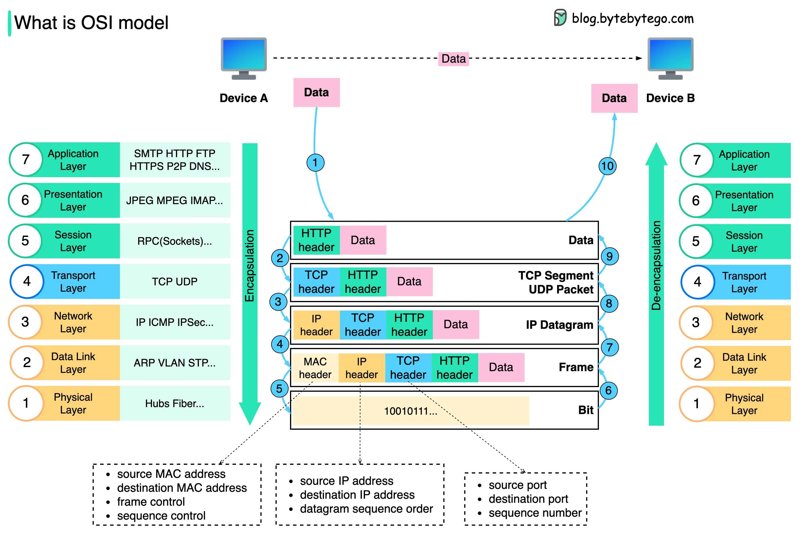

## OSI(Open System Interconnection Model)
The OSI Model is a `logical and conceptual model` that defines network communication used by systems open to interconnection and communication with other systems.

### OIS model leayers:
1. **Application Layer (Layer 7):** Provides network services directly to end-users; interfaces with software applications to implement a communicating component.
   - Network resource sharing, remote file access, network management.
   - Examples: HTTP (HyperText Transfer Protocol), FTP (File Transfer Protocol), SMTP (Simple Mail Transfer Protocol), DNS (Domain Name System).

2. **Presentation Layer (Layer 6):**
   - Function: Translates data between the application layer and the network; handles `data encryption and decryption, compression, and translation`.
   - Examples: SSL/TLS (Secure Sockets Layer / Transport Layer Security), JPEG, MPEG.

3. **Session Layer (Layer 5):**
   - Function: Manages sessions and controls dialogues between computers; `establishes, maintains, and terminates connections`.
   - Examples: NetBIOS, PPTP (Point-to-Point Tunneling Protocol).

4. **Transport Layer (Layer 4):**
   - Function: Provides reliable data transfer services to the upper layers; handles error recovery and flow control.
   - Examples: `TCP (Transmission Control Protocol)`, `UDP (User Datagram Protocol)`.

5. **Network Layer (Layer 3):**
   - Function: Determines the best physical path for data to reach its destination; handles `packet forwarding and routing`.
   - Examples: IP (Internet Protocol), Routers, ICMP (Internet Control Message Protocol).

6. **Data Link Layer (Layer 2):**
   - Function: Provides node-to-node data transfer and handles error detection and correction from the physical layer.
   - Examples: MAC addresses, Ethernet, Switches, Bridges, PPP (Point-to-Point Protocol).

7. **Physical Layer (Layer 1):**
   - Function: Transmits raw bit streams over a physical medium.
   - Examples: `Cables (Ethernet cables, fiber optics), Hubs, Network Interface Cards (NICs)`.

**Examples:**

1. `Step 1:` When Device A sends data to Device B over the network via the `HTTP protocol`, it is first added an `HTTP header` at the application layer.

2. `Step 2:` Then a `TCP or a UDP` header is added to the data. It is encapsulated into TCP segments at the transport layer. The header contains the `source port, destination port, and sequence number`.

3. `Step 3:` The segments are then encapsulated with an IP header at the `network layer`. The IP header contains the `source/destination`IP addresses.

4. `Step 4:` The IP datagram is added a MAC header at the data link layer, with `source/destination MAC addresses`.

5. `Step 5:` The encapsulated frames are sent to the `physical layer` and `sent over the network in binary bits`.

6. `Steps 6-10:` When Device B receives the bits from the network, it performs the de-encapsulation process, which is a reverse processing of the encapsulation process. The headers are removed layer by layer, and eventually, Device B can read the data.

We need layers in the network model because each layer focuses on its own responsibilities. Each layer can rely on the headers for processing instructions and does not need to know the meaning of the data from the last layer.

---
### Hypertext transfer protocol (HTTP)
Hypertext Transfer Protocol (HTTP) is a protocol that allows web browsers and servers to communicate, enabling the transfer of information over the web.
1. `Request-Response Model:` If server get a request in return it will give a response.
2. `Stateless Protocol:` HTTP is stateless, meaning each request is treated independently without memory of previous requests.
3. `HTTP Methods:` HTTP uses different methods to define actions that the server should perform.`GET, POST, UPDATE, DELETE`
4. `HTTP Status Codes`:
   1. Successful: `200-299`
      1. 200: OK
      2. 201: created
      3. 204: no content
   2. Redirection: `300-399`
      1. 301: move permanently
      2. 303: found temporarily
   3. Clinet Error: `400-499`
      1. 400: bad request
      2. 401: unauthorized
      3. 403: forbidden
      4. 404: not found
   4. Server Error: `500-599`
      1. 500: internal server error
      2. 501: not implemented
      3. 502: bad gateway
      4. 503: service unavailable
      5. 504: gateway timeout
#### HTTPS (Hypertext Transfer Protocol Secure)
HTTPS is the secure version of HTTP, adding encryption to protect data during transmission.

1. Purpose: HTTPS is used to secure data exchange between a web browser and server, especially for sensitive data (e.g., passwords, credit card details). URLs for HTTPS begin with https://.
2. Data Encryption: HTTPS uses SSL/TLS encryption, ensuring that data is encrypted during transmission, making it much harder for attackers to intercept or alter it.
3. Use Cases: Essential for sites where privacy and security are important, such as online banking, e-commerce, and any site that handles personal information

---
### TCP vs UDP:
TCP (Transmission Control Protocol) and UDP (User Datagram Protocol) are two of the main protocols used for sending data over the internet.

   1. TCP: TCP is a connection-oriented protocol that ensures reliable and ordered delivery of data between applications over a network. It establishes a connection before transmitting data and ensures that data packets are delivered in the same order in which they were sent, with no loss or duplication.
      - `Web browsing (HTTP/HTTPS)`: Browsers use TCP to load web pages reliably.
      - `Email (SMTP, IMAP, POP3)`: Email protocols use TCP to ensure messages are delivered correctly.
      - `File transfer (FTP)`: FTP uses TCP to reliably transfer files between computers.
      - `Remote access (SSH, Telnet)`: Secure remote access protocols use TCP to maintain reliable connections.

   2. UDP: UDP is a connectionless protocol that allows applications to send messages, called datagrams, without establishing a connection. It provides a simple and fast transmission mechanism but does not guarantee reliability, order, or error correction.
   - `streaming media, online game, DNS`.
---

## Domain Name System (DNS)
The Domain Name System (DNS) is like the internet’s phone book, translating `human-readable domain names (like www.example.com)` into `IP addresses (like 192.0.2.1)` that computers use to identify each other on the network.

DNS uses several types of records to manage different types of requests:
1. `A record`: Maps a domain to an IPv4 address.
2. `AAAA record`: Maps a domain to an IPv6 address.
3. `CNAME record`: Alias that maps one domain to another.
4. `MX record`: Directs email traffic to the correct mail server.
5. `NS record`: Indicates which server is authoritative for a domain.

### How DNS works?
DNS lookup involves the following eight steps:
1. `User Request`: 
   - When a user types a URL into their browser or clicks a link, their device needs to find the IP address for the domain they want to access.
   - The device checks its cache to see if it already knows the IP address. If it’s not cached, it initiates a DNS query.
2. `Recursive Resolver`
   - The query is first sent to a recursive DNS resolver, usually provided by the user's internet service provider (ISP) or a third-party DNS service (like Google’s DNS at 8.8.8.8).
   - The resolver’s job is to locate the IP address by querying multiple DNS servers if needed.
3. `Root DNS Server`:
   1. If the resolver doesn’t have the IP address in its cache, it queries a root DNS server. Root servers are the highest level in the DNS hierarchy and direct queries to the correct Top-Level Domain (TLD) servers (e.g., .com, .org, .net).
   2. For example, if you requested www.example.com, the root server would direct the resolver to the .com TLD server.
4. `Top-Level Domain (TLD) Server:` The TLD server then directs the resolver to the authoritative name server responsible for the specific domain (like example.com).
5. `Authoritative Name Server`: The authoritative name server has the final answer for the IP address associated with the domain. It responds with the IP address of the requested domain (e.g., 192.0.2.1 for www.example.com).
6. `Returning the IP Address:` The recursive resolver returns this IP address to the user’s device, which can then connect to the website's server to load the page.
7. `Caching:` To speed up future requests, the IP address is often cached by the user’s device and the recursive resolver for a period of time (determined by the DNS Time to Live or TTL setting).
---
**Summary:** 
1. A client types `example.com` into a web browser, the query travels to the internet and is received by a `DNS resolver`.
2. The resolver then recursively queries a `DNS root nameserver`.
3. The root server responds to the resolver with the address of a `Top-Level Domain (TLD)`.
4. The resolver then makes a request to the `.com TLD`.
5. The TLD server then responds with the `IP address` of the domain's nameserver, example.com.
6. Lastly, the recursive resolver sends a query to the `domain's nameserver`.
7. The IP address for example.com is then returned to the resolver from the nameserver.
8. The DNS resolver then responds to the web browser with the IP address of the domain requested initially.

---
## URL, URI, URN
1. **URL (Uniform Resource Locator):** A URL is a `specific type of URI` that provides the address of a unique resource on the web.
   - `https://www.example.com:443/path/to/resource?key=value#section`
   - `Scheme:` Indicates the protocol to be used (e.g., `http, https, ftp, jdbc`).
   - `Host:` The `domain name or IP address` of the server (e.g., www.example.com).
   - `Port (optional):` The port number on the server (e.g., `:80 for HTTP`, `:443 for HTTPS`).
   - `Path:` The specific path to the resource on the server (e.g., /path/to/resource).
   - `Query (optional):` A string of key-value pairs for additional parameters (e.g., `?key=value`).
   - `Fragment (optional):` A reference to a specific part of the resource (e.g., `#section`).

2. **URI (Uniform Resource Identifier):** A URI is a generic term for a string of characters that uniquely identifies a resource on the internet. A URI can be further classified into a `URL or a URN`.
   - `https://www.example.com:443/path/to/resource?key=value#section`
   - `urn:isbn:978-3-16-148410-0`
3. **URN (Uniform Resource Name):** A URN is a type of URI that names a resource without specifying its location. A URN is intended to serve as a persistent, `location-independent resource identifier`.
   - Schema+name(urn: name): `urn:isbn:978-3-16-148410-0`
 
## Life cycle of an HTTP request
1. `Client Initiates Request:` It all starts when your web browser (the client) wants to retrieve information from a server. You type a URL or click a link.
2. `DNS Lookup:` Before the client can send the request, it needs to know where to send it. This is where the Domain Name System (DNS) comes in, translating the human-friendly domain name (like www.example.com) into an IP address.
3. `Establish Connection:` With the IP address in hand, the client establishes a connection to the server using the `Transmission Control Protocol (TCP)`. This involves a three-way handshake to ensure both sides are ready to communicate.
4. `Send HTTP Request:` Now the actual HTTP request is sent over this connection. This request includes various elements like the HTTP method (GET, POST, etc.), headers (information about the request), and sometimes a body (with data for POST requests).
5. `Server Processes Request:` Upon receiving the request, the server processes it. This might involve querying a database, executing some server-side code, or simply fetching a static file.
6. `Send HTTP Response:` Once the server has the requested data, it sends back an HTTP response. This response includes a status code (like 200 OK, 404 Not Found), headers, and the body with the requested content (like an HTML page, JSON data, etc.).
7. `Client Receives Response:` The client's browser receives the response and processes it. For example, if it's an HTML page, the browser will render it for you to see.
8. `Close Connection:` Finally, the connection is closed, freeing up resources on both the client and server sides.