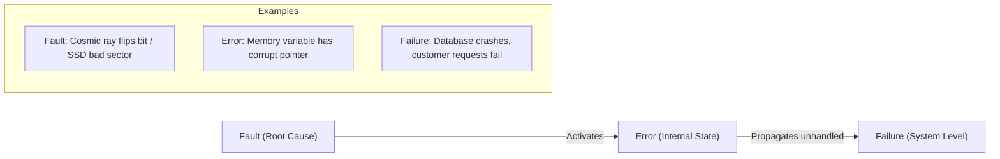
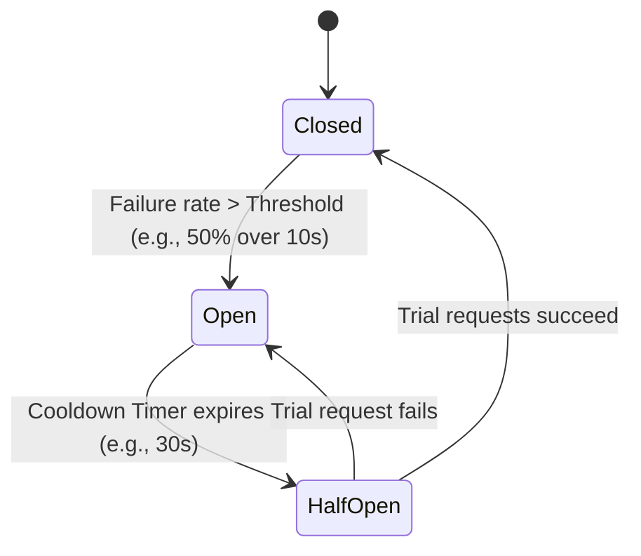
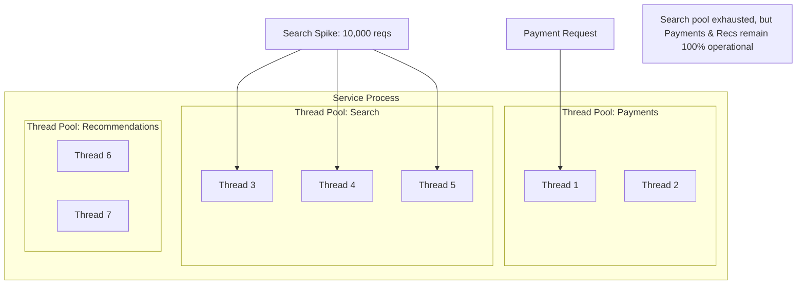
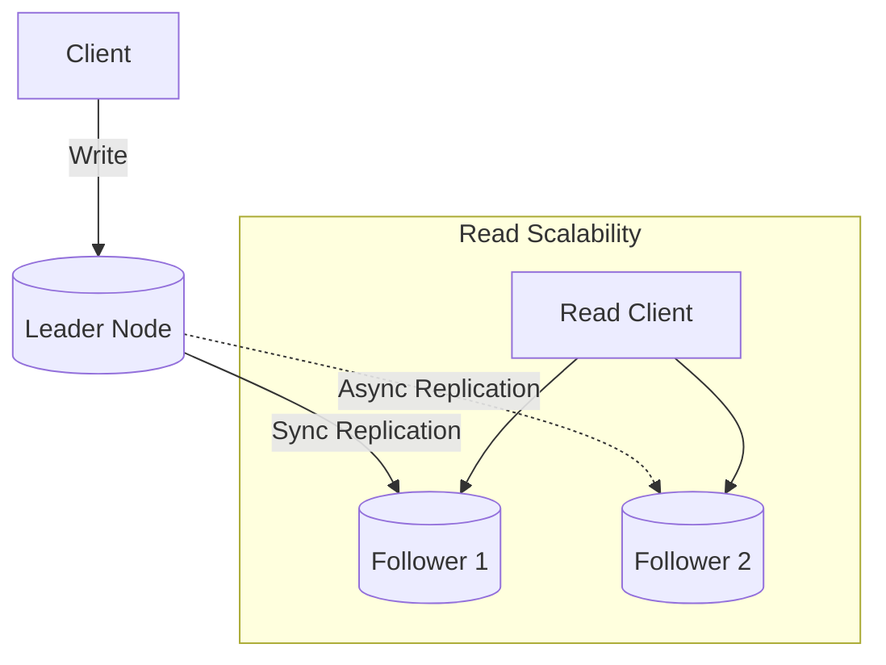
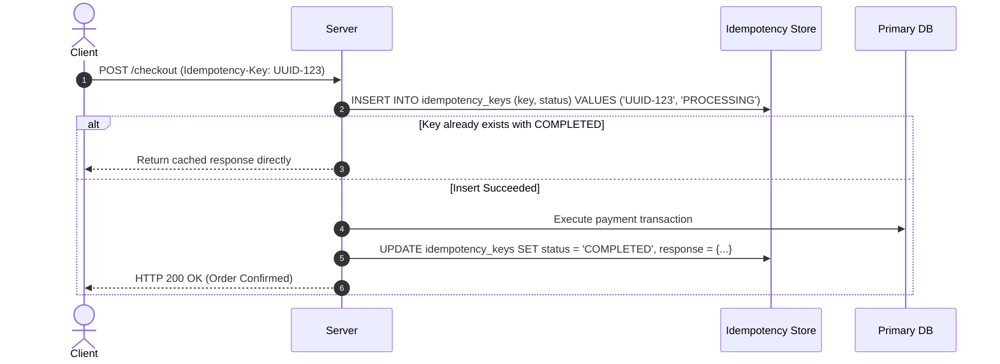
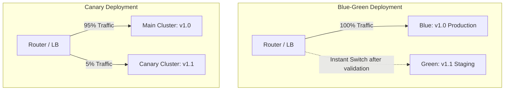

# Comprehensive System Design Guide: Reliability in Distributed Systems

---

## Table of Contents
1. [Core Fundamentals & Definitions](#1-core-fundamentals--definitions)
2. [The Fault-Error-Failure Lifecycle](#2-the-fault-error-failure-lifecycle)
3. [Reliability Metrics & Math](#3-reliability-metrics--math)
4. [Failure Modes in Distributed Systems](#4-failure-modes-in-distributed-systems)
5. [Resilience & Traffic Control Patterns (Deep Dive)](#5-resilience--traffic-control-patterns-deep-dive)
   - [Timeouts & Deadline Propagation](#51-timeouts--deadline-propagation)
   - [Retries with Exponential Backoff & Jitter](#52-retries-with-exponential-backoff--jitter)
   - [Circuit Breaker Pattern](#53-circuit-breaker-pattern)
   - [Bulkhead Pattern](#54-bulkhead-pattern)
   - [Load Shedding & Graceful Degradation](#55-load-shedding--graceful-degradation)
   - [Rate Limiting](#56-rate-limiting)
6. [Data Integrity & Storage Reliability](#6-data-integrity--storage-reliability)
   - [Replication & High Availability](#61-replication--high-availability)
   - [Split-Brain & Fencing Tokens](#62-split-brain--fencing-tokens)
   - [Idempotency Design](#63-idempotency-design)
   - [Write-Ahead Logging (WAL) & Crash Recovery](#64-write-ahead-logging-wal--crash-recovery)
   - [Consensus Protocols (Raft & Paxos)](#65-consensus-protocols-raft--paxos)
7. [Operational Reliability & Deployment Safety](#7-operational-reliability--deployment-safety)
   - [Canary & Blue-Green Deployments](#71-canary--blue-green-deployments)
   - [Health Checks: Liveness vs. Readiness](#72-health-checks-liveness-vs-readiness)
   - [Observability: Golden Signals, RED & USE](#73-observability-golden-signals-red--use)
   - [Chaos Engineering](#74-chaos-engineering)
8. [System Design Interview Reliability Checklist](#8-system-design-interview-reliability-checklist)
9. [Development & Prototyping Standards (EF Core, SQLite & Seeding)](#9-development--prototyping-standards-ef-core-sqlite--seeding)

---

## 1. Core Fundamentals & Definitions

### What is Reliability?
**Reliability** is the probability that a system will perform its intended function correctly, without failure, under specified operating conditions for a given period of time.

### The Four Pillars Comparison

| Concept | Definition | Focus |
| :--- | :--- | :--- |
| **Reliability** | Continuously providing **correct** results and behavior even when faults occur. | Correctness + Durability over time |
| **Availability** | Percentage of time the system is online and accepting requests. | Uptime ($\frac{\text{Uptime}}{\text{Total Time}}$) |
| **Resilience** | Ability of the system to absorb shocks, recover from failure, and adapt. | Recovery & Graceful Degradation |
| **Fault Tolerance** | Ability of the system to continue execution in the presence of hardware/software faults. | Preventing fault $\to$ failure escalation |

> **Key Distinction**: A service that answers every request with an empty `200 OK` in 1ms has **100% Availability**, but **0% Reliability**.

---

## 2. The Fault-Error-Failure Lifecycle



1. **Fault**: The underlying defect or deviation in a hardware, software, or external dependency.
   - *Example*: A physical network cable gets disconnected, or an external payment API returns a 500 error.
2. **Error**: The resulting incorrect internal state within the system boundary.
   - *Example*: An in-memory cache pointer is null, or an unhandled exception is thrown in a worker thread.
3. **Failure**: The system as a whole stops providing the expected external service to users.
   - *Example*: The checkout page displays a blank 500 page to end customers.

> **Design Goal**: We cannot prevent all faults. We must detect and isolate **errors** so they never turn into **failures**.

---

## 3. Reliability Metrics & Math

### Key Time Metrics
* **MTTF (Mean Time To Failure)**: The average operating time between the start of operation and the first failure (used for non-repairable or component-level failure).
* **MTTR (Mean Time To Repair / Recover)**: Average time required to diagnose, repair, and restore a failed component back to working order.
* **MTBF (Mean Time Between Failures)**: Average time between consecutive failures for repairable components.
$$\text{MTBF} = \text{MTTF} + \text{MTTR}$$

```
|--- MTTF (Operational) ---|-- MTTR (Downtime) --|--- MTTF (Operational) ---|
|<------------------------ MTBF ------------------------>|
```

### Availability Formula
$$\text{Availability} (A) = \frac{\text{MTBF} - \text{MTTR}}{\text{MTBF}} = \frac{\text{MTTF}}{\text{MTTF} + \text{MTTR}}$$

To increase Availability/Reliability, you have two engineering levers:
1. **Increase MTTF**: Higher quality hardware, better testing, defensive coding, redundancy.
2. **Decrease MTTR**: Automated failover, self-healing containers, instant rollback, automated canary verification.

### SLI vs. SLO vs. SLA
* **SLI (Service Level Indicator)**: A measurable metric of service behavior (e.g., `Percentage of successful requests (non-5xx) over 30 days`).
* **SLO (Service Level Objective)**: The internal target for an SLI that the engineering team commits to (e.g., `99.95% successful requests`).
* **SLA (Service Level Agreement)**: The external contract with customers, backed by financial penalties/credits (e.g., `If availability < 99.9%, customers receive a 10% credit`).
* **Error Budget**: The allowable unreliability ($1 - \text{SLO}$). For a $99.9\%$ SLO, the error budget is $0.1\%$ (approx. 43 minutes of downtime per month).

---

## 4. Failure Modes in Distributed Systems

| Category | Specific Fault | Consequence | Mitigation Strategy |
| :--- | :--- | :--- | :--- |
| **Hardware** | Hard drive failure / Bit rot | Corrupted storage blocks | RAID, Write-Ahead Logging (WAL), checksums |
| **Hardware** | Network Partition / Switch failure | Nodes cannot talk (Split-Brain) | Quorum consensus (Raft/Paxos), fencing tokens |
| **Hardware** | Clock Drift | True-time skew, incorrect ordering | Vector clocks, NTP bounds, Hybrid Logical Clocks (HLC) |
| **Software** | Memory Leak / OOM | Process killed abruptly | Memory profiling, cgroup limits, auto-restart |
| **Software** | Cascading Failure / Retry Storm | One slow service crashes entire chain | Circuit breakers, exponential backoff with jitter |
| **Software** | Poison Pill Message | A bad message crashes consumer repeatedly | Dead Letter Queues (DLQ), message validation |
| **Human** | Bad Config / Broken Deployment | System-wide outage | Canary releases, blue-green, config validation schemas |

---

## 5. Resilience & Traffic Control Patterns (Deep Dive)

### 5.1 Timeouts & Deadline Propagation

A missing or overly generous timeout is the #1 cause of cascading system lockups.

* **Connection Timeout**: Time allowed to establish the TCP/TLS handshake (usually 100ms - 1s).
* **Socket / Read Timeout**: Max idle time waiting for response packets after connection is established.
* **Request / End-to-End Deadline**: Total maximum time allowed for the entire client-to-server transaction.

```
Client (Total Deadline: 500ms)
   │
   ├─► Service A (Consumes 100ms, Remaining: 400ms)
   │      │
   │      └─► Service B (Consumes 250ms, Remaining: 150ms)
   │             │
   │             └─► Service C (Needs 200ms -> Aborts immediately because 200ms > 150ms)
```

**Deadline Propagation (e.g., gRPC / HTTP headers like `X-Request-Deadline`)**:
When a top-level client initiates a request with a 500ms deadline, every downstream service receives the remaining budget. If Service C detects that the deadline has already expired, it drops the request immediately rather than wasting CPU and database resources on a dead transaction.

---

### 5.2 Retries with Exponential Backoff & Jitter

Blind retries turn small blips into catastrophic **retry storms**.

#### The Exponential Backoff Formula:
$$\text{Delay}(n) = \min(\text{MaxDelay}, \text{Base} \times 2^n)$$

#### Why Jitter is Essential:
If 10,000 clients fail at time $t=0$, pure exponential backoff causes all 10,000 clients to retry at exactly $t=2s, 4s, 8s$, crushing the recovering service in synchronized waves (Thundering Herd).

**Full Jitter Algorithm (AWS Recommended)**:
```python
import random

def calculate_backoff_with_jitter(attempt: int, base: float = 0.5, max_delay: float = 30.0) -> float:
    temp = min(max_delay, base * (2 ** attempt))
    sleep_duration = random.uniform(0, temp)  # Full Jitter
    return sleep_duration
```

#### Rules for Safe Retries:
1. **Never retry non-idempotent operations** (e.g., POST `/charge-credit-card`) without an idempotency key.
2. **Cap maximum retries** (typically 3 attempts).
3. **Use Retry Budgets**: A service should refuse to retry if retries account for more than 10% of total outbound requests.

---

### 5.3 Circuit Breaker Pattern

The Circuit Breaker pattern prevents an application from repeatedly trying to execute an operation that's likely to fail.



#### Circuit Breaker States:
1. **Closed**: Normal state. All requests pass through. Failures are counted in a sliding window.
2. **Open**: The failure threshold is breached. All calls fail fast immediately without making the network call, returning a pre-defined fallback or error.
3. **Half-Open**: After a cooldown period, a limited number of "probe" requests are permitted through:
   - If the probes succeed $\rightarrow$ Return to **Closed**.
   - If any probe fails $\rightarrow$ Trip back to **Open** for another cooldown.

---

### 5.4 Bulkhead Pattern

Derived from the watertight compartments of a ship's hull. If one compartment is punctured, only that compartment floods, preventing the entire ship from sinking.



#### Implementations:
1. **Thread Pool Isolation**: Allocate dedicated thread pools per external dependency (e.g., Netflix Hystrix/Resilience4j).
2. **Cluster / Tenant Isolation**: Dedicated servers or database shards for tier-1 premium customers vs free-tier customers.
3. **Process Isolation**: Microservices split by critical vs non-critical domains.

---

### 5.5 Load Shedding & Graceful Degradation

When incoming load exceeds capacity, a system should not crash; it should degrade gracefully.

1. **Load Shedding**:
   - The server monitors its own health (CPU usage > 85%, request queue depth > 1,000).
   - Once threshold is crossed, it immediately rejects lower-priority traffic with HTTP `503 Service Unavailable` or `429 Too Many Requests`.
2. **Graceful Degradation**:
   - Return stale cache data instead of live fresh data.
   - Disable non-essential UI widgets (e.g., "Personalized Recommendations" falls back to static "Top 10 items").
   - Decouple write paths: Accept the user's order, persist to an append-only queue (Kafka), and acknowledge success while processing billing asynchronously.

---

### 5.6 Rate Limiting

Controls the rate of traffic entering a service or sent to a dependency.

* **Token Bucket**: Fixed capacity bucket where tokens are added at a constant rate. Requests consume a token. Handles bursts up to bucket capacity.
* **Leaky Bucket**: Requests enter a queue and leak out at a constant, smooth rate. Good for smoothing out traffic spikes.
* **Sliding Window Counter**: Tracks request timestamps in memory (Redis ZSET) to enforce strict rate limits across rolling time windows.

---

## 6. Data Integrity & Storage Reliability

### 6.1 Replication & High Availability



* **Synchronous Replication**:
  - Leader waits for confirmation from follower before acknowledging client.
  - *Advantage*: Zero data loss (RPO = 0).
  - *Disadvantage*: High write latency; write stalls if follower hangs.
* **Asynchronous Replication**:
  - Leader acknowledges write immediately, replicates in background.
  - *Advantage*: Fast write performance.
  - *Disadvantage*: If leader dies before replication finishes, un-replicated data is lost.
* **Semi-Synchronous (Best Practice)**:
  - Leader synchronizes with at least one replica, while other replicas sync asynchronously.

---

### 6.2 Split-Brain & Fencing Tokens

When a network partition splits a cluster into two disconnected halves, both sides might assume the other is dead and elect their own leader. Both accept writes $\rightarrow$ irreversible data corruption.

#### Solutions:
1. **Quorum**: A node can only become or stay leader if it can communicate with a majority of nodes:
$$\text{Quorum} = \lfloor \frac{N}{2} \rfloor + 1$$
   *(e.g., in a 5-node cluster, at least 3 nodes must agree).*
2. **Fencing Tokens**: Every newly elected leader receives a monotonically increasing token (e.g., Generation 1, Generation 2). The storage layer rejects any writes carrying an older token than the highest seen.

---

### 6.3 Idempotency Design

In distributed networks, "at-least-once" delivery is common because network timeouts cause clients to retry requests that might have succeeded on the server.



#### Idempotency Invariants:
- `GET`, `PUT`, `DELETE` are semantically idempotent by HTTP spec.
- `POST` is not idempotent by default; must use a client-supplied unique idempotency key.

---

### 6.4 Write-Ahead Logging (WAL) & Crash Recovery

To survive abrupt server power loss without losing committed transactions:
1. Every state modification is first written sequentially to an append-only log file on persistent disk (**WAL**).
2. Disk sequential writes are 10-100x faster than random memory-to-disk page flushes.
3. Once the WAL record is synced (`fsync`), the transaction is officially committed.
4. If the database crashes, upon reboot it replays the WAL from the last checkpoint to reconstruct the exact in-memory state.

---

### 6.5 Consensus Protocols (Raft & Paxos)

Consensus allows a collection of machines to work as a coherent group that can survive failures of some of its members.

* **Raft Algorithm Structure**:
  1. **Leader Election**: Heartbeats monitor leader liveness; randomized election timers prevent split votes.
  2. **Log Replication**: Leader accepts log entries from clients, appends them to its log, and propagates them to followers.
  3. **Safety**: A log entry is committed only when replicated on a majority of nodes. A candidate cannot be elected leader unless its log contains all committed entries.

---

## 7. Operational Reliability & Deployment Safety

### 7.1 Canary & Blue-Green Deployments



* **Canary Release**: Route 1% $\rightarrow$ 5% $\rightarrow$ 25% $\rightarrow$ 100% of user traffic to new build. Automated monitoring watches error rates and latency. If error threshold spikes, traffic rolls back instantly to 0%.
* **Blue-Green Deployment**: Run two identical production environments. One is live (Blue), one receives the new deployment (Green). Once green passes smoke tests, the router switches all traffic to Green. Rollback is a simple router toggle.

---

### 7.2 Health Checks: Liveness vs. Readiness

* **Liveness Probe**: "Is the application process running?"
  - If fails $\rightarrow$ Container orchestrator (e.g., Kubernetes) restarts/kills the container.
  - *Caution*: Never check external dependencies (DB/Kafka) in a liveness probe! If the DB dies, all your pods will restart simultaneously, killing the application cluster.
* **Readiness Probe**: "Is the application ready to accept network traffic?"
  - Checks warm caches, connected DB pools.
  - If fails $\rightarrow$ Node is temporarily removed from load balancer rotation until healthy again.
* **Startup Probe**: For slow-starting legacy apps; disables liveness/readiness until initialization completes.

---

### 7.3 Observability: Golden Signals, RED & USE

#### The 4 Golden Signals (Google SRE):
1. **Latency**: Time taken to service a request (track p50, p95, p99, not averages).
2. **Traffic**: Demand on the system (requests per second, I/O rate).
3. **Errors**: Rate of requests that fail explicitly (HTTP 500s) or implicitly (wrong content).
4. **Saturation**: How full your most constrained service resource is (CPU, RAM, DB connection pool).

#### RED Method (for Microservices):
- **Rate**: Requests/sec.
- **Errors**: Number of failed requests/sec.
- **Duration**: Time each request takes.

#### USE Method (for Infrastructure):
- **Utilization**: % time resource was busy.
- **Saturation**: Extra work queued up.
- **Errors**: Hardware/driver error count.

---

### 7.4 Chaos Engineering

> *"Hope is not a strategy."*

Chaos engineering is the discipline of experimenting on a system in order to build confidence in the system's capability to withstand turbulent conditions in production.

#### Typical Chaos Experiments:
* Randomly kill EC2 instances or Kubernetes pods (e.g., Chaos Monkey).
* Inject artificial network latency (e.g., +500ms on 10% of DB queries).
* Simulate complete Availability Zone (AZ) failure.
* Corrupt DNS resolution for an external third-party dependency.

---

## 8. System Design Interview Reliability Checklist

When asked to design any system (e.g., Payment Gateway, Ride Sharing, Video Streaming), use this 6-step checklist:

- [ ] **1. Single Points of Failure (SPOFs)**: Are all layers (DNS, LB, App, Database, Cache) N+1 redundant across multiple Availability Zones?
- [ ] **2. Dependency Failure Handling**: If an upstream service or 3rd party API goes down, what happens? (Timeouts, Circuit Breakers, Fallbacks).
- [ ] **3. Data Safety**: How are writes protected? (Write-Ahead Logging, Synchronous quorum replication, Offsite backups).
- [ ] **4. At-Least-Once Delivery & Idempotency**: Can users double-click submit without creating duplicate charges/records? (Idempotency keys, unique constraints).
- [ ] **5. Overload Protection**: How does the system behave under a 10x traffic spike? (Rate limiting, queueing, load shedding, auto-scaling).
- [ ] **6. Observability & Self-Healing**: How do we know it's broken before customers tweet? (SLOs, synthetic monitoring, automated canary rollback).

---

## 9. Development & Prototyping Standards (EF Core, SQLite & Seeding)

When implementing or prototyping resilient reference architectures and distributed system components in code:

1. **Always EF Core ORM**:
   - Use Entity Framework Core for all persistence layers.
   - Enforce strong typing, migrations, LINQ abstractions, and database connection resilience (e.g., `EnableRetryOnFailure`).
2. **Always `sqlite.db` for Faster Development**:
   - Use an embedded SQLite file-based database (`sqlite.db` or `Filename=sqlite.db`) for lightweight, zero-dependency, reproducible local execution.
   - Ensures ACID compliance, crash resilience (Write-Ahead Logging / WAL mode in SQLite), and quick startup across all environments.
3. **Always Seed Data for Each Entity**:
   - Every domain entity (e.g., Accounts, Payments, Products, Idempotency Records) must be seeded on initialization.
   - Seed count constraint: **At least 2 and at most 4 items** per entity to provide instant realistic test data without cluttering logs or test runs.

