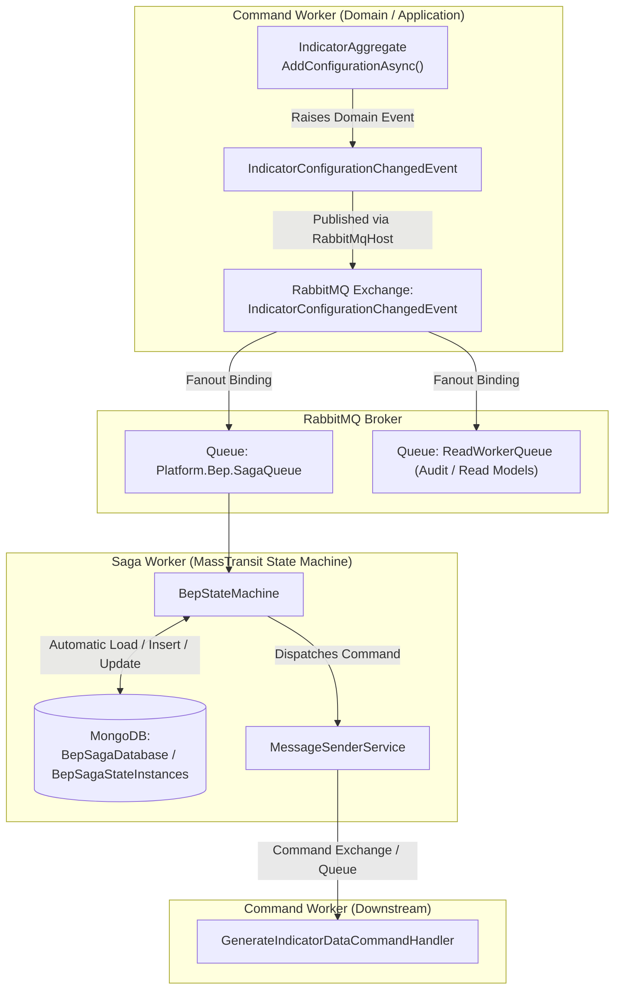

# Saga Architecture & Workflow in BEP

This document provides a comprehensive summary of how the Saga pattern works in the BEP backend, specifically detailing the workflow for `IndicatorConfigurationChangedEvent` and `GenerateIndicatorDataCommand`.

---

## 1. Architecture Overview

The BEP backend implements an **orchestration-based Saga** using:
* **MassTransit State Machine (`MassTransitStateMachine<BepStateInstance>`)**: Manages the saga lifecycle, state transitions, and event-to-command coordination.
* **RabbitMQ**: Acts as the message broker for asynchronous publish/subscribe events and direct command queues.
* **MongoDB**: Stores the persistent state of each saga instance (`BepStateInstance`) across distributed transactions.



---

## 2. Event Publishing & Routing (Exchange vs. Queue)

### Why the event is NOT published directly to the Saga queue
In RabbitMQ / AMQP architecture:
1. **The publisher sends messages to an Exchange, not directly to a queue.**
   * In `CommandWorker` (`src/Application/CommandWorker/Program.cs`), producers are registered via:
     ```csharp
     config.ConfigurePublisherFor<IndicatorConfigurationChangedEvent>();
     ```
   * When `IndicatorRepository.UpdateAsync(indicator)` finishes saving the aggregate, uncommitted domain events are dispatched to a **Fanout Exchange** named after the event type.

2. **MassTransit sets up the queue binding automatically.**
   * The Saga Worker listens on the queue defined in `src/Saga/SagaWorker/appsettings.json`:
     ```json
     "BusConfig": {
       "QueueName": "Platform.Bep.SagaQueue"
     }
     ```
   * MassTransit inspects `BepStateMachine`, discovers `When(IndicatorConfigurationChangedEvent)`, and declares a binding:
     $$\text{Exchange: IndicatorConfigurationChangedEvent} \xrightarrow{\text{Binding}} \text{Queue: Platform.Bep.SagaQueue}$$
   * Because it is a Fanout Exchange, any other consumer (like the Read model / Audit Log consumer) gets its own copy of the event independently.

---

## 3. Saga State Machine Execution

### State Machine Definition
The Saga is split across partial classes in `Platform.BEP.Saga.SagaService`:
* **State Instance**: `src/Saga/SagaService/StateMachines/BepStateInstance.cs`
* **Core & Transitions**: `src/Saga/SagaService/StateMachines/BepStateMachine.Core.cs`
* **Events**: `src/Saga/SagaService/StateMachines/BepStateMachine.EventDefinition.cs`
* **States**: `src/Saga/SagaService/StateMachines/BepStateMachine.StateDefinition.cs`
* **Event Handlers**: `src/Saga/SagaService/EventHandlers/SagaEventHandlers.Indicator.cs`

### Behavior Definition
```csharp
private void SetIndicatorBehaviours()
{
    Initially(
        When(IndicatorConfigurationChangedEvent)
            .TransitionTo(IndicatorConfigurationChanged)
            .ThenAsync(HandleIndicatorConfigurationChangedEventAsync));
}
```

### Handler Implementation
```csharp
public async Task HandleIndicatorConfigurationChangedEventAsync(
    BehaviorContext<BepStateInstance, IndicatorConfigurationChangedEvent> context)
{
    var command = new GenerateIndicatorDataCommand()
    {
        IndicatorConfigurationIds = [context.Message.IndicatorConfigurationId],
        IpAddress = context.Message.IpAddress,
        UserContext = context.Message.UserContext,
        CorrelationId = context.Message.CorrelationId,
        TriggeringAuditLog = false
    };
    await _messageSenderService.SendCommandAsync(command, context);
}
```
* **Context Preservation**: Transmits `CorrelationId`, `UserContext`, and `IpAddress` from the triggering event into the downstream command for full end-to-end auditability.
* **Dispatch**: `MessageSenderService.SendCommandAsync` dynamically determines the target endpoint queue (`${SagaConstants.ExchangePrefix}{Namespace}.{CommandName}`) and sends the command over RabbitMQ.

---

## 4. Saga State Persistence in MongoDB

### Configuration
In `src/Saga/SagaWorker/appsettings.json`:
```json
"SagaPersistenceSettings": {
  "DatabaseName": "BepSagaDatabase",
  "CollectionName": "BepSagaStateInstances",
  "ConnectionString": "mongodb://localhost:27017"
}
```

Registered in `src/Saga/SagaWorker/Extensions/ServiceCollectionExtensions.cs`:
```csharp
busRegistrationConfigurator.AddSagaStateMachine<BepStateMachine, BepStateInstance>()
    .MongoDbRepository(r =>
    {
        r.DatabaseName = sagaPersistenceSettings.DatabaseName;
        r.CollectionName = sagaPersistenceSettings.CollectionName;
        r.Connection = sagaPersistenceSettings.ConnectionString;
    });
```

### Document Structure
Stored in collection **`BepSagaStateInstances`**:
```json
{
  "_id": "c3b94e35-6497-4ebc-8822-2a74c2d361ec",
  "CurrentState": "IndicatorConfigurationChanged",
  "Version": 1
}
```

### Does MassTransit Automatically Create the Document?
**Yes.**
* The **`Initially(...)`** block instructs MassTransit that if no document with `_id == CorrelationId` exists in MongoDB, it must create a new `BepStateInstance`.
* MassTransit initializes the instance, sets `CurrentState = "IndicatorConfigurationChanged"`, executes the handler, and inserts the document into MongoDB automatically.
* If `BepSagaDatabase` or `BepSagaStateInstances` does not exist, MongoDB creates them automatically upon the first document insert.
* If a concurrent event tries to modify the same instance simultaneously, optimistic concurrency control checks `Version` and triggers the configured retry policy with randomized backoff.
