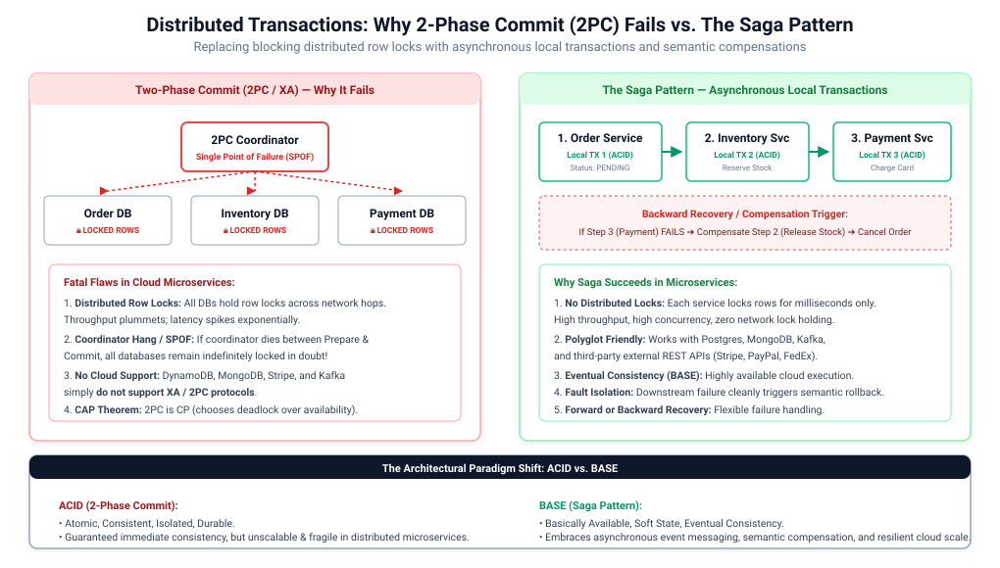
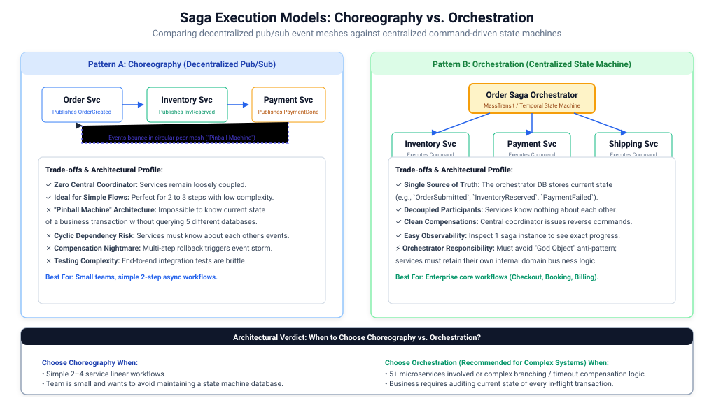
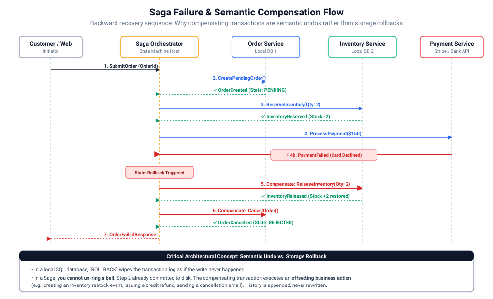
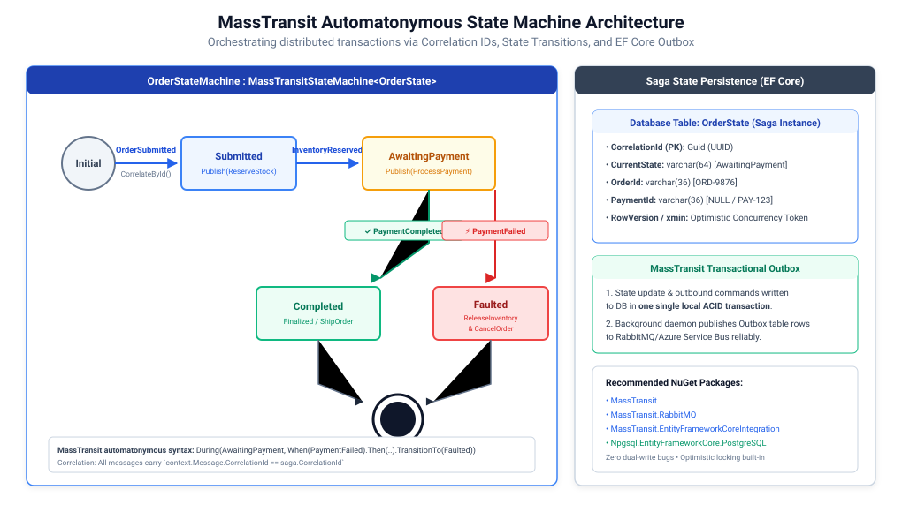

# The Saga Pattern in Distributed Systems: Distributed Transactions & Failure Recovery

In a monolithic architecture with a single relational database, maintaining data consistency across multiple business operations is straightforward: you wrap them inside a single database transaction conforming to **ACID** (Atomicity, Consistency, Isolation, Durability) guarantees.

In modern cloud microservices architectures, the industry standard is the **Database-per-Service** pattern. Each microservice encapsulates its own private data store (PostgreSQL, MongoDB, DynamoDB). However, business transactions—such as checking out an e-commerce cart, booking a flight and hotel, or processing a ride-share trip—routinely span multiple microservices.

**The Saga Pattern** is an architectural pattern that coordinates distributed business transactions across independent microservice databases using a sequence of **local transactions** and **compensating transactions**, guaranteeing eventual data consistency without distributed locking.



---

## 1. The Core Problem: Why Do We Need the Saga Pattern?

### The Death of Traditional Distributed Transactions (2PC / XA)
Before the cloud era, distributed transactions across multiple databases were solved using the **Two-Phase Commit (2PC)** protocol (e.g., X/Open XA standard):
1. **Phase 1 (Prepare)**: A centralized Transaction Coordinator asks every participating database: *"Can you commit this change?"* Every database acquires locks on the affected rows and responds *"Prepared"*.
2. **Phase 2 (Commit)**: If all participants voted yes, the coordinator instructs all databases to commit. If any node voted no or timed out, all nodes are told to roll back.

### Why Two-Phase Commit (2PC) Fails in Cloud Microservices

| 2PC Failure Mode | Why It Breaks in Cloud & Microservices | Real-World Impact |
| :--- | :--- | :--- |
| **Distributed Row Locks** | Database row locks must be held across multiple network hops until all remote services reply. | Latency spikes exponentially ($T_{\text{hold}} = \sum T_{\text{network}}$); thread pools exhaust; throughput collapses. |
| **Coordinator Single Point of Failure (SPOF)** | If the coordinator crashes between Phase 1 and Phase 2, databases remain **indefinitely locked in doubt**. | Blocked resources cannot be modified until human database administrators intervene. |
| **No Cloud / NoSQL Support** | Cloud-native stores like **Amazon DynamoDB, Apache Kafka, MongoDB, and Stripe API** simply do not support XA/2PC. | You cannot open a 2PC transaction between a local SQL database and a third-party payment gateway! |
| **The CAP Theorem CP Trap** | 2PC prioritizes Consistency over Availability ($CP$). In cloud networks where transient latency and network partitions are inevitable, 2PC grinds the system to a complete halt. | Unacceptable in consumer web systems where high availability ($AP$) is mandatory. |

### The Dual-Write Problem
Attempting to write to a local database and publish an event to a message broker in the same operation creates the **Dual-Write Trap**:
- If the database commit succeeds but the message broker crashes before publishing, downstream microservices never receive the update.
- If the event is published first but the local database transaction rolls back, downstream services process phantom data!

**The Saga Pattern—paired with the Transactional Outbox Pattern—solves both problems.**

---

## 2. What is a Saga? Fundamentals & Core Mechanics

The Saga concept was originally proposed in 1987 by **Hector Garcia-Molina and Kenneth Salem** in their Princeton research paper: *"Sagas"*. Originally designed for long-lived database transactions, it has become the standard design pattern for microservice consistency.

### Definition of a Saga
A **Saga** is a sequence of local transactions:
$$S = \{T_1, \, T_2, \, T_3, \, \dots, \, T_n\}$$

- Each local transaction $T_i$ updates data inside a single microservice's private database using standard local ACID transactions.
- Once $T_i$ commits locally, it publishes a message or event that triggers the next local transaction $T_{i+1}$.

---

### Failure Handling: Forward vs. Backward Recovery

When a local transaction fails in the middle of a Saga (e.g., $T_3$ throws an error), the system cannot simply call `ROLLBACK` on $T_1$ and $T_2$ because those transactions have **already committed to disk**. The Saga must choose one of two recovery strategies:

```
                                SAGA FAILURE RECOVERY
                                          │
                  ┌───────────────────────┴───────────────────────┐
                  ▼                                               ▼
         FORWARD RECOVERY                                BACKWARD RECOVERY
      (Retry Until Success)                         (Compensating Transactions)
   • Idempotent retries with jitter              • Used when business failure occurs
   • Used when operation CANNOT fail               (e.g., Card Declined, Out of Stock)
   • Example: Sending confirmation email         • Executes semantic undos: C2, C1
```

#### A. Forward Recovery (Retry Until Success)
Used for operations that are guaranteed to eventually succeed and cannot fail for business reasons (e.g., transient network glitch, sending an email, generating an invoice). The service applies exponential backoff and idempotent retries until $T_i$ completes.

#### B. Backward Recovery (Compensating Transactions)
Used when an operation encounters an irreversible business failure (e.g., Card Declined, Fraud Alert, Out of Stock). The Saga executes a compensating transaction $C_i$ for every previously committed transaction in reverse order:

$$\text{Rollback Sequence:} \quad C_{n-1}, \, C_{n-2}, \, \dots, \, C_1$$

---

### Critical Insight: Semantic Undos vs. Storage Rollbacks
In a single relational database, `ROLLBACK` wipes the transaction log as if the write never occurred.

In a Saga, **you cannot un-ring a bell**. A compensating transaction is an **offsetting business action**:
- You cannot undo a charged credit card; you execute a **Refund** transaction.
- You cannot undo an order creation row; you update its state to **`CANCELLED`** or **`REJECTED`**.
- You cannot undo a reserved hotel room; you issue a **Cancellation Notice**.

History in a distributed system is **appended**, never erased.

---

## 3. Choreography vs. Orchestration: Deep Architectural Comparison

There are two primary architectural patterns for implementing a Saga: **Choreography** (decentralized) and **Orchestration** (centralized).



### A. Choreography-Based Saga (Decentralized Pub/Sub)
In a choreographed saga, there is no central controller. Microservices listen to domain events published by preceding services and execute their local transactions independently:

```
[Order Svc] ──OrderCreated──► [Inventory Svc] ──InventoryReserved──► [Payment Svc]
```

#### Benefits:
- **Loose Coupling**: Services only publish and subscribe to domain events; no central authority dictates workflow.
- **Simplicity for Small Workflows**: Minimal setup overhead for short workflows involving 2 to 3 services.

#### Drawbacks:
- **"Pinball Machine" Architecture**: Events bounce unpredictably between services. Understanding the end-to-end flow requires inspecting multiple repositories.
- **Cyclic Dependencies**: Services frequently need to subscribe to each other's events, creating tight coupling in disguise.
- **Compensation Complexity**: When step 5 fails, orchestrating reverse events across 4 independent services creates an event storm that is notoriously difficult to debug and test.

---

### B. Orchestration-Based Saga (Centralized State Machine)
In an orchestrated saga, a dedicated **Saga Orchestrator** (often modeled as a finite state machine) coordinates the workflow by sending explicit **commands** to participant microservices and listening for **replies**:

```
                  ┌───────────────┐
                  │ Order Saga    │
                  │ Orchestrator  │
                  └───┬───────┬───┘
       ReserveInventory│       │ProcessPayment
           Command    │       │   Command
                      ▼       ▼
              [Inventory]   [Payment]
```

#### Benefits:
- **Single Source of Truth**: The orchestrator database holds the exact state of every in-flight transaction (e.g., `AwaitingPayment`, `Compensating`, `Completed`).
- **Separation of Concerns**: Microservices remain simple worker services executing commands without needing to know the overarching business workflow.
- **Straightforward Error Recovery**: The orchestrator cleanly dispatches compensating commands in exact reverse order upon failure.
- **Superior Observability**: Tracking long-running business workflows (which may take hours or days) is centralized in a single state machine dashboard.

#### Drawbacks:
- **Risk of Over-Centralization**: If developers place internal business logic inside the orchestrator rather than within the participating services, the orchestrator degenerates into an anemic "God Object".

---

### Side-by-Side Architectural Trade-off Matrix

| Architectural Dimension | Choreography-Based Saga | Orchestration-Based Saga |
| :--- | :--- | :--- |
| **Coordination Model** | Decentralized peer-to-peer event mesh. | Centralized hub-and-spoke command coordinator. |
| **Communication Style** | Asynchronous Domain Events (`OrderCreated`). | Explicit Point-to-Point Commands (`ProcessPayment`). |
| **Coupling** | Low structural coupling; high event dependency coupling. | Low participant coupling; centralized workflow dependency. |
| **State Visibility** | Dispersed across all microservice databases. | **Centralized**: Queryable in the orchestrator's state table. |
| **Rollback Complexity** | **High**: Requires complex compensating event subscriptions. | **Low**: Orchestrator explicitly calls compensating commands. |
| **Best Used For** | Simple linear workflows ($2 - 4$ services). | Enterprise complex workflows ($5+$ services, e-commerce, banking). |

---

## 4. Saga Concurrency & The Lack of Isolation (ACD without I)

The most dangerous pitfall in Saga architecture is concurrency. Sagas provide **Atomicity**, **Consistency**, and **Durability**, but they **LACK ISOLATION**!

$$\text{Sagas provide } \mathbf{ACD} \text{, not } \mathbf{ACID}$$

Because each local transaction commits immediately to disk, **uncommitted intermediate data is visible to concurrent transactions**.

### Common Concurrency Anomalies
1. **Lost Updates**: Saga 1 updates an account balance; concurrent Saga 2 overwrites the balance before Saga 1 completes or compensates.
2. **Dirty Reads**: Saga 1 creates an order and reserves flight seats. Customer checks available seats and sees zero. Saga 1 fails payment and compensates (releasing seats). The customer experienced a dirty read.

---

### Proven SRE & Architectural Countermeasures

To safely run Sagas without database isolation, apply these industry design countermeasures:

```
                            SAGA ISOLATION COUNTERMEASURES
                                          │
    ┌───────────────────────┬─────────────┴─────────────┬───────────────────────┐
    ▼                       ▼                           ▼                       ▼
1. SEMANTIC LOCK       2. COMMUTATIVE UPDATES      3. PESSIMISTIC VIEW     4. OPTIMISTIC LOCK
 • Status = PENDING     • Order of ops doesn't      • Put irreversible      • RowVersion / xmin
 • Blocks concurrent      matter (Credit / Debit)     steps (Payment) at      • Detects concurrent
   writes at app level  • Prevents lost updates       the very end            overwrite collisions
```

#### 1. Semantic Lock (Pending State)
Whenever a local transaction alters a record, it sets a state flag (e.g., `OrderState = PENDING_APPROVAL`, `Stock = RESERVED`). Concurrent sagas inspecting this record see the lock and either wait, fail, or bypass the locked record.

#### 2. Commutative Updates
Design operations so that the order of execution does not alter the final result:
$$\text{Account.Balance} + 50 - 30 = \text{Account.Balance} - 30 + 50$$
Commutative operations eliminate lost updates because concurrent sagas can apply additions and subtractions in any sequence.

#### 3. Pessimistic View / Step Reordering
Order the steps in your saga to minimize business risk:
- Reversible steps (reserving stock, placing a hold on points) are executed **first**.
- Difficult or irreversible steps (charging a non-refundable credit card, triggering physical factory assembly) are executed **last**.

#### 4. Optimistic Concurrency Control (OCC)
Enforce a `RowVersion` or `xmin` token in your saga state database table. If two concurrent messages attempt to transition the state machine at the same millisecond, the second update fails with an optimistic concurrency exception and retries cleanly.

---

## 5. Real-World E-Commerce Case Study & Failure Walkthrough

Consider a real-world e-commerce checkout flow involving four microservices:



### The Happy Path (Forward Execution)
1. **Order Service**: Creates order record with state `PENDING`.
2. **Inventory Service**: Decrements stock by $2$.
3. **Payment Service**: Charges credit card for $\$150.00$.
4. **Order Service**: Transitions order state to `COMPLETED`. Customer receives confirmation email.

---

### The Failure & Compensation Path (Backward Recovery)
1. **Order Service**: Creates order record (`PENDING`).
2. **Inventory Service**: Decrements stock by $2$.
3. **Payment Service**: Card is **Declined** (Insufficient funds / fraud detection).
4. **Saga Orchestrator**: Catches `PaymentFailed` event.
5. **Compensation Step 1**: Orchestrator dispatches `ReleaseInventoryCommand(OrderId, Qty: 2)` to Inventory Service. Inventory increments stock back by $2$.
6. **Compensation Step 2**: Orchestrator dispatches `CancelOrderCommand(OrderId)` to Order Service. Order transitions to `REJECTED`.
7. **Client Notification**: Customer receives a notification: *"Payment failed. Your order has been cancelled and items returned to stock."*

Data consistency across all 3 databases is preserved!

---

## 6. Architectural Standard (.NET / C# Focus with MassTransit)

In the .NET ecosystem, **MassTransit** is the gold-standard framework for building production-grade, event-driven Sagas using its **Automatonymous State Machine** engine.



### Benefits:
- **Declarative Fluent DSL**: Define states, events, and transitions cleanly in pure C#.
- **Built-in Transactional Outbox**: Guarantees that saga state updates and outgoing commands are committed atomically to PostgreSQL or SQL Server.
- **Optimistic Concurrency**: Automatically leverages EF Core row versions to prevent race conditions.

### Drawbacks & Trade-offs:
- **Schema Migrations**: Schema updates to in-flight saga state tables require careful zero-downtime migration strategies.

### Target Technology & NuGet Packages for .NET / C#:
- `MassTransit` (Core distributed messaging framework)
- `MassTransit.RabbitMQ` (or `MassTransit.Azure.ServiceBus.Core`)
- `MassTransit.EntityFrameworkCoreIntegration` (State machine persistence)
- `Microsoft.EntityFrameworkCore` & `Npgsql.EntityFrameworkCore.PostgreSQL`

---

### Production-Grade C# Implementation: E-Commerce MassTransit Saga

#### 1. Define Saga State & Domain Contracts
```csharp
// Contracts.cs - Async Messages Correlated by Guid
namespace ECommerce.Contracts;

public record SubmitOrder(Guid CorrelationId, string OrderId, decimal Amount, int Quantity);
public record ReserveInventory(Guid CorrelationId, int Quantity);
public record InventoryReserved(Guid CorrelationId);
public record ProcessPayment(Guid CorrelationId, decimal Amount);
public record PaymentCompleted(Guid CorrelationId);
public record PaymentFailed(Guid CorrelationId, string Reason);
public record ReleaseInventory(Guid CorrelationId, int Quantity);
public record CancelOrder(Guid CorrelationId, string Reason);

// OrderState.cs - Persistent Saga State Entity
using MassTransit;

public class OrderState : SagaStateMachineInstance
{
    public Guid CorrelationId { get; set; } // Primary Key (Saga Instance ID)
    public string CurrentState { get; set; } = null!;
    public string OrderId { get; set; } = null!;
    public int Quantity { get; set; }
    public decimal Amount { get; set; }
    public uint RowVersion { get; set; } // Optimistic Concurrency Token (Postgres xmin)
}
```

---

#### 2. The MassTransit State Machine Orchestrator
```csharp
// OrderStateMachine.cs - The Declarative Orchestrator
using ECommerce.Contracts;
using MassTransit;

public class OrderStateMachine : MassTransitStateMachine<OrderState>
{
    // States
    public State Submitted { get; private set; } = null!;
    public State AwaitingPayment { get; private set; } = null!;
    public State Faulted { get; private set; } = null!;

    // Events
    public Event<SubmitOrder> OrderSubmitted { get; private set; } = null!;
    public Event<InventoryReserved> InventoryReserved { get; private set; } = null!;
    public Event<PaymentCompleted> PaymentCompleted { get; private set; } = null!;
    public Event<PaymentFailed> PaymentFailed { get; private set; } = null!;

    public OrderStateMachine()
    {
        InstanceState(x => x.CurrentState);

        // Correlate incoming events by CorrelationId
        Event(() => OrderSubmitted, x => x.CorrelateById(m => m.Message.CorrelationId));
        Event(() => InventoryReserved, x => x.CorrelateById(m => m.Message.CorrelationId));
        Event(() => PaymentCompleted, x => x.CorrelateById(m => m.Message.CorrelationId));
        Event(() => PaymentFailed, x => x.CorrelateById(m => m.Message.CorrelationId));

        // Step 1: Handle Initial Order Submission
        Initially(
            When(OrderSubmitted)
                .Then(context =>
                {
                    context.Saga.OrderId = context.Message.OrderId;
                    context.Saga.Quantity = context.Message.Quantity;
                    context.Saga.Amount = context.Message.Amount;
                })
                .Publish(context => new ReserveInventory(context.Saga.CorrelationId, context.Saga.Quantity))
                .TransitionTo(Submitted)
        );

        // Step 2: Handle Inventory Reservation OK -> Trigger Payment
        During(Submitted,
            When(InventoryReserved)
                .Publish(context => new ProcessPayment(context.Saga.CorrelationId, context.Saga.Amount))
                .TransitionTo(AwaitingPayment)
        );

        // Step 3: Handle Payment Result
        During(AwaitingPayment,
            // Happy Path: Payment OK -> Finalize
            When(PaymentCompleted)
                .Finalize(),

            // Failure Path: Payment Failed -> Execute Compensating Transactions!
            When(PaymentFailed)
                .Publish(context => new ReleaseInventory(context.Saga.CorrelationId, context.Saga.Quantity))
                .Publish(context => new CancelOrder(context.Saga.CorrelationId, context.Message.Reason))
                .TransitionTo(Faulted)
        );

        // Clean up completed sagas from DB
        SetCompletedWhenFinalized();
    }
}
```

---

#### 3. Program.cs - EF Core Saga Repository & Outbox Registration
```csharp
// Program.cs - MassTransit with PostgreSQL EF Core Outbox
using ECommerce.Contracts;
using MassTransit;
using Microsoft.EntityFrameworkCore;

var builder = WebApplication.CreateBuilder(args);

builder.Services.AddDbContext<SagaDbContext>(options =>
{
    options.UseNpgsql("Host=localhost;Database=saga_db;Username=postgres;Password=secret");
});

builder.Services.AddMassTransit(x =>
{
    // Register the State Machine and EF Core Saga Repository
    x.AddSagaStateMachine<OrderStateMachine, OrderState>()
        .EntityFrameworkRepository(r =>
        {
            r.ExistingDbContext<SagaDbContext>();
            r.UsePostgres();
        });

    // Configure RabbitMQ Transport with Transactional Outbox
    x.UsingRabbitMq((context, cfg) =>
    {
        cfg.Host("rabbitmq://localhost");

        // Enable Transactional Outbox to prevent Dual-Write bugs
        cfg.UseEntityFrameworkOutbox<SagaDbContext>(context);

        cfg.ConfigureEndpoints(context);
    });
});

var app = builder.Build();

// Trigger a new Saga instance
app.MapPost("/api/checkout", async (IPublishEndpoint publishEndpoint) =>
{
    var sagaId = Guid.NewGuid();
    await publishEndpoint.Publish(new SubmitOrder(sagaId, $"ORD-{Random.Shared.Next(1000, 9999)}", 149.99m, 2));

    return Results.Accepted($"/api/orders/{sagaId}", new { CorrelationId = sagaId, Status = "Order Processing Started" });
});

app.Run();

// EF Core DbContext definition
public class SagaDbContext(DbContextOptions<SagaDbContext> options) : DbContext(options)
{
    public DbSet<OrderState> OrderStates => Set<OrderState>();

    protected override void OnModelCreating(ModelBuilder modelBuilder)
    {
        base.OnModelCreating(modelBuilder);
        modelBuilder.Entity<OrderState>(entity =>
        {
            entity.HasKey(e => e.CorrelationId);
            entity.Property(e => e.CurrentState).HasMaxLength(64);
            entity.Property(e => e.RowVersion).IsRowVersion(); // Optimistic locking
        });
    }
}
```

---

## 7. System Design Interview Decision Framework for Distributed Transactions

When asked to design multi-service business workflows during system design interviews, apply this decision matrix:

```
Distributed Data Consistency Decision Tree
 ├── Can all operations fit into a single relational database?
 │    └── YES ──► Monolith / Modular Monolith ACID Transaction (NEVER use Saga prematurely!)
 │
 ├── Does the workflow involve asynchronous events across independent databases?
 │    │
 │    ├── Are there only 2 to 3 services with simple linear logic?
 │    │    └── YES ──► Choreography-Based Saga (Event-driven via Kafka/RabbitMQ)
 │    │
 │    └── Are there 4+ services, complex branching, or strict audit requirements?
 │         └── YES ──► Orchestration-Based Saga (MassTransit / Temporal State Machine)
 │
 ├── How to prevent Dual-Write bugs between Database and Message Broker?
 │    └── Mandatory: The Transactional Outbox Pattern
 │
 └── How to handle the lack of database Isolation?
      ├── Step 1: Use Semantic Locks (State = PENDING)
      ├── Step 2: Ensure Commutative Updates where possible
      └── Step 3: Reorder Steps (Pessimistic View: Irreversible payment executes last)
```
